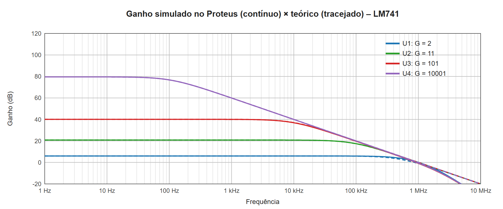
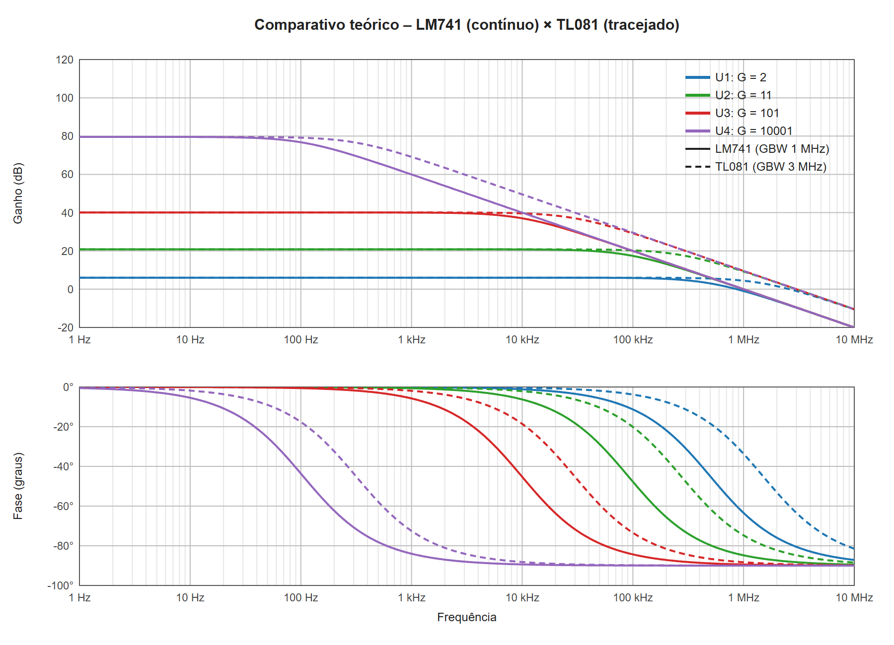
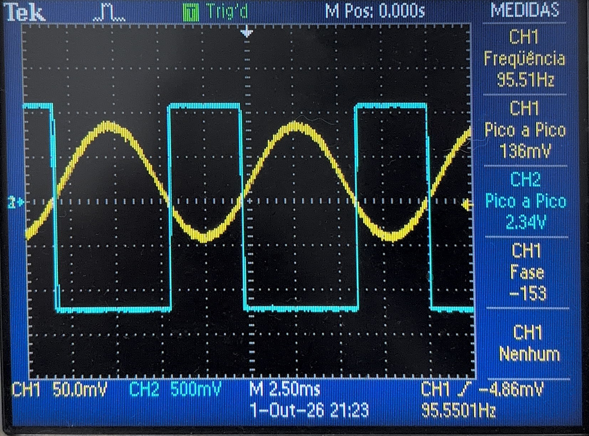
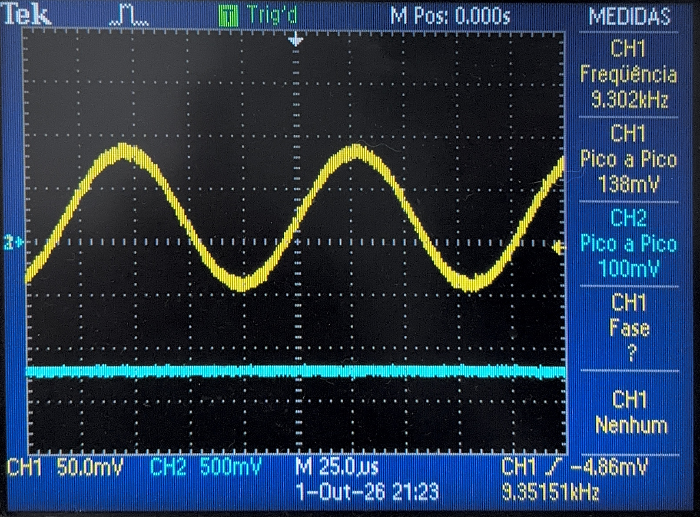
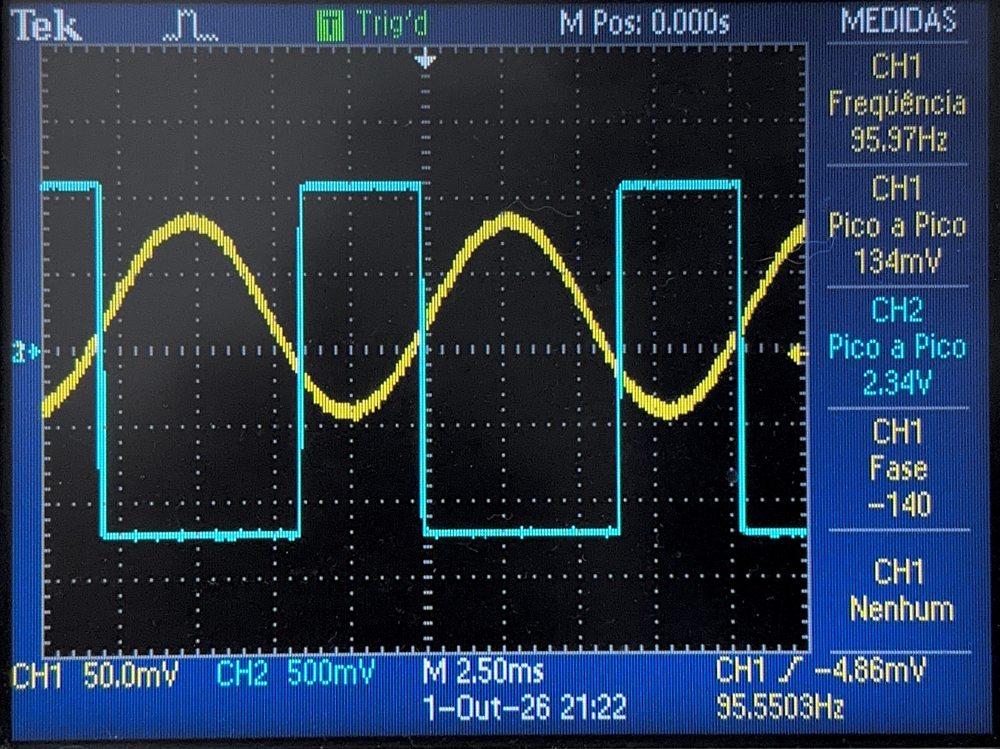
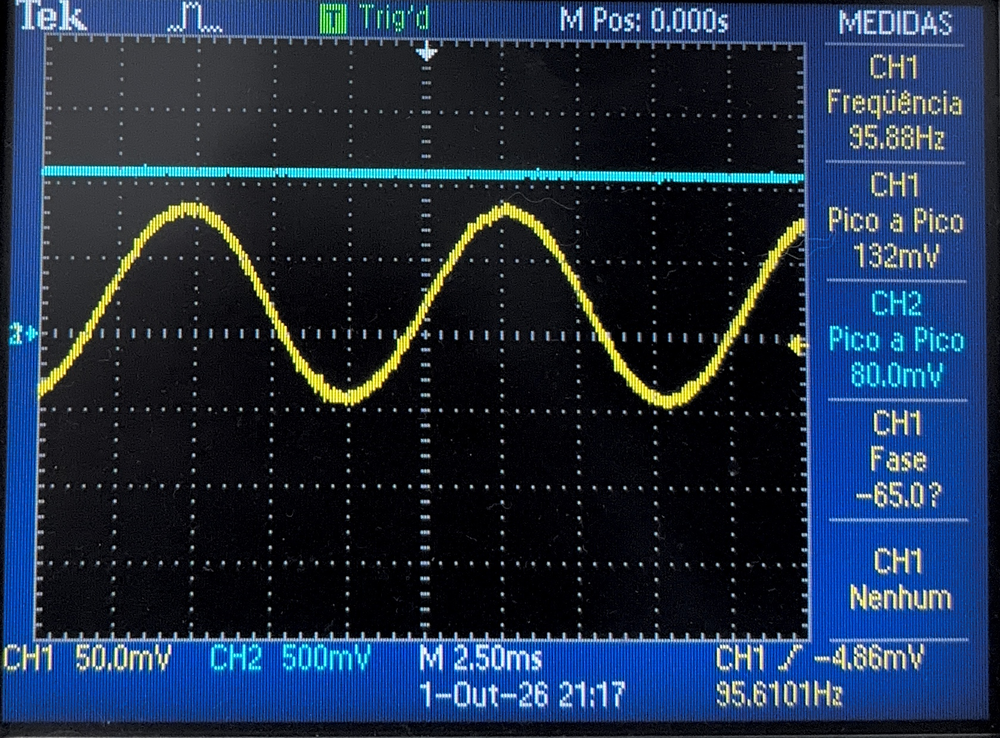

# Atividade 02 – Não Idealidades – Resposta em Frequência

**Curso:** Engenharia Eletrônica
**Unidade Curricular:** Filtros Ativos
**Professor:** Luis Carlos Martinhago Schlichting

---

## Objetivo

Analisar, simular e montar amplificadores com ampop para ver como o ganho e a fase mudam com a frequência. Os circuitos foram analisados com o **LM741** e depois com o **TL081/TL082** (entrada JFET, mesmo CI usado na Atividade 01).

> **Situação desta versão (05/10/2026).** Os itens 1 a 6 (análise teórica e simulação) estão completos. **O item 7 não foi alcançado:** a montagem em bancada foi feita, mas as medidas da primeira tentativa não produziram leituras válidas de ganho e fase, por um erro de ajuste da ponta de prova que deixou a entrada 27 vezes maior que a projetada e saturou os circuitos de ganho alto. O que aquelas telas mostram, e o porquê de não servirem para traçar a curva, está documentado no item 7. A medida será refeita, e só então o item 8 poderá comparar as três análises como o enunciado pede.

---

## 1. Circuitos

*Figura 1 – Circuitos analisados (enunciado).*

São quatro amplificadores **não inversores** (U1 a U4) ligados na mesma fonte senoidal, com alimentação de ±15 V. A entrada vai direto no pino 3 (V⁺) de todos. Em cada um, um resistor R_g vai do pino 2 (V⁻) ao terra e um resistor R_f vai da saída ao pino 2.

| Circuito | R_g (V⁻ → terra) | R_f (saída → V⁻) | R_f / R_g | Ampop |
|----------|:----:|:---:|:---:|:---:|
| U1 | R5 = 10 kΩ | R6 = 10 kΩ | 1 | LM741 |
| U2 | R4 = 10 kΩ | R3 = 100 kΩ | 10 | LM741 |
| U3 | R1 = 10 kΩ | R2 = 1 MΩ | 100 | LM741 |
| U4 | R7 = 1 kΩ | R8 = 10 MΩ | 10 000 | LM741 |

A topologia é a mesma nos quatro. O que muda é só a razão R_f/R_g, ou seja, o ganho. A ideia é ver como o ganho escolhido define até onde o circuito consegue ir em frequência.

---

## 2. Ganho

### Ganho ideal

Com ganho de malha aberta infinito, V⁻ = V⁺ = V_e. A corrente em R_g é $V_e/R_g$ e é a mesma que passa em R_f:

$$\frac{V_e}{R_g} = \frac{V_s - V_e}{R_f} \quad \Rightarrow \quad G = \frac{V_s}{V_e} = 1 + \frac{R_f}{R_g}$$

$$G_{U1} = 1 + \frac{10k}{10k} = 2 \qquad G_{U2} = 1 + \frac{100k}{10k} = 11 \qquad G_{U3} = 1 + \frac{1M}{10k} = 101 \qquad G_{U4} = 1 + \frac{10M}{1k} = 10\,001$$

O ganho é positivo: a saída fica **em fase** com a entrada (0°), ao contrário do inversor da Atividade 01 (180°).

### Ganho com A₀ finito

Chamando de $\beta = R_g/(R_g + R_f) = 1/G$ a fração da saída que volta para a entrada, o ganho real em baixa frequência é:

$$G_{real} = \frac{A_0}{1 + A_0\beta}$$

Com $A_0 = 200$ V/mV (106 dB, típico dos dois CIs):

| Circuito | G ideal | G ideal (dB) | $A_0\beta$ | G real | G real (dB) | Erro |
|----------|:---:|:---:|:---:|:---:|:---:|:---:|
| U1 | 2 | 6,02 | 100 000 | 2,000 | 6,02 | 0,001 % |
| U2 | 11 | 20,83 | 18 182 | 10,999 | 20,83 | 0,005 % |
| U3 | 101 | 40,09 | 1 980 | 100,95 | 40,08 | 0,05 % |
| U4 | 10 001 | 80,00 | 20 | **9 525** | **79,58** | **−4,8 %** |

Nos três primeiros a sobra de ganho ($A_0\beta$) é enorme e o ganho real é igual ao ideal. Em U4 o ganho pedido (80 dB) já está perto do próprio A₀ (106 dB). Sobram só 26 dB (20 vezes) de ganho de malha, e o ganho real já fica 4,8 % abaixo do ideal mesmo em DC.

---

## 3. Resposta em frequência teórica (LM741)

### Modelo de polo dominante

O ganho de malha aberta do ampop não é constante. Por causa do capacitor de compensação interno (o mesmo que define o slew rate na Atividade 01), ele cai a partir de uma frequência bem baixa:

$$A(f) = \frac{A_0}{1 + j\,f/f_p} \qquad f_p = \frac{GBW}{A_0}$$

| Parâmetro (típico, ±15 V) | LM741 | TL081 |
|---|:---:|:---:|
| Ganho em malha aberta A₀ | 200 V/mV (106 dB) | 200 V/mV (106 dB) |
| Produto ganho × banda (GBW) | 1 MHz | 3 MHz |
| Polo de malha aberta $f_p = GBW/A_0$ | 5 Hz | 15 Hz |
| Slew rate | 0,5 V/µs | 13 V/µs |

Colocando A(f) na fórmula do ganho com realimentação:

$$A_{cl}(f) = \frac{A(f)}{1 + A(f)\,\beta} = \frac{G_{real}}{1 + j\,f/f_c} \qquad f_c = f_p\,(1 + A_0\beta) \approx \beta \cdot GBW = \frac{GBW}{G}$$

Ou seja, o circuito com realimentação também tem um polo só, mas numa frequência muito maior. A realimentação "troca" ganho por banda:

$$G \cdot f_c \approx GBW = \text{constante}$$

Módulo e fase:

$$|A_{cl}(f)| = \frac{G_{real}}{\sqrt{1 + (f/f_c)^2}} \qquad \varphi(f) = -\arctan\left(\frac{f}{f_c}\right)$$

- Abaixo de $f_c$: ganho constante e fase ≈ 0°.
- Em $f_c$: ganho cai 3 dB (×0,707) e a fase é −45°.
- Acima de $f_c$: ganho cai 20 dB por década ($|A_{cl}| \approx GBW/f$) e a fase vai para −90°.

Acima de $f_c$ o ganho do circuito passa a ser o próprio ganho de malha aberta do ampop. Por isso as quatro curvas se juntam na reta do A(f) depois de cada $f_c$, e todas passam por 0 dB em ≈ 1 MHz.

### Frequência de corte de cada circuito

| Circuito | G | $f_c$ LM741 | $f_c$ TL081 | Fase em $f_c$ |
|----------|:---:|:---:|:---:|:---:|
| U1 | 2 | **500 kHz** | 1,5 MHz | −45° |
| U2 | 11 | **90,9 kHz** | 272,7 kHz | −45° |
| U3 | 101 | **9,91 kHz** | 29,7 kHz | −45° |
| U4 | 10 001 | **105 Hz** | 315 Hz | −45° |

Cada vez que o ganho sobe 10 vezes (20 dB), a banda cai 10 vezes. O TL081 tem GBW 3 vezes maior, então todas as bandas ficam 3 vezes maiores com o mesmo ganho.

Em U4 a conta exata ($f_c = 5 \times 21 = 105$ Hz) já difere um pouco de $GBW/G = 100$ Hz. É o mesmo efeito do erro de ganho em DC: com só 20× de sobra, a aproximação $A_0\beta \gg 1$ não vale mais direito.

*Figura 2 – Resposta em frequência teórica com LM741 (modelo de polo dominante). Os pontos marcam o −3 dB / −45° de cada circuito; a linha tracejada é o ganho de malha aberta A(f). Gerado com `gerar_graficos.ps1`.*

### Valores teóricos (LM741)

$|A_{cl}|$ (em V/V e dB) e fase em cada frequência:

| f | U1 (G = 2) | U2 (G = 11) | U3 (G = 101) | U4 (G = 10 001) |
|:---:|:---:|:---:|:---:|:---:|
| 10 Hz | 2,00 (6,0 dB) / 0° | 11,0 (20,8 dB) / 0° | 101 (40,1 dB) / −0,1° | 9 482 (79,5 dB) / −5,4° |
| 100 Hz | 2,00 (6,0 dB) / 0° | 11,0 (20,8 dB) / −0,1° | 101 (40,1 dB) / −0,6° | 6 897 (76,8 dB) / −43,6° |
| 1 kHz | 2,00 (6,0 dB) / −0,1° | 11,0 (20,8 dB) / −0,6° | 100 (40,0 dB) / −5,8° | 995 (60,0 dB) / −84,0° |
| 10 kHz | 2,00 (6,0 dB) / −1,1° | 10,9 (20,8 dB) / −6,3° | 71,0 (37,0 dB) / −45,3° | 100 (40,0 dB) / −89,4° |
| 50 kHz | 1,99 (6,0 dB) / −5,7° | 9,64 (19,7 dB) / −28,8° | 19,6 (25,9 dB) / −78,8° | 20 (26,0 dB) / −89,9° |
| 100 kHz | 1,96 (5,9 dB) / −11,3° | 7,40 (17,4 dB) / −47,7° | 9,95 (20,0 dB) / −84,3° | 10 (20,0 dB) / −89,9° |
| 200 kHz | 1,86 (5,4 dB) / −21,8° | 4,55 (13,2 dB) / −65,6° | 4,99 (14,0 dB) / −87,2° | 5 (14,0 dB) / −90° |
| 500 kHz | 1,41 (3,0 dB) / −45,0° | 1,97 (5,9 dB) / −79,7° | 2,00 (6,0 dB) / −88,9° | 2 (6,0 dB) / −90° |
| 1 MHz | 0,89 (−1,0 dB) / −63,4° | 1,00 (0,0 dB) / −84,8° | 1,00 (0,0 dB) / −89,4° | 1 (0,0 dB) / −90° |
| 2 MHz | 0,49 (−6,3 dB) / −76,0° | 0,50 (−6,0 dB) / −87,4° | 0,50 (−6,0 dB) / −89,7° | 0,5 (−6,0 dB) / −90° |

Acima de uns 100 kHz as colunas de U2, U3 e U4 ficam iguais: é a reta $GBW/f$ do ampop. Só U1, com ganho 2, ainda "não chegou" na reta.

### Limites que o modelo não mostra

O gráfico de Bode acima é de **pequenos sinais**. Na prática, outras não idealidades vistas na Atividade 01 também entram:

**Slew rate.** Para a saída senoidal não virar triângulo, a inclinação máxima $2\pi f V_{s,p}$ tem que ficar abaixo do SR. No circuito com realimentação $V_{s,p} = |A_{cl}(f)| \cdot V_{e,p}$, e a inclinação máxima da saída cresce com f até o limite:

$$\left.\frac{dV_s}{dt}\right|_{max} = 2\pi f\,|A_{cl}(f)|\,V_{e,p} \;\longrightarrow\; 2\pi \cdot GBW \cdot V_{e,p} \quad (f \gg f_c)$$

Então, para não ter distorção por SR em nenhuma frequência:

$$V_{e,p} < \frac{SR}{2\pi \cdot GBW}$$

| | SR | $V_{e,p}$ máximo |
|---|:---:|:---:|
| LM741 (datasheet) | 0,5 V/µs | 80 mV |
| LM741 (medido na Atividade 01) | 0,34 V/µs | **54 mV** |
| TL081 | 13 V/µs | 690 mV |

Esse limite não depende do ganho do circuito. Com o 741 a entrada tem que ser de algumas dezenas de mV.

**Saturação.** Em baixa frequência $V_{s,p} = G \cdot V_{e,p}$ tem que ficar abaixo de ≈ 13 V. Em U4 isso dá $V_{e,p} < 1{,}3$ mV, que já está no nível do ruído do gerador.

**Offset (U4).** O ganho de 10 001 também vale para o erro DC na entrada:

| Fonte do erro | LM741 | TL081 |
|---|:---:|:---:|
| $V_{OS} \times G$ (V_OS típico) | 1 mV × 10 001 ≈ **10 V** | 3 mV × 10 001 ≈ **30 V** (satura) |
| $I_B \times R_f$ | 80 nA × 10 MΩ = 0,8 V | 30 pA × 10 MΩ ≈ 0,3 mV |

Na bancada U4 muito provavelmente fica saturado (ou quase) só pelo offset, sem nenhum sinal na entrada. Por isso U4 não foi escolhido para a montagem (item 7).

**Polos não dominantes.** O ampop real tem outros polos em alguns MHz. Eles quase não afetam U2, U3 e U4 (que já cortaram bem antes), mas podem somar fase em U1 perto de 1 MHz. Na simulação a fase de U1 pode passar de −90° em alta frequência, o que o modelo de um polo não prevê.

---

## 4. Simulação com LM741 (Proteus)

A resposta em frequência foi traçada com o gráfico FREQUENCY do Proteus, com o gerador U1(+IP) como referência e uma ponta de prova em cada saída (U1(OP) a U4(OP)). Cada ponta foi lançada duas vezes no gráfico: no eixo esquerdo como módulo em dB e no eixo direito como fase (traces "U1 fase" a "U4 fase"). A varredura foi de 1 Hz a 25 MHz — o limite superior é o do gerador de funções disponível na bancada, de modo que a faixa simulada e a faixa mensurável coincidem — com 100 pontos por década. Os dados do gráfico foram exportados (`LM741.DAT`, 740 pontos) e comparados com a teoria pelo script `gerar_graficos.ps1`. As frequências de corte foram tiradas por interpolação no ponto em que o ganho cai 3,01 dB, e a fase correspondente foi interpolada na mesma frequência.

*Figura 3 – Simulação, resposta em frequência dos quatro circuitos com LM741 (gráfico FREQUENCY do Proteus). Eixo esquerdo: ganho em dB (U1(OP) a U4(OP)). Eixo direito: fase em graus (U1 fase a U4 fase). Varredura de 1 Hz a 25 MHz.*

*Figura 3b – Ganho simulado no Proteus (linha contínua, dados exportados) sobreposto à teoria de polo dominante (tracejado). Em U2, U3 e U4 as curvas praticamente coincidem até ≈ 1 MHz.*

| Circuito | G teórico (dB) | G simulado (dB) | $f_c$ teórico | $f_c$ simulado | Desvio de $f_c$ | $G \cdot f_c$ simulado | Fase em $f_c$ (sim.) |
|----------|:---:|:---:|:---:|:---:|:---:|:---:|:---:|
| U1 | 6,02 | 6,02 | 500 kHz | **631 kHz** | +26 % | 1,26 MHz | **−60,6°** |
| U2 | 20,83 | 20,83 | 90,9 kHz | **91,9 kHz** | +1,0 % | 1,01 MHz | **−47,0°** |
| U3 | 40,08 | 40,08 | 9,91 kHz | **9,62 kHz** | −2,9 % | 0,97 MHz | **−45,2°** |
| U4 | 79,58 | 79,58 | 105 Hz | **104,7 Hz** | −0,3 % | 1,00 MHz | **−45,0°** |

A fase em $f_c$ confirma o modelo de um polo em U3 e U4 (−45°, como previsto) e mostra o desvio em U1 (−60,6°), onde a proximidade do segundo polo acrescenta atraso. U2 fica no meio do caminho, com −47,0°.

Ganho simulado em alguns pontos (dB), com a teoria entre parênteses:

| f | U1 | U2 | U3 | U4 |
|:---:|:---:|:---:|:---:|:---:|
| 10 Hz | 6,02 (6,0) | 20,83 (20,8) | 40,08 (40,1) | 79,54 (79,5) |
| 100 Hz | 6,02 (6,0) | 20,83 (20,8) | 40,08 (40,1) | 76,76 (76,8) |
| 1 kHz | 6,02 (6,0) | 20,83 (20,8) | 40,04 (40,0) | 59,93 (60,0) |
| 10 kHz | 6,02 (6,0) | 20,78 (20,8) | 36,90 (37,0) | 39,97 (40,0) |
| 100 kHz | 5,92 (5,9) | 17,43 (17,4) | 19,70 (20,0) | 19,97 (20,0) |
| 200 kHz | 5,64 (5,4) | 13,24 (13,2) | 13,71 (14,0) | 13,95 (14,0) |
| 500 kHz | 3,96 (3,0) | 5,78 (5,9) | 5,58 (6,0) | 5,81 (6,0) |
| 1 MHz | 0,11 (−1,0) | −0,60 (0,0) | −0,88 (0,0) | −0,64 (0,0) |
| 2 MHz | −7,03 (−6,3) | −8,10 (−6,0) | −8,31 (−6,0) | −8,07 (−6,0) |
| 5 MHz | −20,5 (−14,4) | −20,9 (−14,0) | −21,0 (−14,0) | −20,7 (−14,0) |
| 10 MHz | −31,7 (−20,3) | −31,8 (−20,0) | −31,8 (−20,0) | −31,6 (−20,0) |
| 25 MHz | −46,2 (−28,3) | −45,6 (−28,0) | −45,5 (−28,0) | −45,5 (−28,0) |

Fase simulada em alguns pontos (graus):

| f | U1 | U2 | U3 | U4 |
|:---:|:---:|:---:|:---:|:---:|
| $f_c$ de cada circuito | −60,6 | −47,0 | −45,2 | −45,0 |
| 25 MHz | −160,8 | −159,2 | −158,9 | −160,8 |

Nos quatro circuitos a fase passa de −90° acima de ≈ 1 MHz e chega perto de −160° em 25 MHz. O modelo de polo dominante prevê o limite de −90°; o excedente é o atraso dos polos não dominantes do ampop.

Outras grandezas tiradas dos dados:

| Grandeza | Teoria | Simulação |
|---|:---:|:---:|
| Frequência em que as curvas cruzam 0 dB (U2, U3, U4) | 1 MHz | 0,91 a 0,94 MHz |
| Inclinação acima de $f_c$, de 100 kHz a 1 MHz (U3, U4) | −20 dB/déc | −20,6 dB/déc |
| Inclinação de 1 MHz a 10 MHz (todos) | −20 dB/déc | **−31 dB/déc** |
| Inclinação de 10 MHz a 25 MHz (todos) | −20 dB/déc | **−35 a −37 dB/déc** |
| Fase em 25 MHz (todos) | −90° | **−159° a −161°** |
| A₀ do modelo, calculado pelo ganho de U4 ($A_0 = G/(1 - G\beta)$) | 200 000 | ≈ 199 000 (106 dB) |
| Pico de ganho (sobressinal) em U1 | não tem | não tem (máximo = 6,02 dB) |

---

## 5. TL081/TL082

### Teoria

O circuito é o mesmo, então os ganhos em baixa frequência são os mesmos do item 2. A diferença é o GBW de 3 MHz, que leva o polo de malha aberta para 15 Hz e multiplica todas as frequências de corte por 3.

*Figura 4 – Resposta em frequência teórica com TL081.*

| f | U1 (G = 2) | U2 (G = 11) | U3 (G = 101) | U4 (G = 10 001) |
|:---:|:---:|:---:|:---:|:---:|
| 10 Hz | 2,00 (6,0 dB) / 0° | 11,0 (20,8 dB) / 0° | 101 (40,1 dB) / 0° | 9 520 (79,6 dB) / −1,8° |
| 100 Hz | 2,00 (6,0 dB) / 0° | 11,0 (20,8 dB) / 0° | 101 (40,1 dB) / −0,2° | 9 078 (79,2 dB) / −17,6° |
| 1 kHz | 2,00 (6,0 dB) / 0° | 11,0 (20,8 dB) / −0,2° | 101 (40,1 dB) / −1,9° | 2 861 (69,1 dB) / −72,5° |
| 10 kHz | 2,00 (6,0 dB) / −0,4° | 11,0 (20,8 dB) / −2,1° | 95,7 (39,6 dB) / −18,6° | 300 (49,5 dB) / −88,2° |
| 50 kHz | 2,00 (6,0 dB) / −1,9° | 10,8 (20,7 dB) / −10,4° | 51,6 (34,2 dB) / −59,3° | 60 (35,6 dB) / −89,6° |
| 100 kHz | 2,00 (6,0 dB) / −3,8° | 10,3 (20,3 dB) / −20,1° | 28,8 (29,2 dB) / −73,4° | 30 (29,5 dB) / −89,8° |
| 200 kHz | 1,98 (5,9 dB) / −7,6° | 8,87 (19,0 dB) / −36,3° | 14,8 (23,4 dB) / −81,5° | 15 (23,5 dB) / −89,9° |
| 500 kHz | 1,90 (5,6 dB) / −18,4° | 5,27 (14,4 dB) / −61,4° | 5,99 (15,5 dB) / −86,6° | 6 (15,6 dB) / −90° |
| 1 MHz | 1,66 (4,4 dB) / −33,7° | 2,89 (9,2 dB) / −74,7° | 3,00 (9,5 dB) / −88,3° | 3 (9,5 dB) / −90° |
| 2 MHz | 1,20 (1,6 dB) / −53,1° | 1,49 (3,4 dB) / −82,2° | 1,50 (3,5 dB) / −89,1° | 1,5 (3,5 dB) / −90° |

*Figura 5 – Comparativo teórico: LM741 (linha contínua) × TL081 (tracejada). Com o mesmo ganho, a curva do TL081 fica deslocada uma distância de log(3) ≈ 0,48 década para a direita.*

### Simulação

*Figura 6 – Simulação, resposta em frequência dos quatro circuitos com TL081 (gráfico FREQUENCY do Proteus). Eixo esquerdo: ganho em dB. Eixo direito: fase em graus. Varredura de 1 Hz a 25 MHz.*

O circuito simulado é o mesmo da Figura 3 — mesma fiação, mesmos resistores e mesmas pontas de prova. Só o modelo dos quatro ampops foi trocado, de `LM741` (biblioteca NATDA) para `TL081` (biblioteca TEX301). O TL081 tem a mesma pinagem do 741 (2 = V⁻, 3 = V⁺, 6 = saída, 4 e 7 = alimentação), então a troca não exigiu alterar o esquemático. O arquivo do projeto é `atividade_02_resposta_em_frequencia_tl081.pdsprj` e os dados exportados estão em `TL081.DAT` (740 pontos).

| Circuito | G teórico (dB) | G simulado (dB) | $f_c$ teórico | $f_c$ simulado | Fase em $f_c$ (sim.) | $G \cdot f_c$ simulado |
|----------|:---:|:---:|:---:|:---:|:---:|:---:|
| U1 | 6,02 | **6,02** | 1,5 MHz | **2,231 MHz** | **−67,2°** | 4,46 MHz |
| U2 | 20,83 | **20,83** | 272,7 kHz | **329,0 kHz** | **−48,0°** | 3,62 MHz |
| U3 | 40,08 | **40,08** | 29,7 kHz | **34,33 kHz** | **−45,3°** | 3,47 MHz |
| U4 | 79,58 | **79,63** | 315 Hz | **359,8 Hz** | **−45,0°** | 3,45 MHz |

Ganho simulado em alguns pontos (dB):

| f | U1 | U2 | U3 | U4 |
|:---:|:---:|:---:|:---:|:---:|
| 1 MHz | 5,35 | 10,63 | 10,69 | 10,65 |
| 2 MHz | 3,54 | 4,62 | 4,37 | 4,33 |
| 5 MHz | −4,05 | −5,03 | −5,25 | −5,28 |
| 10 MHz | −13,96 | −14,47 | −14,57 | −14,58 |
| 25 MHz | −28,85 | −28,92 | −28,93 | −28,94 |

As curvas de U2, U3 e U4 cruzam 0 dB entre 3,11 e 3,20 MHz, contra 0,91 a 0,94 MHz no 741. A fase em 25 MHz fica em −165° nos quatro circuitos.

---

## 6. Análise da simulação

**Ganho em baixa frequência (LM741).** Os quatro ganhos simulados bateram com a teoria até a segunda casa decimal: 6,02, 20,83, 40,08 e 79,58 dB. O caso mais interessante é U4. O simulador deu 79,58 dB e não os 80,00 dB do ganho ideal, exatamente o valor previsto com A₀ finito no item 2. A partir desse ganho dá para calcular o A₀ do modelo do Proteus: ≈ 199 000, ou 106 dB, que é o valor típico do datasheet. Então o erro de −4,8 % em U4 não é defeito da simulação. É a falta de ganho de malha que a teoria já apontava.

**Comparando os circuitos (LM741).** O produto $G \cdot f_c$ deu 1,01 MHz em U2, 0,97 MHz em U3 e 1,00 MHz em U4. O ganho variou de 11 a 10 001 (quase 1000 vezes) e o produto ficou praticamente constante, igual ao GBW de 1 MHz do datasheet. Isso confirma a principal conclusão da teoria: o 741 tem um "orçamento" fixo de ≈ 1 MHz, e cada circuito troca ganho por banda. U1 fica com mais de 600 kHz de banda com ganho 2, e U4 fica com só ≈ 105 Hz com ganho 10 001, que nem cobre a faixa de áudio.

Na Figura 3b também dá para ver o outro lado da mesma ideia. Acima da própria $f_c$, as curvas de U2, U3 e U4 se juntam numa reta só e cruzam 0 dB entre 0,91 e 0,94 MHz. Ali o ganho do circuito já não depende mais dos resistores: é o ganho de malha aberta do ampop.

**Onde o modelo de um polo não vale (LM741).** Acima de ≈ 1 MHz a queda passa de −20 para −31 dB por década nos quatro circuitos. Isso mostra que o modelo do 741 no Proteus tem pelo menos mais um polo (não dominante). Pela diferença entre o ganho simulado e a reta de −20 dB/déc em 2, 5 e 10 MHz, esse segundo polo fica em torno de **2,5 MHz**. Ele quase não afeta U2, U3 e U4, que cortam bem antes (no máximo 92 kHz).

Em U1 o efeito aparece. A $f_c$ simulada foi 631 kHz, 26 % acima dos 500 kHz previstos, e o ganho em 500 kHz e em 1 MHz ficou acima da teoria (3,96 dB contra 3,0 dB, e 0,11 dB contra −1,0 dB). Como U1 tem o menor ganho, a sua frequência de corte é a mais próxima do segundo polo. O atraso de fase extra que esse polo coloca na malha diminui a margem de fase, e em vez de derrubar a banda isso faz o ganho cair mais devagar perto do corte. O mesmo efeito, com mais atraso, viraria pico de ganho (sobressinal). Aqui ainda não há pico: o máximo de U1 é 6,02 dB, o mesmo valor de baixa frequência.

A curva de fase confirma esse diagnóstico. Em $f_c$, U3 e U4 dão −45,2° e −45,0°, exatamente o que o modelo de um polo prevê, mas U1 dá **−60,6°** — 15° a mais de atraso do que os −45° previstos. É o segundo polo somando fase já na região de corte de U1, que é justamente o circuito cuja $f_c$ está mais perto dele. U2, com $f_c$ em 92 kHz, fica em −47,0°, quase sem contaminação. Acima de ≈ 1 MHz a fase dos quatro passa de −90° e chega a cerca de −160° em 25 MHz, valor que o modelo de um polo não consegue produzir (o limite dele é −90°). Vale notar que a fase é o indicador mais sensível: em U1 o desvio de fase em $f_c$ (+35 %) aparece junto com um desvio de banda de +26 %, mas em U2 a fase já acusa 2° de excesso enquanto o desvio de $f_c$ é de apenas 1 %.

**Comparando os CIs.** Com o TL081 o ganho em baixa frequência é o mesmo (depende só dos resistores e de A₀, que são iguais) — a simulação confirma: 6,02, 20,83, 40,08 e 79,63 dB, os mesmos quatro valores do 741. O que muda é a banda:

| Circuito | $f_c$ LM741 | $f_c$ TL081 | Razão $f_{c,TL081}/f_{c,741}$ |
|----------|---:|---:|:---:|
| U1 | 631,0 kHz | 2,231 MHz | **3,54** |
| U2 | 91,85 kHz | 329,0 kHz | **3,58** |
| U3 | 9,616 kHz | 34,33 kHz | **3,57** |
| U4 | 104,7 Hz | 359,8 Hz | **3,44** |

A razão ficou entre 3,44 e 3,58, próxima e um pouco acima do fator 3 previsto pela relação dos GBW de datasheet (3 MHz / 1 MHz). A razão é praticamente a mesma nos quatro circuitos, o que mostra que a troca de CI desloca a curva inteira sem mudar o formato — é o deslocamento de log(3) ≈ 0,48 década previsto na Figura 5, medido aqui como log(3,5) ≈ 0,54 década.

**GBW do modelo do TL081.** O produto $G \cdot f_c$ deu 3,62 MHz em U2, 3,47 MHz em U3 e 3,45 MHz em U4 — constante, como esperado, mas cerca de 15 % acima dos 3 MHz típicos do datasheet. Ou seja, o modelo SPICE do TL081 no Proteus foi parametrizado com um GBW um pouco maior que o típico. Vale contrastar com o 741, cujo modelo deu 0,97 a 1,01 MHz contra 1 MHz de datasheet — ali a coincidência foi quase exata. A coluna teórica deste relatório foi mantida em 3 MHz, ancorada no datasheet: ajustá-la para 3,5 MHz faria a "teoria" descrever o modelo do simulador em vez do componente real, que é justamente o que a comparação existe para testar.

**Polos não dominantes no TL081.** O mesmo efeito visto no 741 reaparece, e mais forte. A inclinação de 10 a 25 MHz chega a −37 dB/década e a fase atinge −165° em 25 MHz. Em U1 o desvio é o maior: $f_c$ de 2,23 MHz contra 1,5 MHz previsto (+49 %) e fase de −67,2° em $f_c$ contra −45°. Faz sentido: com GBW três vezes maior, a $f_c$ de U1 sobe para a faixa de MHz e entra de vez na região dos polos secundários. U3 e U4, que cortam em dezenas de kHz e centenas de Hz, seguem obedecendo ao modelo de um polo (−45,3° e −45,0° em $f_c$).

**U4 no TL081 não saturou.** A previsão era de que, se o modelo do Proteus tivesse tensão de offset, o ganho de 10 001 a levaria ao trilho e a análise mostraria o circuito saturado. Não foi o que aconteceu: o ganho em baixa frequência deu 79,63 dB, praticamente o ideal, e a curva tem o mesmo formato das outras três. A leitura correta não é que o circuito real ficaria bem, e sim que **o modelo não reproduz o offset**: a análise em frequência do Proteus é de pequenos sinais e lineariza o circuito em torno do ponto de operação DC, de modo que $V_{OS}$ e $I_B$ — as grandezas que na bancada saturariam U4 — não entram na conta. A previsão de saturação do item 3 continua válida para a montagem física; a simulação simplesmente não é o instrumento capaz de testá-la. É a mesma limitação, por outro caminho, que já aparece no slew rate: o Bode de pequenos sinais não vê nenhum dos dois.

**Faixa de 10 a 25 MHz.** A varredura foi estendida até 25 MHz para cobrir todo o alcance do gerador da bancada. Nessa frequência o ganho já caiu para −45,5 dB no 741 e −28,9 dB no TL081, ou seja, atenuação de 190× e 28× respectivamente. Com a entrada de 50 mVpp escolhida no item 7, a saída ali seria de 0,3 mVpp (741) a 1,8 mVpp (TL081) — abaixo ou no limite do ruído do osciloscópio. Isso justifica encerrar as medidas de bancada bem antes do limite do gerador: a faixa útil termina onde o sinal de saída deixa de ser mensurável, não onde o gerador para.

---

## 7. Bancada (medida ainda não concluída)

> **Este item ainda não foi concluído.** A montagem existe e foi medida, mas as leituras da primeira tentativa não servem para traçar as curvas de ganho e fase pedidas no enunciado. As Tabelas 1 seguem com as colunas medidas em branco. Os itens 7.1 a 7.3 registram o que foi feito e o que deu errado; o 7.4 e o 7.5 são o plano da repetição.

### 7.1 Primeira tentativa (01/10/2026) – sem leituras válidas

Os quatro circuitos (U1 a U4) foram montados em protoboard com LM741 e medidos em 01/10/2026, com o osciloscópio Tektronix TDS 2024C e gerador de funções Tektronix, os mesmos da Atividade 01. Em cada circuito foram tiradas telas em aproximadamente 95 Hz, 950 Hz, 9,3 kHz, 94 kHz e 917 kHz, ou seja, uma por década. As 21 telas estão em `imgs/protoboard/2026-10-01/`.

Configuração usada em todas as telas: CH1 (amarelo) na entrada, em 50 mV/div, e CH2 (ciano) na saída, em 500 mV/div.

### 7.2 O que as telas mostram

| Circuito | f | CH1 (entrada) | CH2 (saída) | Forma do CH2 |
|---|:---:|:---:|:---:|---|
| U1 (G = 2) | 95,9 Hz | 136 mVpp | 60 mV | linha reta |
| U1 | 943 Hz | 134 mVpp | 60 mV | linha reta |
| U1 | 94,5 kHz | 136 mVpp | 100 mV | linha reta |
| U1 | 917 kHz | 140 mVpp | 80 mV | linha reta |
| U2 (G = 11) | 95,9 Hz | 132 mVpp | 80 mV | linha reta |
| U2 | 945 Hz | 132 mVpp | 60 mV | linha reta |
| U2 | 9,4 kHz | 132 mVpp | 100 mV | linha reta |
| U2 | 94,4 kHz | 134 mVpp | 80 mV | linha reta |
| U3 (G = 101) | 95,4 Hz | 134 mVpp | **2,34 V** | **onda quadrada** |
| U3 | 953 Hz | 134 mVpp | **2,34 V** | **onda quadrada** |
| U3 | 94,3 kHz | 140 mVpp | 100 mV | linha reta |
| U3 | 898 kHz | 140 mVpp | 100 mV | linha reta |
| U4 (G = 10 001) | 95,5 Hz | 136 mVpp | **2,34 V** | **onda quadrada** |
| U4 | 954 Hz | 138 mVpp | **2,34 V** | **onda quadrada** |
| U4 | 9,3 kHz | 138 mVpp | 100 mV | linha reta |
| U4 | 94,3 kHz | 140 mVpp | 100 mV | linha reta |
| U4 | 917 kHz | 140 mVpp | 100 mV | linha reta |

*Figura 7 – U4 em 95,5 Hz. A saída (ciano) é uma onda quadrada: o ampop está saturado, indo de um trilho ao outro. A entrada (amarelo) continua senoidal.*

*Figura 8 – U4 em 9,3 kHz. A saída desaparece: o ampop não consegue mais percorrer a excursão entre os trilhos no tempo de meio período.*

*Figura 9 – U3 em 95,4 Hz. Mesma onda quadrada de U4, com a mesma amplitude.*

*Figura 10 – U2 em 95,9 Hz. Com o CH2 em 500 mV/div, a saída não aparece.*

Um ponto saiu certo: a amplitude de entrada ficou entre 132 e 140 mVpp em todas as 21 telas, nos quatro circuitos e em todas as frequências. A exigência do enunciado de manter $V_e$ constante foi cumprida.

### 7.3 Diagnóstico: por que esses dados não fecham a Tabela 1

**A escala do CH2 ficou em 500 mV/div o tempo todo.** Nessa escala, cada divisão da tela vale 500 mV e a resolução de leitura é de algumas dezenas de mV. Por isso as saídas pequenas aparecem como uma linha reta e os valores de 60, 80 e 100 mV são só os degraus de quantização do aparelho, não medidas. Não dá para tirar ganho de uma leitura que está no piso de resolução.

**A escala da ponta de prova está 10 vezes errada.** Onde a saída aparece (U3 e U4 em baixa frequência), ela é uma onda quadrada de 2,34 Vpp. Um LM741 saturado com ±12 V entrega ≈ 23,4 Vpp, dez vezes mais. A explicação coerente é que as pontas estão na posição ×10 e o menu do osciloscópio está configurado como ×1, de modo que tudo na tela aparece dividido por 10. Com isso:

- a onda quadrada de 2,34 Vpp é, na verdade, ≈ 23,4 Vpp, ou seja, ±11,7 V — exatamente os trilhos da fonte;
- a entrada de 134 mVpp é, na verdade, ≈ **1,34 Vpp**.

**Com 1,34 Vpp na entrada, U3 e U4 têm que saturar.** É o que a Figura 7 e a Figura 9 mostram:

| Circuito | $V_s$ pedido em baixa frequência | Resultado |
|---|:---:|---|
| U1 | 2 × 1,34 = 2,7 Vpp | linear |
| U2 | 11 × 1,34 = 14,7 Vpp | linear, mas já perto do limite (pico de 7,4 V) |
| U3 | 101 × 1,34 = 135 Vpp | **satura** (ceifa em ±11,7 V) |
| U4 | 10 001 × 1,34 = 13 400 Vpp | **satura** |

O enunciado pede explicitamente para garantir que os ampops não saturem. Com a entrada 27 vezes maior que os 50 mVpp previstos no projeto do experimento, U3 e U4 viraram comparadores: a saída não tem mais relação linear com a entrada, então não existe ganho nem defasagem para medir ali.

**O sumiço da saída em U3 e U4 acima de 9 kHz é slew rate, não banda.** Uma vez saturada, a saída precisa percorrer os 23,4 V entre os trilhos. Com o SR de 0,34 V/µs medido na Atividade 01, isso leva ≈ 69 µs, que é o meio período de 7,2 kHz. Acima disso a saída não completa nem uma transição e colapsa — é o que se vê em U4 já em 9,3 kHz (Figura 8) e em U3 em 94 kHz. Esse comportamento é real e consistente, mas é a não idealidade da Atividade 01, não a resposta em frequência que esta atividade quer medir.

**U1 e U2 não mostraram saída nenhuma.** Esses dois estavam na região linear: U2 deveria entregar ≈ 14,7 Vpp reais em baixa frequência, o que apareceria como ≈ 1,5 V na tela, quase 3 divisões. Em vez disso o CH2 ficou reto em todas as telas. Isso não se explica pela escala: indica que, nessas medidas, a ponta do CH2 não estava na saída do ampop, ou que esses dois circuitos não estavam funcionando (alimentação, trilho da protoboard ou a própria realimentação).

**A medida de fase do osciloscópio não vale.** A função "CH1 Fase" compara CH1 com CH2. Sem sinal utilizável no CH2, ela devolve qualquer coisa: nas telas de ≈ 95 Hz, onde todos os circuitos deveriam marcar ≈ 0°, os valores vão de −14,3° a −153°, e em várias telas aparece "?". Nenhum desses números pode ser usado.

### 7.4 Correções para repetir a medida

| O que estava | O que fazer |
|---|---|
| Pontas em ×10 com o menu em ×1 | Ajustar o menu de cada canal (CH1 → Ponta → Tensão → **10×**) e conferir: a entrada deve passar a ser lida 10 vezes maior |
| $V_e$ ≈ 1,34 Vpp | Baixar o gerador até o osciloscópio ler **50 mVpp** já com a ponta corrigida |
| CH2 fixo em 500 mV/div | Reajustar a escala do CH2 a cada frequência, para a onda ocupar 4 a 6 divisões |
| Saída de U1 e U2 ausente | Antes de medir, conferir com o circuito em 1 kHz se $V_s/V_e$ dá ≈ 2 em U1 e ≈ 11 em U2. Se não der, o problema é de montagem |
| Fase pelo medidor automático | Medir o Δt entre as passagens por zero com os cursores e calcular $\varphi = -360° \cdot f \cdot \Delta t$ |
| 5 frequências por circuito | Usar as frequências das tabelas abaixo, que concentram pontos em volta de cada $f_c$ |

Com a entrada corrigida para 50 mVpp, as verificações do projeto do experimento voltam a valer:

| Verificação | U2 | U3 | Limite |
|---|:---:|:---:|:---:|
| $V_s$ em baixa frequência | 0,55 Vpp | 5,05 Vpp | < ≈ 26 Vpp (sem saturar) |
| Inclinação máxima da saída ($2\pi \cdot GBW \cdot V_{e,p}$) | 0,16 V/µs | 0,16 V/µs | < 0,34 V/µs (SR medido na Atividade 01) |
| Offset na saída ($V_{OS} \cdot G + I_B R_f$) | ≈ 0,02 V | ≈ 0,18 V | desprezível; usar acoplamento AC se precisar |

**Quais circuitos medir.** Para o item 7 bastam dois. U2 e U3 são os melhores: cortam em ≈ 91 kHz e ≈ 9,9 kHz, uma década um do outro, dentro da faixa do gerador e do osciloscópio, e ambos ficam longe dos polos não dominantes que bagunçaram U1 na simulação. U1 exigiria medir até perto de 1 MHz e U4, como a primeira tentativa já mostrou, satura.

### 7.5 Procedimento

1. Alimentar com ±15 V e aplicar senoide de 50 mVpp no pino 3.
2. CH1 na entrada ($V_e$) e CH2 na saída ($V_s$), pontas em ×10 **e menu do osciloscópio também em ×10**. Usar média de 16 aquisições, porque o sinal de entrada é pequeno.
3. Em cada frequência, conferir $V_e$ no CH1 e reajustar o gerador para 50 mVpp se tiver mudado.
4. Ajustar a escala vertical do CH2 para a onda ocupar a maior parte da tela.
5. Anotar $V_{pp}$ de CH1 e CH2 e o atraso Δt entre as passagens por zero (subindo) da entrada e da saída.
6. Calcular o ganho $V_s/V_e$, o ganho em dB ($20\log$) e a defasagem:

$$\varphi = -360° \cdot f \cdot \Delta t$$

### Tabela 1 – U3 (G = 101, LM741)

Tabelas preparadas para a repetição da medida. As colunas de teoria já estão preenchidas com o modelo do item 3 e $V_e$ = 50 mVpp; as colunas medidas ficam em branco porque a primeira tentativa não produziu leituras válidas (item 7.3).

| f | Ve (mVpp) | Vs (mVpp) | Ganho Vs/Ve | Ganho (dB) | Δt | Defasagem | Vs teórico | Ganho teórico | Fase teórica |
|:---:|:---:|:---:|:---:|:---:|:---:|:---:|:---:|:---:|:---:|
| 100 Hz | | | | | | | 5 047 mVpp | 100,9 (40,1 dB) | −1° |
| 500 Hz | | | | | | | 5 041 mVpp | 100,8 (40,1 dB) | −3° |
| 1 kHz | | | | | | | 5 022 mVpp | 100,4 (40,0 dB) | −6° |
| 2 kHz | | | | | | | 4 948 mVpp | 99,0 (39,9 dB) | −11° |
| 3 kHz | | | | | | | 4 831 mVpp | 96,6 (39,7 dB) | −17° |
| 5 kHz | | | | | | | 4 506 mVpp | 90,1 (39,1 dB) | −27° |
| 7 kHz | | | | | | | 4 122 mVpp | 82,4 (38,3 dB) | −35° |
| 10 kHz | | | | | | | 3 552 mVpp | 71,0 (37,0 dB) | −45° |
| 15 kHz | | | | | | | 2 782 mVpp | 55,6 (34,9 dB) | −57° |
| 20 kHz | | | | | | | 2 240 mVpp | 44,8 (33,0 dB) | −64° |
| 30 kHz | | | | | | | 1 583 mVpp | 31,7 (30,0 dB) | −72° |
| 50 kHz | | | | | | | 981 mVpp | 19,6 (25,9 dB) | −79° |
| 70 kHz | | | | | | | 707 mVpp | 14,1 (23,0 dB) | −82° |
| 100 kHz | | | | | | | 498 mVpp | 10,0 (20,0 dB) | −84° |
| 200 kHz | | | | | | | 250 mVpp | 5,0 (14,0 dB) | −87° |
| 300 kHz | | | | | | | 167 mVpp | 3,3 (10,5 dB) | −88° |
| 500 kHz | | | | | | | 100 mVpp | 2,0 (6,0 dB) | −89° |
| 1 MHz | | | | | | | 50 mVpp | 1,0 (0,0 dB) | −89° |

### Tabela 1 – U2 (G = 11, LM741)

| f | Ve (mVpp) | Vs (mVpp) | Ganho Vs/Ve | Ganho (dB) | Δt | Defasagem | Vs teórico | Ganho teórico | Fase teórica |
|:---:|:---:|:---:|:---:|:---:|:---:|:---:|:---:|:---:|:---:|
| 100 Hz | | | | | | | 550 mVpp | 11,0 (20,8 dB) | 0° |
| 1 kHz | | | | | | | 550 mVpp | 11,0 (20,8 dB) | −1° |
| 5 kHz | | | | | | | 549 mVpp | 11,0 (20,8 dB) | −3° |
| 10 kHz | | | | | | | 547 mVpp | 10,9 (20,8 dB) | −6° |
| 20 kHz | | | | | | | 537 mVpp | 10,7 (20,6 dB) | −12° |
| 30 kHz | | | | | | | 522 mVpp | 10,4 (20,4 dB) | −18° |
| 50 kHz | | | | | | | 482 mVpp | 9,6 (19,7 dB) | −29° |
| 70 kHz | | | | | | | 436 mVpp | 8,7 (18,8 dB) | −38° |
| 90 kHz | | | | | | | 391 mVpp | 7,8 (17,9 dB) | −45° |
| 100 kHz | | | | | | | 370 mVpp | 7,4 (17,4 dB) | −48° |
| 150 kHz | | | | | | | 285 mVpp | 5,7 (15,1 dB) | −59° |
| 200 kHz | | | | | | | 228 mVpp | 4,6 (13,2 dB) | −66° |
| 300 kHz | | | | | | | 160 mVpp | 3,2 (10,1 dB) | −73° |
| 500 kHz | | | | | | | 98 mVpp | 2,0 (5,9 dB) | −80° |
| 700 kHz | | | | | | | 71 mVpp | 1,4 (3,0 dB) | −83° |
| 1 MHz | | | | | | | 50 mVpp | 1,0 (0,0 dB) | −85° |
| 1,5 MHz | | | | | | | 33 mVpp | 0,7 (−3,5 dB) | −87° |
| 2 MHz | | | | | | | 25 mVpp | 0,5 (−6,0 dB) | −87° |

A partir das tabelas preenchidas, traçar os gráficos de ganho e fase medidos sobre as curvas teóricas, no mesmo formato da Figura 3b.

---

## 8. Análise comparativa: teoria, simulação e bancada

A coluna "Simulação" está preenchida com os valores do LM741 (`LM741.DAT`), que é o CI usado nas montagens. A coluna "Bancada" fica em aberto: a primeira tentativa (item 7.1) saiu com a entrada 27 vezes maior que a prevista, o que levou U3 e U4 à saturação e tirou qualquer leitura linear de ganho e fase.

| Grandeza | Teoria | Simulação | Bancada |
|---|:---:|:---:|:---:|
| G de U2 em baixa frequência | 20,83 dB | **20,83 dB** | não medido |
| $f_c$ de U2 | 90,9 kHz | **91,85 kHz** | não medido |
| G de U3 em baixa frequência | 40,08 dB | **40,08 dB** | não medido |
| $f_c$ de U3 | 9,91 kHz | **9,616 kHz** | não medido |
| $G \cdot f_c$ (U2) | 1 MHz | **1,01 MHz** | não medido |
| $G \cdot f_c$ (U3) | 1 MHz | **0,97 MHz** | não medido |
| Fase em $f_c$ (U2) | −45° | **−47,0°** | não medido |
| Fase em $f_c$ (U3) | −45° | **−45,2°** | não medido |
| Saturação de U3 e U4 com $V_e$ = 1,34 Vpp | prevista no item 3 | não aparece (análise linear) | **confirmada** |
| Excursão de saída saturada | ±13 V (datasheet) | — | **±11,7 V** |

Teoria e simulação concordam bem nos dois circuitos escolhidos para a bancada: o ganho bate até a segunda casa decimal e a $f_c$ difere de +1,0 % em U2 e −2,9 % em U3. São os dois circuitos mais "comportados" da série, justamente porque cortam longe dos polos não dominantes — o que faz deles boas escolhas para confrontar com a medida.

O que a bancada já acrescentou, mesmo sem a curva, é o limite que nenhuma das duas outras análises mostra. A teoria do item 3 previu que U3 e U4 saturariam com entrada grande e que U4 saturaria até sem sinal, por causa do offset. A simulação não tem como confirmar isso: a análise em frequência do Proteus é linear e ignora $V_{OS}$, $I_B$ e slew rate (item 6). Foi a montagem que mostrou os dois efeitos: a saída ceifada em ±11,7 V nos dois circuitos de ganho alto, e o colapso dessa onda quadrada acima de ≈ 7 kHz, que corresponde ao tempo de 69 µs que o 741 leva para percorrer os 23,4 V com SR de 0,34 V/µs. A faixa útil de um amplificador, portanto, não é só a que o Bode de pequenos sinais indica.

Diferenças esperadas e possíveis justificativas na repetição da medida:
- O GBW de 1 MHz é típico. O 741 da bancada mostrou SR 32 % abaixo do típico na Atividade 01, então o GBW real também pode ficar abaixo de 1 MHz, e aí as duas $f_c$ medidas caem na mesma proporção. Nesse caso o $G \cdot f_c$ medido dá direto o GBW do CI usado.
- Tolerância dos resistores (5 %) muda o ganho em baixa frequência na mesma proporção.
- Com 50 mVpp na entrada, o ruído e a resolução do osciloscópio pesam mais na leitura de $V_e$ e na medida de Δt, principalmente nas frequências baixas, onde a fase é quase 0°.
- Em alta frequência a capacitância da ponta de prova e da protoboard pode somar um pouco de atraso de fase.

---

## Conclusão

Os quatro circuitos têm a mesma topologia e só mudam na razão R_f/R_g. Mesmo assim, o comportamento em frequência de cada um é completamente diferente, e a atividade mostra o porquê.

**O ganho é pago com banda.** A realimentação divide o ganho de malha aberta do ampop, e o que sobra de banda é o GBW dividido pelo ganho escolhido. Com o LM741, a $f_c$ cai de 631 kHz em U1 (ganho 2) para 105 Hz em U4 (ganho 10 001). O produto $G \cdot f_c$ medido na simulação ficou em 0,97, 1,01 e 1,00 MHz em U3, U2 e U4 — constante e igual ao GBW de datasheet, mesmo com o ganho variando quase mil vezes. É a conclusão central: o ampop tem um orçamento fixo de ganho × banda, e cada projeto só escolhe como gastá-lo.

**O formato da curva é sempre o mesmo.** Abaixo de $f_c$ o ganho é constante e a saída fica em fase com a entrada (o circuito é não inversor). Em $f_c$ o ganho cai 3 dB e a fase chega a −45°. Acima dela as quatro curvas se encontram na reta do ganho de malha aberta, caindo 20 dB por década rumo a −90°, e cruzam 0 dB em ≈ 0,93 MHz. Nessa região o ganho já não depende dos resistores.

**Trocar de CI desloca a curva inteira.** O TL081 tem o mesmo A₀ e, por isso, os mesmos quatro ganhos em baixa frequência. O que muda é o GBW: a banda de cada circuito ficou de 3,4 a 3,6 vezes maior na simulação, sem mudar o formato da resposta.

**O modelo de um polo tem limite, e ele aparece primeiro no menor ganho.** Acima de ≈ 1 MHz a queda simulada passa de −20 para −31 dB por década e a fase ultrapassa os −90° que o modelo permite: há um segundo polo em torno de 2,5 MHz. U2, U3 e U4 cortam bem antes e seguem a teoria com erro de 1 a 3 % na $f_c$. Já U1, cuja $f_c$ é a mais próxima desse polo, ficou 26 % acima do previsto, com −60,6° de fase em $f_c$ no lugar de −45°. Com o TL081 o efeito é maior ainda (+49 % em U1), porque o GBW três vezes maior empurra a $f_c$ para dentro da região dos polos secundários. A fase é o indicador mais sensível: ela acusa o desvio antes de o módulo mudar de forma perceptível.

**Ganho muito alto esbarra em limites que não são de banda.** U4 já erra 4,8 % no ganho em DC, porque 80 dB pedidos contra 106 dB disponíveis deixam só 20 vezes de ganho de malha — valor confirmado pela simulação (79,58 dB) e que permitiu estimar o A₀ do modelo em ≈ 199 000. Além disso, o mesmo ganho multiplica a tensão de offset: na prática U4 fica saturado antes de amplificar qualquer coisa.

**A bancada mostra o que o Bode de pequenos sinais não vê.** A primeira tentativa de medida foi feita com a entrada 27 vezes maior que a projetada, por causa de um ajuste de ponta de prova ×10 lido como ×1. O resultado não serve para traçar ganho e fase, mas registra dois limites reais: U3 e U4 com a saída ceifada em ±11,7 V, e essa onda quadrada colapsando acima de ≈ 7 kHz pelo slew rate de 0,34 V/µs medido na Atividade 01. Nenhum dos dois efeitos aparece na simulação em frequência, que é linear por construção. A curva de ganho e fase medida continua pendente de uma nova montagem, com os ajustes listados no item 7.4.

Juntando tudo: para escolher um ampop não basta olhar o ganho. É preciso verificar, separadamente, a banda que sobra com esse ganho (GBW), a fase na faixa de interesse, a excursão de saída e a velocidade (slew rate). Os quatro circuitos desta atividade têm a mesma cara no papel e nenhum deles serve para as mesmas aplicações.

---

## Referências

- Datasheet LM741 – Texas Instruments
- Datasheet µA741 – Texas Instruments, SLOS094
- Datasheet TL08x (TL081/TL082) – Texas Instruments
- SEDRA, A. S.; SMITH, K. C. *Microeletrônica*. 7ª ed. Pearson, 2015.
- Simulação: Proteus 8 Professional
- Gráficos teóricos: `gerar_graficos.ps1` (PowerShell), modelo de polo dominante
