# Atividade 02 - Resposta em frequência com LM741 e TL081

**Curso:** Engenharia Eletrônica **Unidade curricular:** Filtros Ativos **Professor:** Luis Carlos Martinhago Schlichting

## 1. Circuitos e previsão teórica

Os quatro circuitos são amplificadores não inversores alimentados em ±15 V. A previsão teórica foi feita para LM741 e TL081 nos quatro ganhos. Os quatro circuitos também foram simulados no Proteus com os dois amplificadores operacionais. Na bancada, foram medidos U1 e U2 com LM741.

*Figura 1 - Circuitos U1 a U4. A previsão teórica e a simulação cobrem os quatro; a bancada cobre U1 e U2 com LM741.*

| Circuito | $R_g$ | $R_f$ | Ganho ideal | Corte teórico LM741 | Corte teórico TL081 |
|:---:|---:|---:|---:|---:|---:|
| U1 | 10 kΩ | 10 kΩ | 2 V/V | 500 kHz | 1,50 MHz |
| U2 | 10 kΩ | 100 kΩ | 11 V/V | 90,9 kHz | 272,7 kHz |
| U3 | 10 kΩ | 1 MΩ | 101 V/V | 9,91 kHz | 29,7 kHz |
| U4 | 1 kΩ | 10 MΩ | 10 001 V/V | 105 Hz | 315 Hz |

O ganho ideal é $1+R_f/R_g$. Em U2, a razão dos resistores é 10, mas **o ganho de tensão é 11**. O LM741 tem produto ganho-banda típico de 1 MHz e o TL081, de 3 MHz. Assim, ao aumentar o ganho de U1 para U4, a frequência de corte prevista diminui; para o mesmo circuito, o TL081 permite uma faixa maior. Em U4, o ganho de malha aberta finito reduz o ganho de baixa frequência para cerca de 9 525 V/V, valor usado na previsão de corte.

A previsão teórica da resposta em frequência usa o modelo de polo dominante:

$$A(f)=\frac{A_0}{1+j(f/f_p)}$$

em que $A_0$ é o ganho em malha aberta em baixas frequências e $f_p$ é a frequência do polo dominante. Com realimentação, $\beta=R_g/(R_g+R_f)=1/G$; portanto, o corte em malha fechada é aproximado por:

$$f_c=f_p(1+A_0\beta)\approx \beta\,GBW=\frac{GBW}{G}$$

Essa relação mostra por que o corte diminui quando o ganho aumenta ([nota de aplicação da Texas Instruments](https://www.ti.com/lit/an/sboa114/sboa114.pdf)).

*Gráfico 1 - Previsão teórica de ganho e fase dos quatro circuitos com LM741.*

*Gráfico 2 - Previsão teórica com TL081. Os ganhos em baixa frequência permanecem; os cortes se deslocam para frequências maiores.*

## 2. Simulação no Proteus

Os quatro circuitos foram simulados de 1 Hz a 25 MHz com LM741 e, depois, com TL081. A varredura AC mostra ganho e fase de pequenos sinais. As frequências de corte foram obtidas no ponto em que o ganho cai 3 dB em relação ao valor de baixa frequência. Os dados exportados são `LM741.DAT` e `TL081.DAT`.

| Circuito | Ganho simulado em baixa frequência | Corte com LM741 | Corte com TL081 |
|:---:|---:|---:|---:|
| U1 | 2,00 V/V | 631 kHz | 2,231 MHz |
| U2 | 11,00 V/V | 91,9 kHz | 329,0 kHz |
| U3 | 100,95 V/V | 9,62 kHz | 34,33 kHz |
| U4 | cerca de 9 525 V/V | 104,7 Hz | 359,8 Hz |

*Gráfico 3 - Proteus com LM741: ganho no eixo esquerdo e fase no direito para U1 a U4.*

*Gráfico 4 - Proteus com TL081, nas mesmas condições e com os mesmos resistores.*

O Proteus confirma a tendência prevista: maior ganho reduz a faixa de frequência, e o TL081 amplia essa faixa. Em U2, o corte com LM741 ficou em 91,9 kHz, próximo dos 90,9 kHz teóricos. Em U1, o modelo simulou 631 kHz, acima dos 500 kHz da aproximação teórica. A bancada permite verificar até onde esses resultados AC continuam válidos com a amplitude aplicada.

## 3. Bancada com LM741: U1, ganho 2

Conectei CH1 (amarelo) à entrada e CH2 (ciano) à saída. Em cada frequência, registrei as amplitudes pico a pico, a fase indicada pelo osciloscópio e a forma de onda. Calculei o ganho com as duas amplitudes da mesma tela: $G=V_{s,pp}/V_{e,pp}$. Extraí as 19 fotos dos PDFs da prática e salvei uma por página em `imgs/protoboard/2026-10-05/`. Quando a saída deixa de ser senoidal, a razão de amplitudes não representa o ganho linear.

| Frequência | Entrada $V_{pp}$ | Saída $V_{pp}$ | Ganho medido | Fase indicada | Saída |
|---:|---:|---:|---:|---:|---|
| 100 Hz | 532 mV | 1,04 V | 1,95 | -0,18° | senoidal |
| 499 Hz | 532 mV | 1,04 V | 1,95 | +0,99° | senoidal |
| 1,00 kHz | 528 mV | 1,04 V | 1,97 | +1,44° | senoidal |
| 9,98 kHz | 528 mV | 1,03 V | 1,95 | -2,71° | senoidal |
| 50,25 kHz | 516 mV | 1,02 V | 1,98 | -7,20° | senoidal |
| 99,95 kHz | 528 mV | 1,02 V | 1,93 | -16,2° | quase senoidal |
| 200,6 kHz | 520 mV | 760 mV | 1,46 | -48,4°* | deformada |
| 498,2 kHz | 516 mV | 328 mV | 0,64 | -90,9°* | triangular |
| 995,4 kHz | 528 mV | 216 mV | 0,41 | -115°* | deformada, leitura instável |

Até 100 kHz, o ganho ficou entre 1,93 e 1,98 V/V, próximo dos 2 V/V previstos. A partir de 200 kHz a saída perde amplitude e deixa de ser senoidal. A tela de 500 kHz já mostra uma onda triangular. A foto adicional de 500,3 kHz repetiu praticamente o mesmo resultado: entrada de 520 mVpp e saída de 328 mVpp.

As dez capturas recebidas para U1 estão incluídas abaixo. A imagem de 500,3 kHz é uma repetição adicional; as demais correspondem aos pontos da tabela.

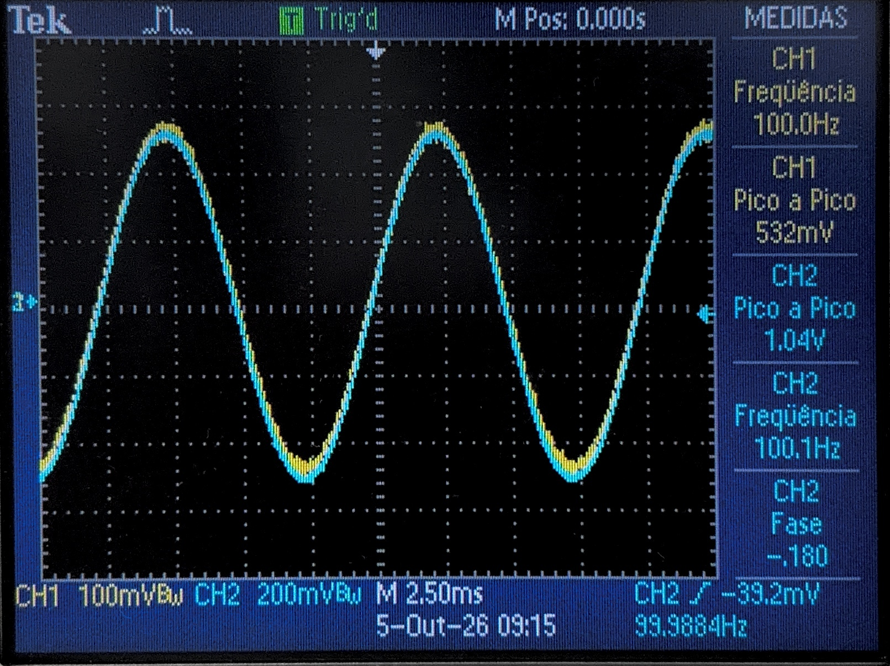{.foto-bancada}

*U1, 100 Hz.*

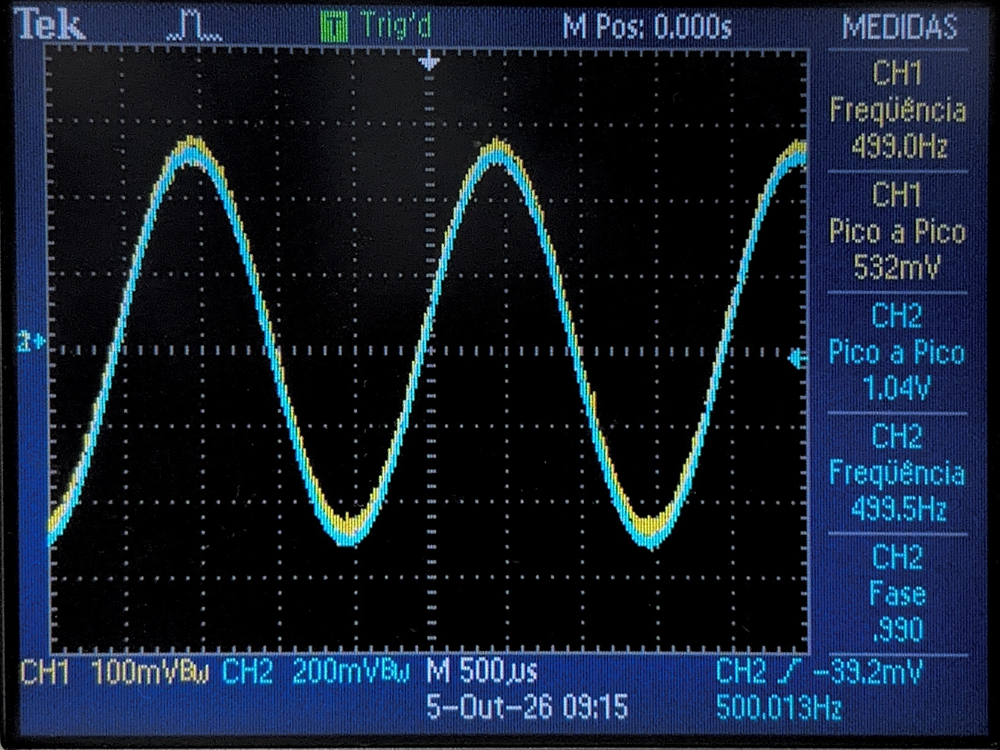{.foto-bancada}

*U1, 499 Hz.*

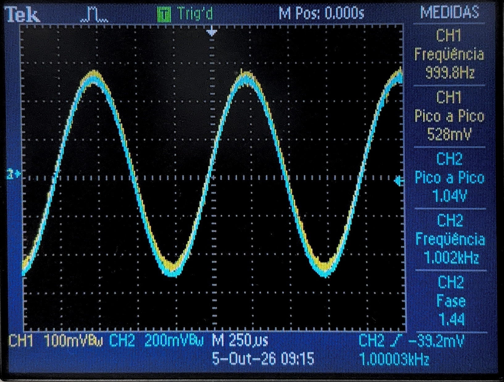{.foto-bancada}

*U1, 1,00 kHz.*

{.foto-bancada}

*U1, 9,98 kHz.*

{.foto-bancada}

*U1, 50,25 kHz.*

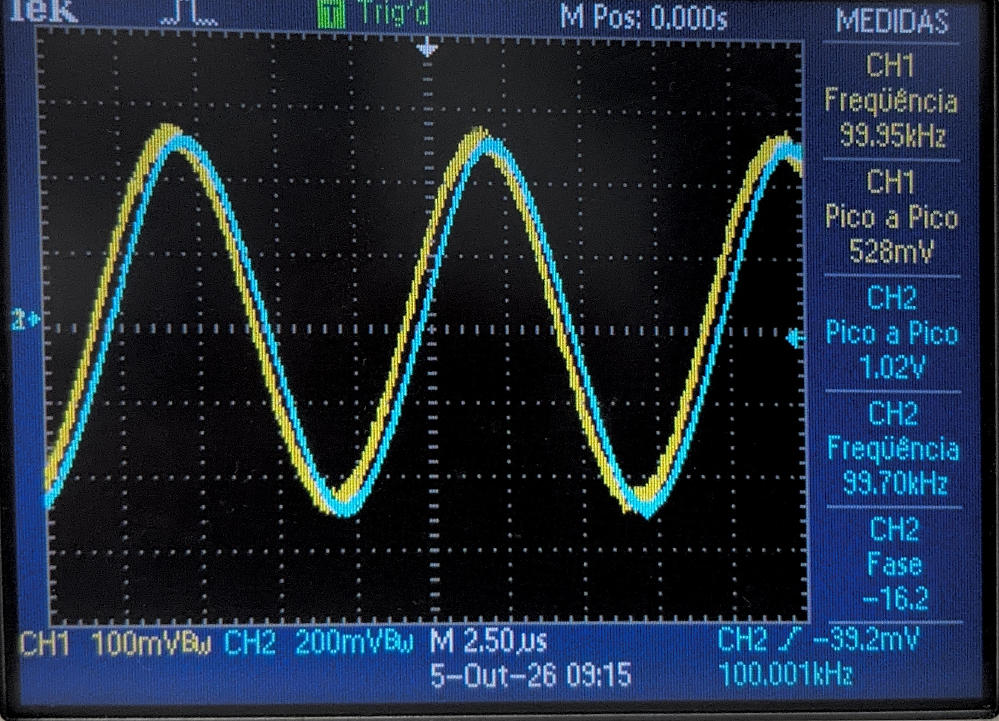{.foto-bancada}

*U1, 99,95 kHz.*

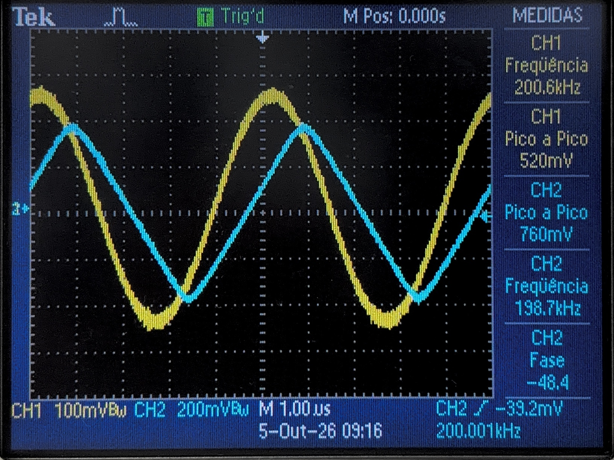{.foto-bancada}

*U1, 200,6 kHz.*

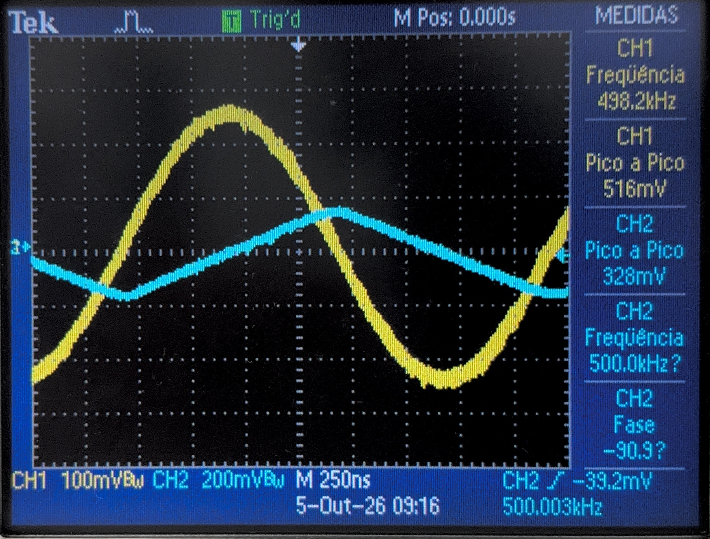{.foto-bancada}

*U1, 498,2 kHz.*

{.foto-bancada}

*U1, 995,4 kHz.*

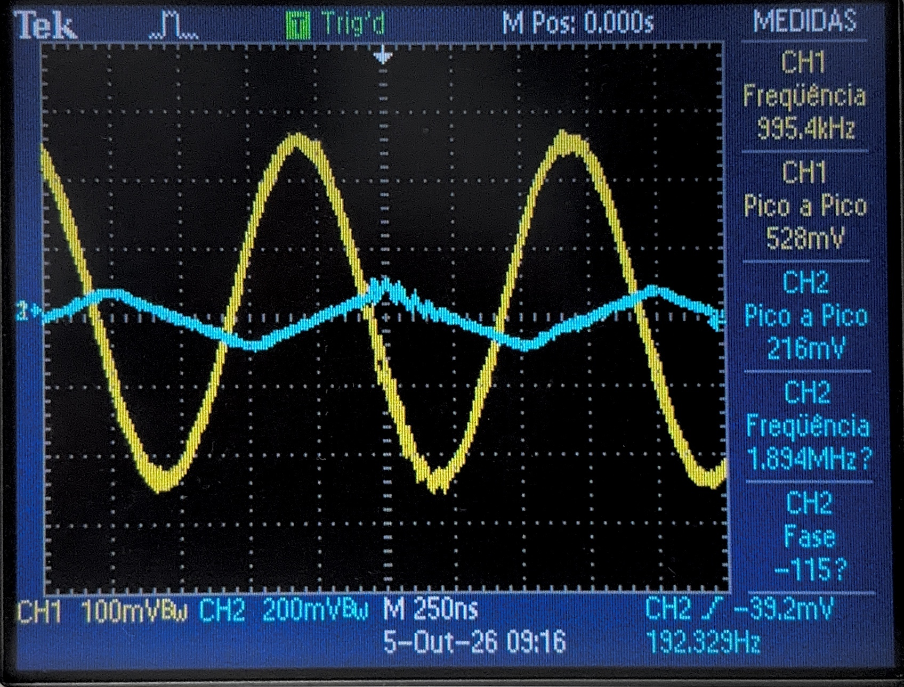{.foto-bancada}

*U1, 500,3 kHz, repetição.*

## 4. Bancada com LM741: U2, ganho 11

| Frequência | Entrada $V_{pp}$ | Saída $V_{pp}$ | Ganho medido | Fase indicada | Saída |
|---:|---:|---:|---:|---:|---|
| 100 Hz | 512 mV | 5,60 V | 10,94 | +0,72° | senoidal |
| 1,00 kHz | 496 mV | 5,60 V | 11,29 | -2,52° | senoidal |
| 10,00 kHz | 538 mV | 5,52 V | 10,26 | -14,4° | senoidal |
| 20,02 kHz | 564 mV | 5,40 V | 9,57 | -25,1° | início de deformação |
| 50,00 kHz | 620 mV | 3,20 V | 5,16 | -61,3°* | triangular |
| 99,80 kHz | 496 mV | 1,64 V | 3,31 | -71,9°* | triangular |
| 193,7 kHz | 496 mV | 840 mV | 1,69 | -86,5°* | triangular |
| 500,5 kHz | 552 mV | 348 mV | 0,63 | -101°* | triangular |

Em 100 Hz e 1 kHz, a bancada entregou 10,94 e 11,29 V/V, respectivamente: ambos próximos do ganho esperado de 11. A forma de onda começa a mudar por volta de 20 kHz e está triangular em 50 kHz. A tela próxima de 1 MHz foi descartada da tabela: a entrada caiu para 73,6 mVpp e a saída, de 39,2 mVpp, ficou próxima do ruído.

As nove capturas recebidas para U2 estão incluídas abaixo, inclusive a tela próxima de 1 MHz que foi descartada da tabela.

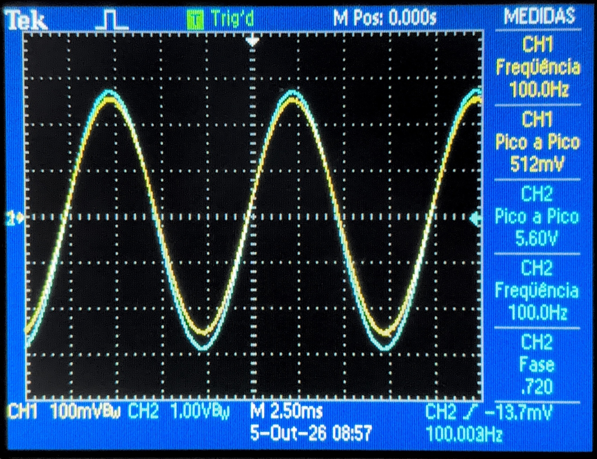{.foto-bancada}

*U2, 100 Hz.*

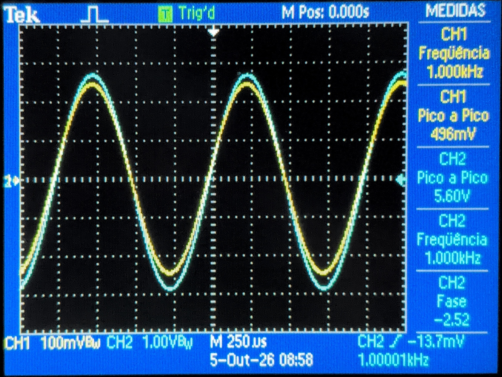{.foto-bancada}

*U2, 1,00 kHz.*

{.foto-bancada}

*U2, 10,00 kHz.*

{.foto-bancada}

*U2, 20,02 kHz.*

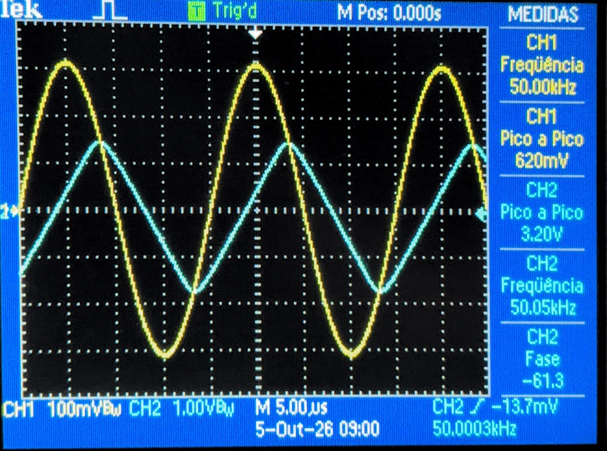{.foto-bancada}

*U2, 50,00 kHz.*

{.foto-bancada}

*U2, 99,8 kHz.*

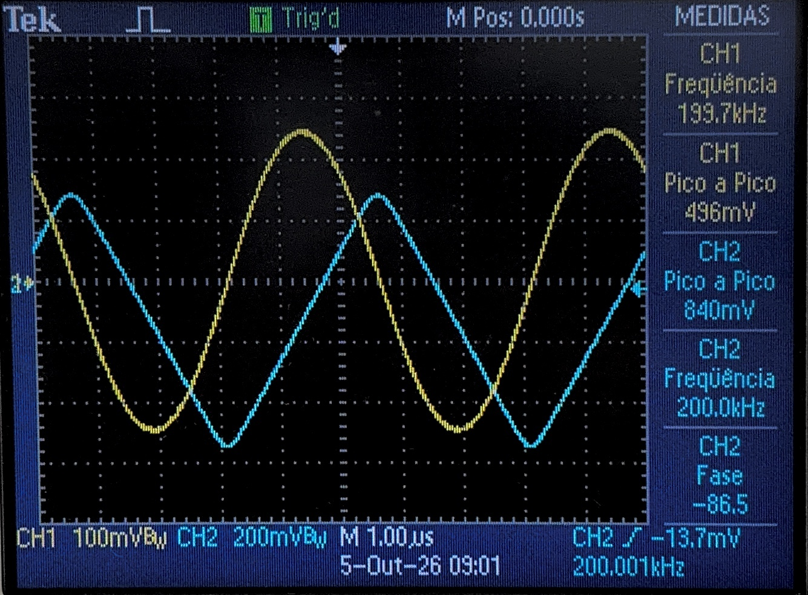{.foto-bancada}

*U2, 193,7 kHz.*

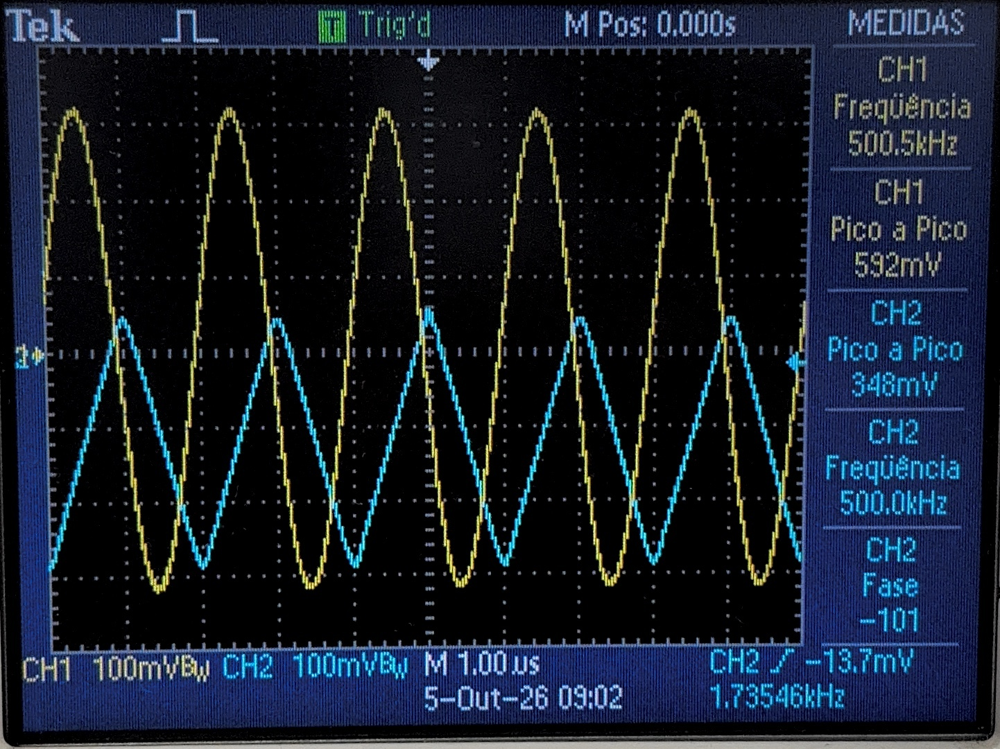{.foto-bancada}

*U2, 500,5 kHz.*

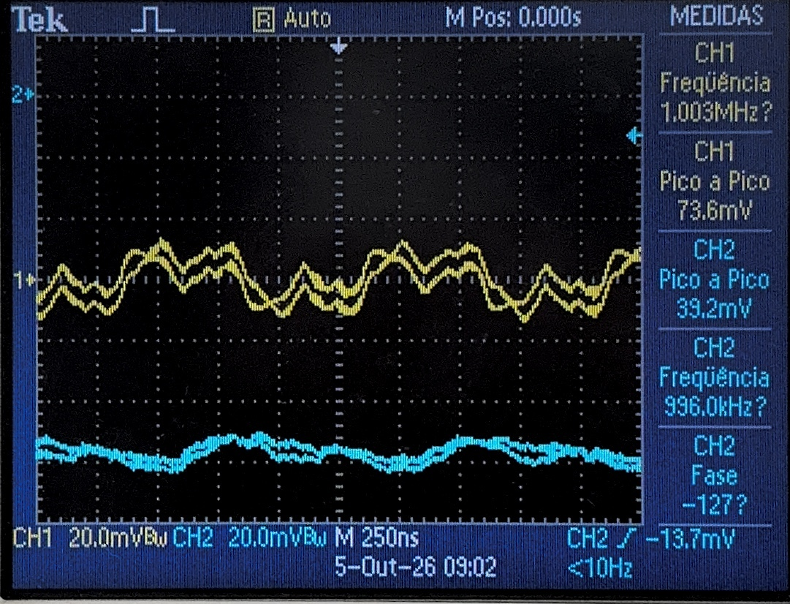{.foto-bancada}

*U2, aproximadamente 1 MHz. Tela descartada: a entrada caiu para 73,6 mVpp e a saída ficou próxima do ruído.*

As fases com asterisco são leituras automáticas sobre ondas deformadas. Mesmo nos pontos senoidais, a fase não foi conferida por cursores; por isso é registrada como indicação do instrumento, sem usá-la para calcular a frequência de corte.

## 5. Bancada comparada à simulação

A varredura AC do Proteus usa sinais pequenos e calcula a resposta linear do circuito. O gráfico abaixo reúne os dados exportados de `LM741.DAT` e os ganhos calculados das fotos. Os pontos verdes correspondem a saídas senoidais; os vermelhos, a saídas deformadas.

*Figura 8 - Ganho em dB, obtido por $20\log_{10}G$. A concordância ocorre enquanto a saída é senoidal. Após a deformação, a amplitude medida cai antes do corte previsto pela simulação AC.*

| Circuito e frequência | Ganho na bancada | Ganho no Proteus | Leitura da tela |
|---|---:|---:|---|
| U1, 100 Hz | 1,95 | 2,00 | acordo em baixa frequência |
| U1, 100 kHz | 1,93 | 1,98 | acordo próximo ao limite observado |
| U1, 200 kHz | 1,46 | 1,91 | saída já deformada |
| U1, 498 kHz | 0,64 | 1,58 | saída triangular |
| U2, 100 Hz | 10,94 | 11,00 | acordo em baixa frequência |
| U2, 10 kHz | 10,26 | 10,94 | saída ainda senoidal |
| U2, 20 kHz | 9,57 | 10,75 | início da deformação |
| U2, 50 kHz | 5,16 | 9,66 | saída triangular |
| U2, 100 kHz | 3,31 | 7,45 | saída triangular |

O padrão é o mesmo nos dois circuitos: a simulação e a bancada concordam em baixa frequência, depois se separam quando a saída deixa de ser senoidal. O corte de 3 dB da simulação ocorre em 631 kHz para U1 e 91,9 kHz para U2. Essas frequências **não foram determinadas em bancada** com a amplitude aplicada, pois a distorção apareceu antes.

### O que limita a bancada

O LM741 da bancada apresentou slew rate de cerca de 0,34 V/µs na Atividade 01. U2 exige esse valor para produzir 5,40 Vpp senoidais a 20 kHz, justamente onde começa a deformar. U1 exige 0,32 V/µs a 100 kHz e deforma no ponto seguinte.

As rampas triangulares também indicam o limite: $2fV_{s,pp}$ vale 0,32 a 0,35 V/µs em U2 (50 a 500 kHz) e 0,327 V/µs em U1 (498 kHz). A queda de amplitude é compatível com slew rate, não com uma medição isolada da largura de banda linear.

A entrada variou de 516 a 532 mVpp em U1 e de 496 a 620 mVpp em U2. Para medir o corte AC, ela deve ser menor e constante. Com 50 mVpp, U2 produziria cerca de 0,55 Vpp e exigiria apenas 0,17 V/µs a 100 kHz.

## 6. Conclusão

Para os quatro circuitos, a teoria e a simulação mostram a troca de ganho por faixa de frequência com LM741 e TL081. Na bancada com LM741, U1 e U2 confirmaram os ganhos de baixa frequência de cerca de 2 e 11 V/V. Com aproximadamente 0,5 Vpp na entrada, U2 começa a deformar em 20 kHz e U1 entre 100 e 200 kHz. As rampas seguintes confirmam o limite de 0,34 V/µs.

A simulação AC prevê corte linear em 91,9 kHz (U2) e 631 kHz (U1). A bancada atingiu antes o limite de velocidade da saída. Para medir esses cortes, a varredura deve ser repetida com entrada menor, constante e saída senoidal.

**Dados:** 19 imagens de `U1 (2).pdf` e `U2 (2).pdf` em `imgs/protoboard/2026-10-05/`; `LM741.DAT`, `TL081.DAT`, Atividade 01 e fichas da TI para [LM741](https://www.ti.com/product/LM741) e [TL081](https://www.ti.com/product/TL081).

