# Atividade 02 - Resposta em frequência com LM741 e TL081

**Curso:** Engenharia Eletrônica **Unidade curricular:** Filtros Ativos **Professor:** Luis Carlos Martinhago Schlichting

## 1. Objetivo e circuitos

Levantar a resposta em frequência de quatro amplificadores não inversores de mesma topologia e ganhos diferentes, por três caminhos: cálculo, simulação no Proteus e medida em bancada. Alimentação de ±15 V em todos os casos.

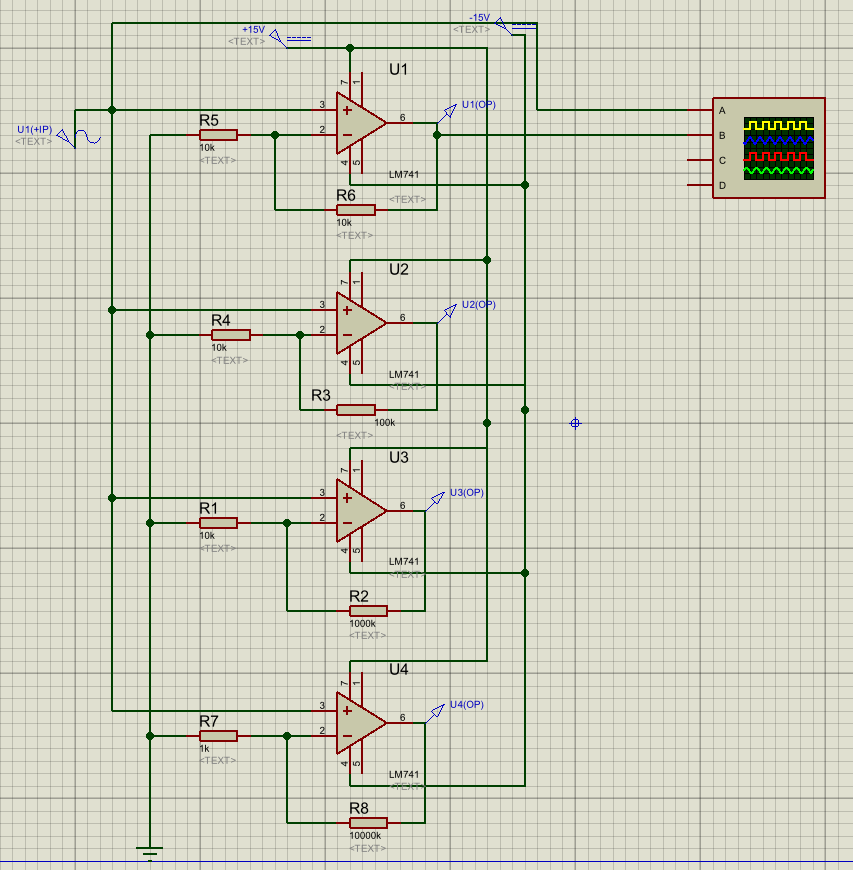

*Figura 1 - Circuitos U1 a U4.*

| Circuito | $R_g$ | $R_f$ | Ganho ideal $1+R_f/R_g$ |
|:---:|---:|---:|---:|
| U1 | 10 kΩ | 10 kΩ | 2 V/V |
| U2 | 10 kΩ | 100 kΩ | 11 V/V |
| U3 | 10 kΩ | 1 MΩ | 101 V/V |
| U4 | 1 kΩ | 10 MΩ | 10 001 V/V |

Cálculo e simulação cobrem os quatro circuitos com os dois amplificadores. A bancada cobre U1 e U2 com LM741: com a mesma entrada, o ganho de 101 de U3 e de 10 001 de U4 levaria a saída ao trilho de alimentação, e a medida deixaria de ser de resposta em frequência.

## 2. Previsão teórica

O amplificador operacional tem um polo dominante:

$$A(f)=\frac{A_0}{1+j(f/f_p)}$$

Com realimentação, $\beta=R_g/(R_g+R_f)=1/G$, e o corte em malha fechada vale:

$$f_c=f_p(1+A_0\beta)\approx \beta\,GBW=\frac{GBW}{G}$$

O ganho consome o produto ganho-banda do componente: dobrar o ganho corta a faixa pela metade ([nota de aplicação da Texas Instruments](https://www.ti.com/lit/an/sboa114/sboa114.pdf)). O LM741 tem GBW típico de 1 MHz; o TL081, de 3 MHz.

| Circuito | Ganho | Corte com LM741 | Corte com TL081 |
|:---:|---:|---:|---:|
| U1 | 2 V/V | 500 kHz | 1,50 MHz |
| U2 | 11 V/V | 90,9 kHz | 272,7 kHz |
| U3 | 101 V/V | 9,91 kHz | 29,7 kHz |
| U4 | 10 001 V/V | 105 Hz | 315 Hz |

Em U4 o ganho pedido já está perto do ganho de malha aberta do componente, e o ganho real em baixa frequência cai para cerca de 9 525 V/V. Esse valor foi usado no corte previsto.

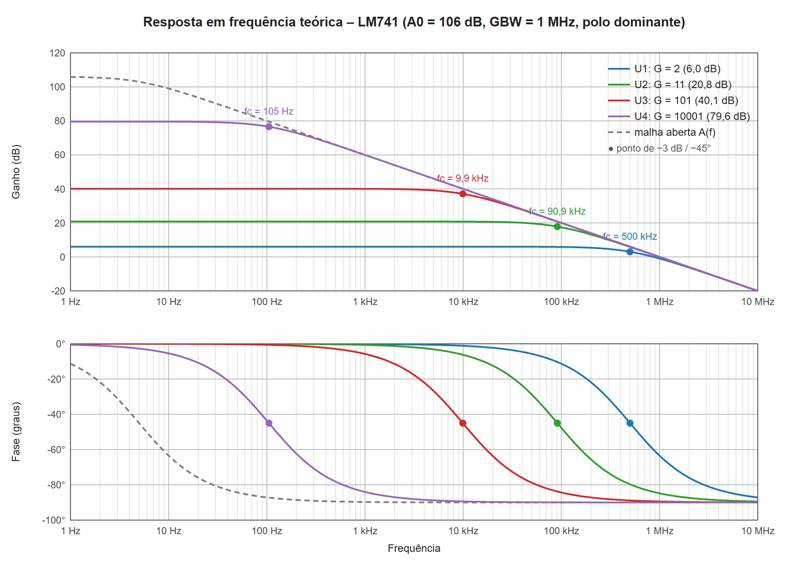

*Gráfico 1 - Ganho e fase previstos com LM741.*

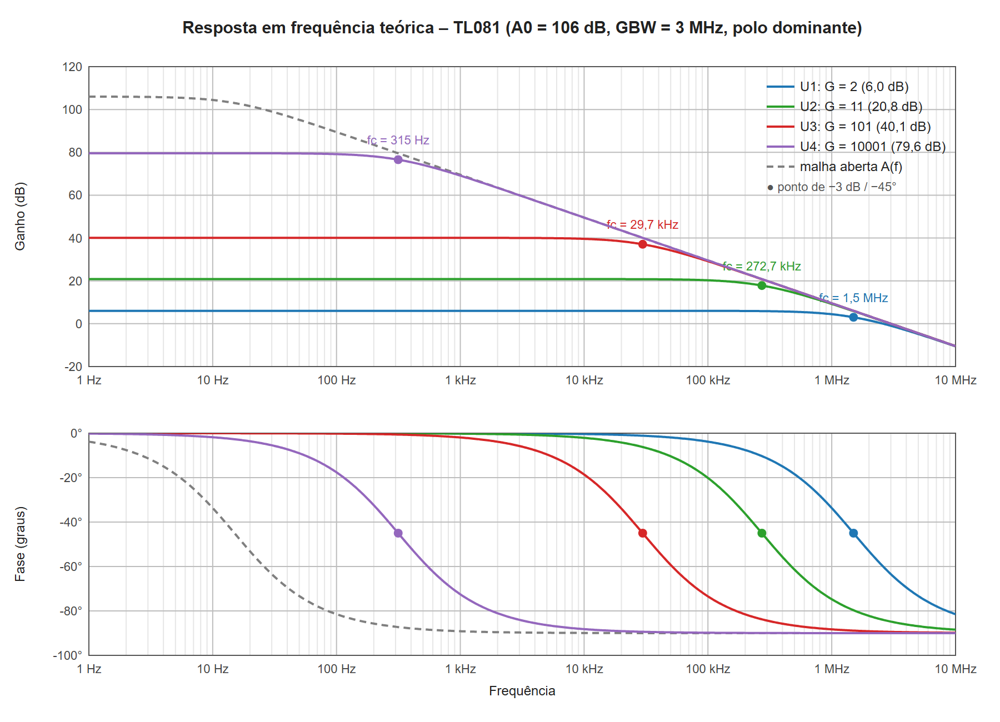

*Gráfico 2 - Mesma previsão com TL081. Os ganhos de baixa frequência não mudam; os cortes sobem na mesma proporção do GBW.*

## 3. Simulação no Proteus

Varredura AC de 1 Hz a 25 MHz, primeiro com LM741 e depois com TL081, trocando apenas o modelo dos amplificadores. O corte foi lido onde o ganho cai 3 dB em relação à baixa frequência. Dados exportados em `LM741.DAT` e `TL081.DAT`.

| Circuito | Ganho simulado em baixa frequência | Corte com LM741 | Corte com TL081 |
|:---:|---:|---:|---:|
| U1 | 2,00 V/V | 631 kHz | 2,231 MHz |
| U2 | 11,00 V/V | 91,9 kHz | 329,0 kHz |
| U3 | 100,95 V/V | 9,62 kHz | 34,33 kHz |
| U4 | 9 525 V/V | 104,7 Hz | 359,8 Hz |

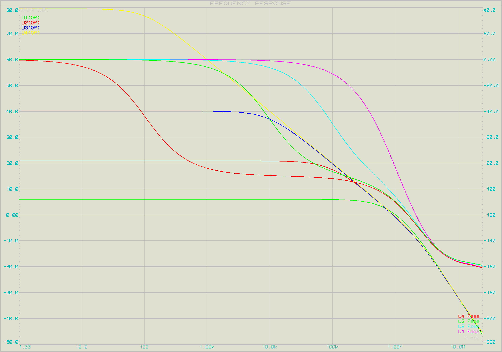

*Gráfico 3 - Proteus com LM741: ganho no eixo esquerdo, fase no direito.*

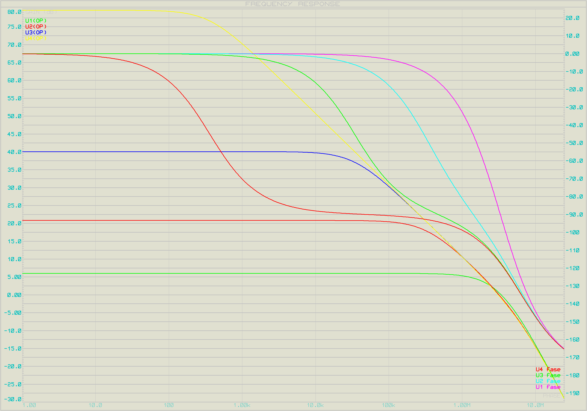

*Gráfico 4 - Proteus com TL081, mesmos resistores.*

Os quatro cortes seguem a previsão em U2, U3 e U4, com erro abaixo de 3 %. U1 ficou em 631 kHz contra 500 kHz calculados: é o circuito de menor ganho, cujo corte cai perto dos polos secundários do modelo, que o polo dominante sozinho não representa. O ganho de U4 confirma a perda prevista por ganho de malha aberta finito.

## 4. Medidas em bancada

### 4.1 Procedimento

Osciloscópio Tektronix TDS 2024C, gerador de funções Tektronix, montagem em protoboard com LM741. CH1 (amarelo) na entrada, CH2 (ciano) na saída. Em cada frequência registrei as amplitudes pico a pico, a fase indicada pelo instrumento e a forma de onda. O ganho é a razão das duas amplitudes da mesma tela, $G=V_{s,pp}/V_{e,pp}$.

A entrada foi mantida em torno de 0,5 Vpp, variando de 516 a 532 mVpp em U1 e de 496 a 620 mVpp em U2. As telas estão em `imgs/protoboard/2026-10-05/`.

Duas ressalvas de leitura. A fase é a medida automática do osciloscópio, não foi conferida com cursores. E, quando a saída deixa de ser senoidal, a razão de amplitudes não é mais ganho linear: os pontos nessa condição estão marcados com asterisco.

### 4.2 U1, ganho 2

| Frequência | Entrada $V_{pp}$ | Saída $V_{pp}$ | Ganho medido | Ganho previsto | Fase medida | Fase prevista | Saída |
|---:|---:|---:|---:|---:|---:|---:|---|
| 100 Hz | 532 mV | 1,04 V | 1,95 | 2,00 | -0,18° | 0° | senoidal |
| 500 Hz | 532 mV | 1,04 V | 1,95 | 2,00 | +0,99° | -0,1° | senoidal |
| 1 kHz | 528 mV | 1,04 V | 1,97 | 2,00 | +1,44° | -0,1° | senoidal |
| 10 kHz | 532 mV | 1,03 V | 1,94 | 2,00 | -2,71° | -1,1° | senoidal |
| 50 kHz | 516 mV | 1,02 V | 1,98 | 1,99 | -7,20° | -5,7° | senoidal |
| 100 kHz | 528 mV | 1,02 V | 1,93 | 1,96 | -16,2° | -11,3° | quase senoidal |
| 200 kHz | 520 mV | 760 mV | 1,46* | 1,86 | -48,4°* | -21,8° | deformada |
| 500 kHz | 516 mV | 328 mV | 0,64* | 1,41 | -90,9°* | -45,0° | triangular |
| 1 MHz | 528 mV | 216 mV | 0,41* | 0,89 | -115°* | -63,4° | deformada, leitura instável |

Até 100 kHz o ganho fica entre 1,93 e 1,98 V/V, contra 2 V/V previstos. A diferença de 2 % a 3 % é compatível com a tolerância dos resistores. De 200 kHz em diante a saída perde amplitude e deixa de ser senoidal, antes do corte previsto. Uma segunda captura em 500 kHz, com outra base de tempo, repetiu o resultado: 520 mVpp na entrada e 328 mVpp na saída.

{.foto-bancada}

*Figura 2 - U1 em 1 kHz. Saída senoidal, ganho 1,97.*

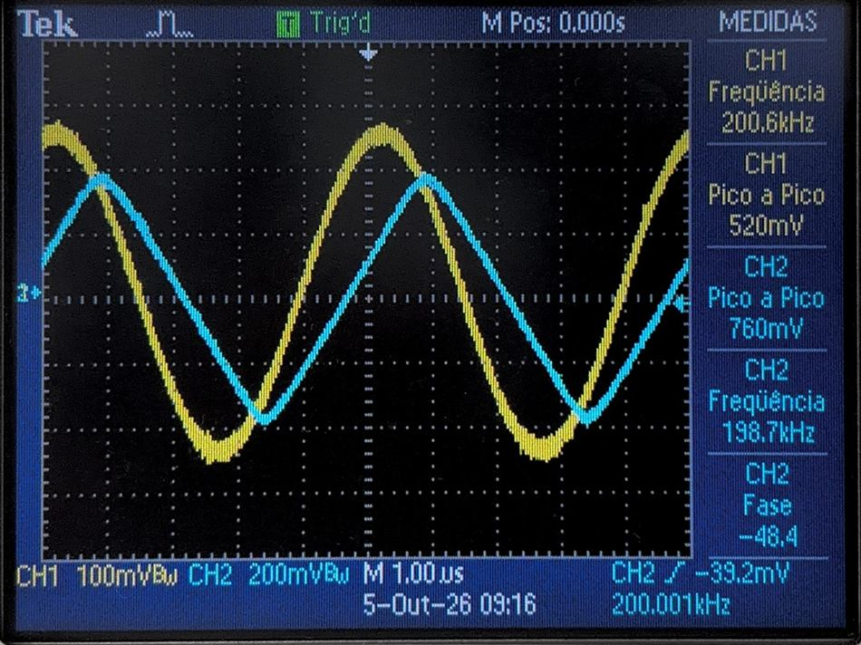{.foto-bancada}

*Figura 3 - U1 em 200 kHz. A saída já não acompanha a entrada e os flancos ficam retos.*

{.foto-bancada}

*Figura 4 - U1 em 500 kHz. Saída triangular, com 328 mVpp.*

### 4.3 U2, ganho 11

| Frequência | Entrada $V_{pp}$ | Saída $V_{pp}$ | Ganho medido | Ganho previsto | Fase medida | Fase prevista | Saída |
|---:|---:|---:|---:|---:|---:|---:|---|
| 100 Hz | 512 mV | 5,60 V | 10,94 | 11,00 | +0,72° | -0,1° | senoidal |
| 1 kHz | 496 mV | 5,60 V | 11,29 | 11,00 | -2,52° | -0,6° | senoidal |
| 10 kHz | 530 mV | 5,52 V | 10,42 | 10,93 | -14,4° | -6,3° | senoidal |
| 20 kHz | 564 mV | 5,40 V | 9,57 | 10,74 | -25,1° | -12,4° | início de deformação |
| 50 kHz | 620 mV | 3,20 V | 5,16* | 9,64 | -61,3°* | -28,8° | triangular |
| 100 kHz | 496 mV | 1,64 V | 3,31* | 7,40 | -71,9°* | -47,7° | triangular |
| 200 kHz | 496 mV | 840 mV | 1,69* | 4,55 | -86,5°* | -65,6° | triangular |
| 500 kHz | 592 mV | 348 mV | 0,59* | 1,97 | -101°* | -79,7° | triangular |

Em 100 Hz e 1 kHz o ganho deu 10,94 e 11,29 V/V, contra 11 V/V previstos. A forma de onda começa a mudar em 20 kHz e está triangular em 50 kHz, muito antes dos 90,9 kHz de corte. A tela de 1 MHz foi descartada da tabela: a entrada caiu para 73,6 mVpp e a saída, de 39,2 mVpp, ficou no nível do ruído.

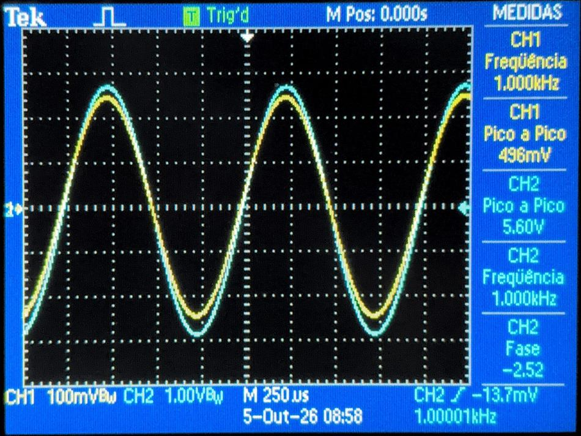{.foto-bancada}

*Figura 5 - U2 em 1 kHz. Saída senoidal de 5,60 Vpp.*

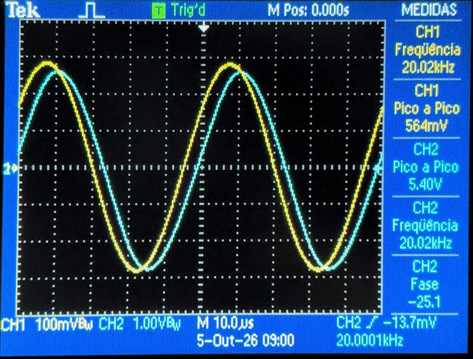{.foto-bancada}

*Figura 6 - U2 em 20 kHz. Primeira tela com deformação visível.*

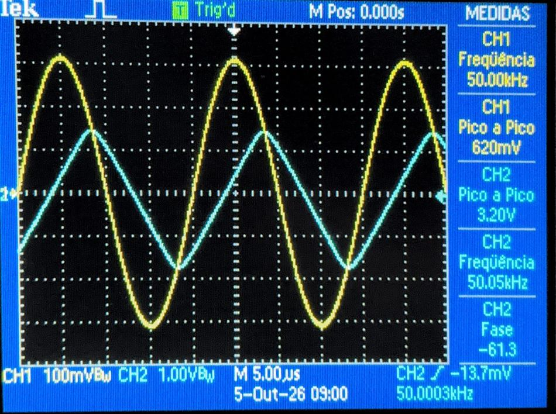{.foto-bancada}

*Figura 7 - U2 em 50 kHz. Saída triangular, com rampas de inclinação constante.*

## 5. Teoria, simulação e bancada

### 5.1 Ganho em baixa frequência

| Circuito | Teoria | Proteus | Bancada |
|:---:|---:|---:|---:|
| U1 | 2,00 V/V | 2,00 V/V | 1,95 V/V |
| U2 | 11,00 V/V | 11,00 V/V | 10,94 V/V |

Os três resultados coincidem dentro de 3 %. A diferença da bancada é da ordem da tolerância dos resistores: o ganho de 1,95 corresponde a $R_f/R_g=0{,}95$, dentro de uma faixa de 5 %.

### 5.2 Ganho ao longo da faixa

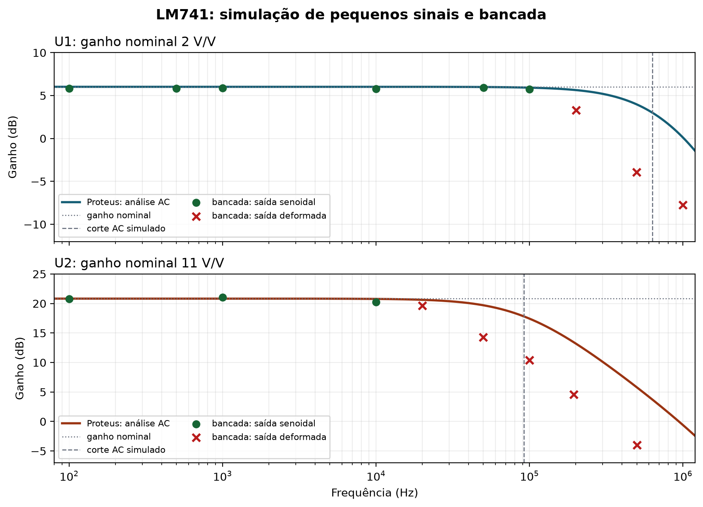

*Gráfico 5 - Ganho em dB. Linha: varredura AC do Proteus. Pontos verdes: bancada com saída senoidal. Pontos vermelhos: bancada com saída deformada.*

| Circuito e frequência | Bancada | Proteus | Teoria |
|---|---:|---:|---:|
| U1, 100 Hz | 1,95 | 2,00 | 2,00 |
| U1, 100 kHz | 1,93 | 1,98 | 1,96 |
| U1, 200 kHz | 1,46* | 1,92 | 1,86 |
| U1, 500 kHz | 0,64* | 1,58 | 1,41 |
| U2, 100 Hz | 10,94 | 11,00 | 11,00 |
| U2, 10 kHz | 10,42 | 10,94 | 10,93 |
| U2, 20 kHz | 9,57 | 10,75 | 10,74 |
| U2, 50 kHz | 5,16* | 9,66 | 9,64 |
| U2, 100 kHz | 3,31* | 7,44 | 7,40 |

Teoria e simulação ficam coladas em toda a faixa. A bancada acompanha enquanto a saída é senoidal e se descola a partir do ponto em que a onda deforma: 20 kHz em U2 e 200 kHz em U1.

### 5.3 Frequência de corte

| Circuito | Teoria | Proteus | Bancada |
|:---:|---:|---:|---:|
| U1 | 500 kHz | 631 kHz | não alcançada |
| U2 | 90,9 kHz | 91,9 kHz | não alcançada |

Com a amplitude usada, a saída deformou antes do corte nos dois circuitos. Os valores de corte deste relatório, portanto, vêm de cálculo e simulação; a bancada confirmou o ganho de baixa frequência e identificou outro limite, tratado em 5.5.

### 5.4 Fase

Na região senoidal, a fase medida segue a tendência prevista, mas sempre com atraso maior: -2,71° contra -1,1° em U1 a 10 kHz, -14,4° contra -6,3° em U2 a 10 kHz. Duas causas, nenhuma delas conferida isoladamente: a medida automática do osciloscópio não foi verificada com cursores e, em U2, 10 kHz já está na metade da frequência em que a saída começa a perder velocidade (item 5.5), o que por si só adiciona atraso. A fase não foi usada para determinar corte.

### 5.5 Por que a bancada parou antes do corte

O limite encontrado foi o slew rate, não a banda de pequenos sinais. A inclinação máxima de uma senoide de saída é $\pi f V_{s,pp}$. Igualando ao slew rate de 0,34 V/µs, medido neste mesmo LM741 na Atividade 01:

$$f_{SR}=\frac{SR}{\pi V_{s,pp}}$$

| Circuito | $V_{s,pp}$ em baixa frequência | $f_{SR}$ calculada | Primeira tela deformada |
|:---:|---:|---:|---:|
| U1 | 1,04 V | 104 kHz | 200 kHz |
| U2 | 5,60 V | 19,3 kHz | 20 kHz |

Acima de $f_{SR}$ a saída vira rampa e a amplitude passa a valer $V_{s,pp}=SR/(2f)$, sem relação com o ganho do circuito. As telas triangulares confirmam, porque devolvem o próprio slew rate do componente:

| Circuito | Frequência | $V_{s,pp}$ medido | $SR=2fV_{s,pp}$ |
|:---:|---:|---:|---:|
| U2 | 50 kHz | 3,20 V | 0,32 V/µs |
| U2 | 100 kHz | 1,64 V | 0,33 V/µs |
| U2 | 200 kHz | 840 mV | 0,34 V/µs |
| U2 | 500 kHz | 348 mV | 0,35 V/µs |
| U1 | 500 kHz | 328 mV | 0,33 V/µs |
| U1 | 1 MHz | 216 mV | 0,43 V/µs |

Cinco dos seis pontos ficam entre 0,32 e 0,35 V/µs, contra 0,34 V/µs medidos na Atividade 01. O ponto de 1 MHz em U1 tem leitura instável e já inclui ruído.

Para a varredura chegar ao corte é preciso $f_{SR}>f_c$. Como $V_{s,pp}=G\,V_{e,pp}$ e $f_c=GBW/G$, o ganho se cancela e sobra um limite que vale para qualquer um dos quatro circuitos:

$$V_{e,pp}<\frac{SR}{\pi\,GBW}=\frac{0{,}34\ \text{V/µs}}{\pi\cdot 1\ \text{MHz}}\approx 108\ \text{mVpp}$$

A entrada usada, de cerca de 500 mVpp, está cinco vezes acima disso. Com 50 mVpp, U2 entregaria 0,55 Vpp e teria $f_{SR}$ de 197 kHz, contra 91,9 kHz de corte; U1 entregaria 0,10 Vpp e teria 1,1 MHz, contra 631 kHz. Nas duas condições a saída se mantém senoidal além do corte, e a comparação com a varredura AC passa a valer na faixa inteira.

## 6. Conclusão

O ganho é pago com faixa de frequência. Cálculo e simulação concordam nisso nos quatro circuitos: com LM741, o corte cai de 500 kHz em U1 para 105 Hz em U4, e trocar para o TL081 multiplica as quatro faixas por três, sem mexer nos ganhos. O produto ganho-banda do componente é o que está sendo dividido.

A bancada confirmou os ganhos de baixa frequência de U1 e U2, 1,95 e 10,94 V/V contra 2 e 11 previstos. Não confirmou os cortes: com 0,5 Vpp na entrada, a saída de U2 deformou em 20 kHz e a de U1 entre 100 e 200 kHz, exatamente nas frequências calculadas pelo slew rate. As rampas triangulares que aparecem depois devolvem 0,32 a 0,35 V/µs, o mesmo valor medido na Atividade 01, o que fecha o diagnóstico.

Ou seja, a varredura AC descreve o circuito só enquanto o amplificador consegue seguir o sinal. Dois limites diferentes, um de banda e outro de velocidade, e nesta montagem o segundo apareceu primeiro. Para medir o corte basta reduzir a entrada para menos de 108 mVpp, critério que não depende do ganho do circuito.

## Apêndice - demais telas

{.foto-bancada}

*U1, 100 Hz.*

{.foto-bancada}

*U1, 500 Hz.*

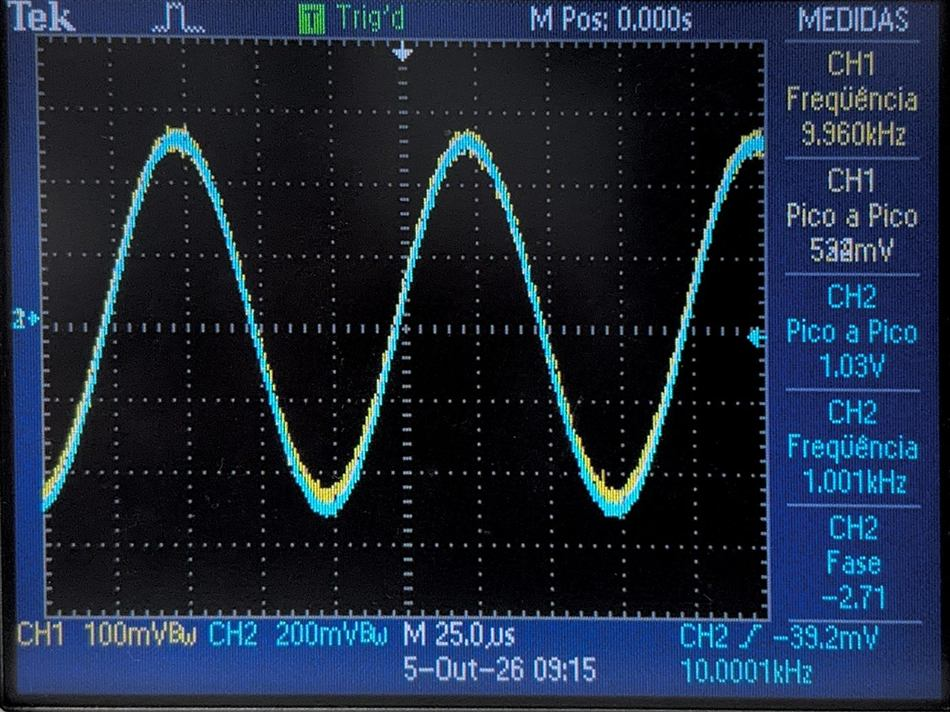{.foto-bancada}

*U1, 10 kHz.*

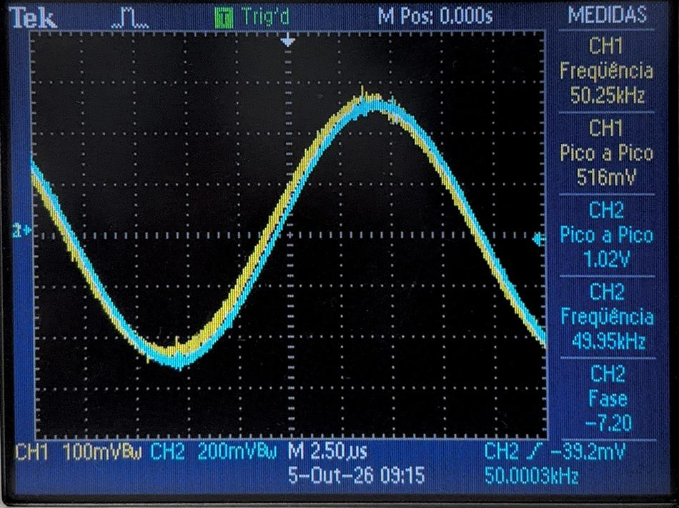{.foto-bancada}

*U1, 50 kHz.*

{.foto-bancada}

*U1, 100 kHz.*

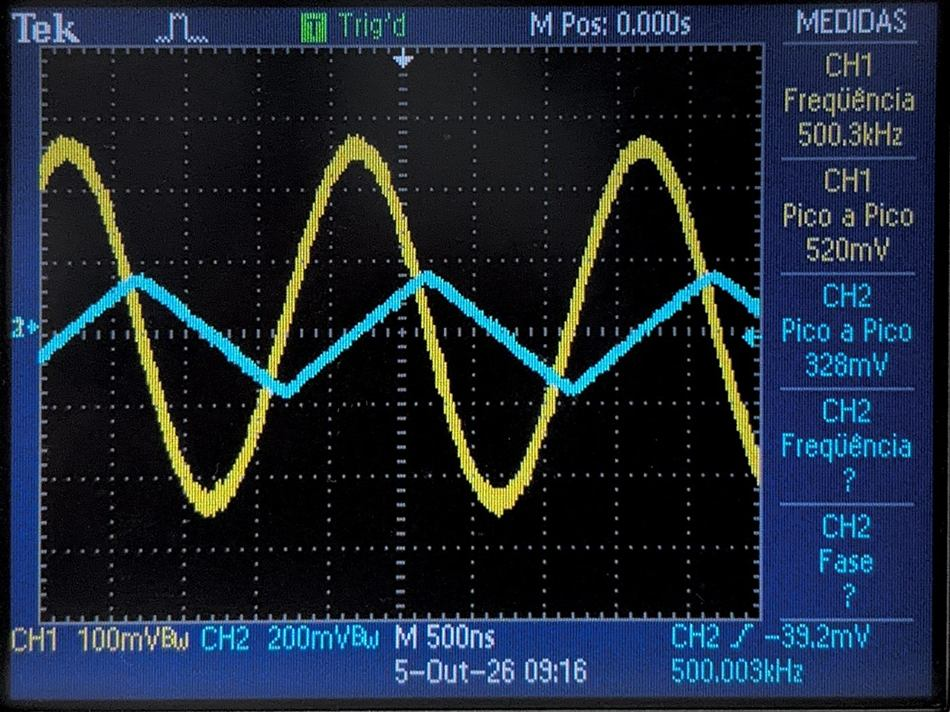{.foto-bancada}

*U1, 500 kHz, segunda captura com outra base de tempo.*

{.foto-bancada}

*U1, 1 MHz.*

{.foto-bancada}

*U2, 100 Hz.*

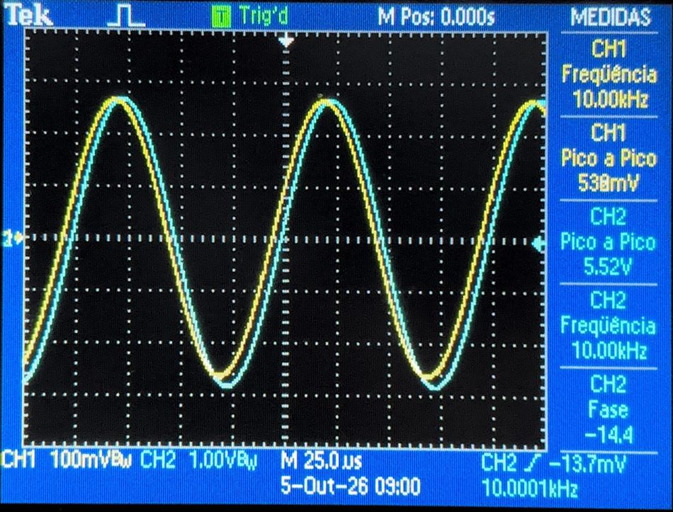{.foto-bancada}

*U2, 10 kHz.*

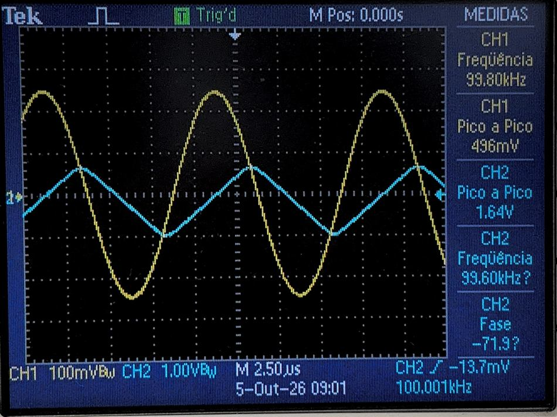{.foto-bancada}

*U2, 100 kHz.*

{.foto-bancada}

*U2, 200 kHz.*

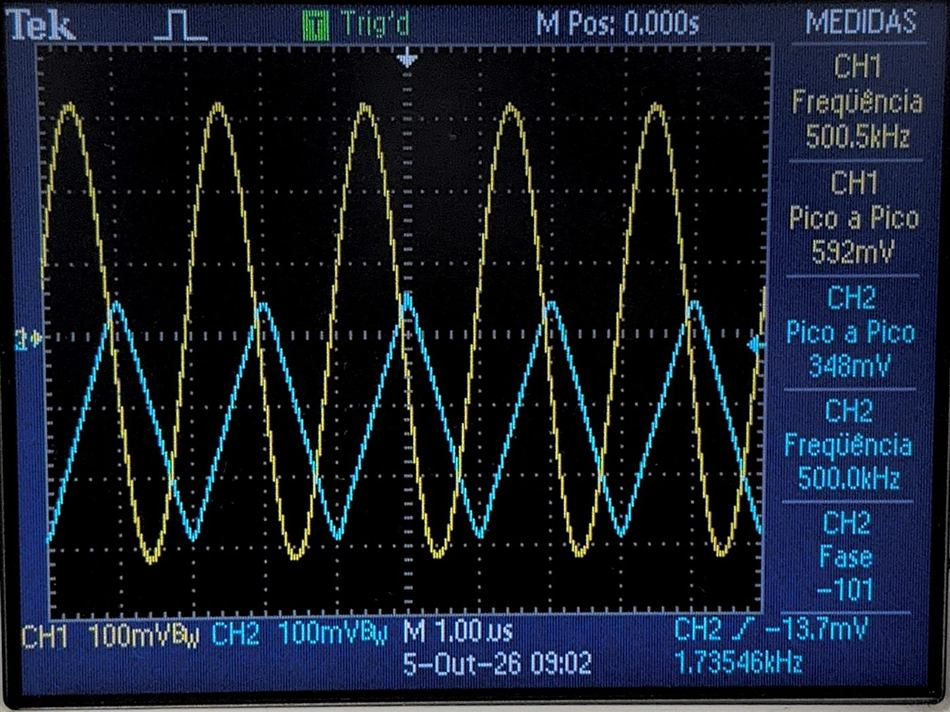{.foto-bancada}

*U2, 500 kHz.*

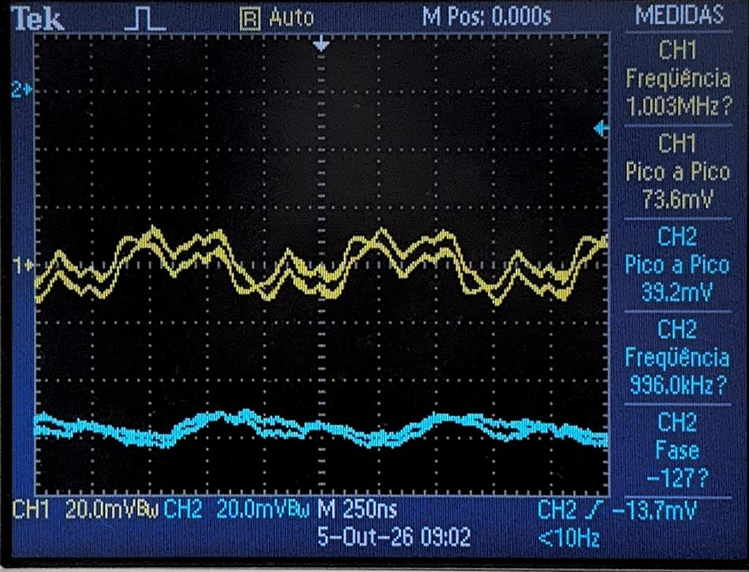{.foto-bancada}

*U2, 1 MHz. Tela descartada: entrada de 73,6 mVpp e saída no nível do ruído.*

## Arquivos e referências

Telas de bancada em `imgs/protoboard/2026-10-05/`. Varreduras do Proteus em `LM741.DAT` e `TL081.DAT`, projetos em `atividade_02_resposta_em_frequencia.pdsprj` e `atividade_02_resposta_em_frequencia_tl081.pdsprj`. Gráficos teóricos gerados por `gerar_graficos.ps1` e comparativo por `gerar_comparativo_bancada.py`. Slew rate de 0,34 V/µs medido na Atividade 01. Fichas técnicas: [LM741](https://www.ti.com/product/LM741) e [TL081](https://www.ti.com/product/TL081).
