# Atividade 01 – Não Idealidades em Amplificadores Operacionais

**Curso:** CST Eletrônica Industrial / Engenharia Eletrônica
**Unidade Curricular:** FIL221A06 – Filtros Ativos
**Professor:** Luis Carlos Martinhago Schlichting

---

## Objetivo

Ver na teoria e na simulação (e, na Parte 2, também na bancada) como algumas limitações reais dos ampops afetam um circuito: valor dos resistores de realimentação, carga na saída, saturação de tensão, limite de corrente de saída e slew rate.

Na Parte 1 foi usado o **LM741**. Na Parte 2 o LM741 (entrada bipolar) foi comparado com o **TL082** (entrada JFET). O TL082 é um TL081 duplo, com dois ampops no mesmo CI e as mesmas características.

---

# PARTE 1 – Impedância e Saturação

## 1.1 Circuito

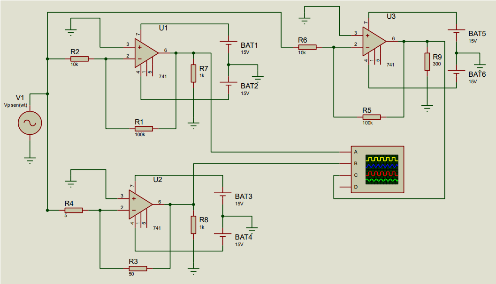

*Figura 1 – Circuito da Parte 1.*

São três amplificadores inversores (U1, U2 e U3) ligados na mesma fonte V1 (senoide de 1 kHz), com alimentação de ±15 V. A entrada não inversora de todos está no terra.

| Circuito | R_in | R_f | R_L (carga) | Ganho ideal $A_v = -R_f/R_{in}$ | Alimentação |
|----------|:----:|:---:|:-----------:|:--------------------------------:|:-----------:|
| U1 | R2 = 10 kΩ | R1 = 100 kΩ | R7 = 1 kΩ | −10 | ±15 V |
| U2 | R4 = 5 Ω | R3 = 50 Ω | R8 = 1 kΩ | −10 | ±15 V |
| U3 | R6 = 10 kΩ | R5 = 100 kΩ | R9 = 300 Ω | −10 | ±15 V |

Os três têm o mesmo ganho (−10), mas mudam em outras coisas:

- U1 e U2 têm a mesma carga, mas os resistores de U2 são de ohms e não de kΩ. Serve para ver o efeito de uma realimentação de baixa impedância.
- U1 e U3 têm a mesma realimentação, mas a carga de U3 é bem menor (300 Ω). Serve para ver o efeito da carga.

**Procedimento:**

1. Calcular o ganho de cada circuito.
2. Aplicar uma senoide de 1 kHz com 1 V de pico e medir a saída de U1, U2 e U3.
3. Repetir com 3 V de pico.
4. Ver se a limitação em cada caso é de tensão (alimentação) ou de corrente de saída.

---

## 1.2 Teoria

### Ganho

Com V⁺ no terra, pelo curto-circuito virtual V⁻ = 0 e:

$$I_{R_{in}} = \frac{V_{in}}{R_{in}} = I_{R_f} = \frac{-V_{out}}{R_f} \quad \Rightarrow \quad A_v = \frac{V_{out}}{V_{in}} = -\frac{R_f}{R_{in}}$$

$$A_{v,U1} = -\frac{100k}{10k} = -10 \qquad A_{v,U2} = -\frac{50}{5} = -10 \qquad A_{v,U3} = -\frac{100k}{10k} = -10$$

### Saturação de tensão

A saída não passa de mais ou menos `V_CC − 2 V`. Valores típicos do LM741 com ±15 V:

| Parâmetro (típico, LM741) | Valor |
|---------------------|:-----:|
| Excursão de saída (V_sat), R_L ≥ 2 kΩ | ≈ ±13 V |
| Corrente de curto-circuito na saída (I_sc) | ≈ 25 mA |
| Resistência de entrada (r_i) | ≈ 2 MΩ (mínimo 0,3 MΩ) |
| Resistência de saída em malha aberta (r_o) | ≈ 75 Ω |
| Ganho em malha aberta (A_VD) | 200 V/mV (mínimo 20 V/mV) |
| Corrente de polarização (I_B) | ≈ 80 nA |

Esses são os valores clássicos do 741 (datasheet µA741 da TI até a revisão G, de 2018). A revisão de 2026 do datasheet mudou vários típicos (I_sc = 80 mA, r_i = 540 GΩ, r_o = 575 Ω), provavelmente por causa de uma versão nova do CI. Aqui foram usados os valores clássicos, que são os que costumam aparecer nos livros.

### Limite de corrente

O ampop também tem um limite de corrente na saída (I_sc). A corrente que ele precisa fornecer é a da carga mais a da realimentação:

$$I_{out} = \frac{|V_{out}|}{R_L} + \frac{|V_{out}|}{R_f}$$

Se essa corrente chegar em I_sc antes de a saída chegar em V_sat, o circuito satura por corrente e a saída máxima fica:

$$V_{out,max} = \frac{I_{sc}}{\dfrac{1}{R_L} + \dfrac{1}{R_f}}$$

Ou seja, dois circuitos com o mesmo ganho podem saturar por motivos diferentes, dependendo dos valores de R_f e R_L.

### Impedâncias e o tamanho dos resistores

O ganho só depende da razão R_f/R_in, mas o valor absoluto dos resistores define as impedâncias que a fonte e o ampop enxergam.

**Impedância de entrada do circuito.** No inversor, a entrada V⁻ fica no terra virtual, então a fonte V1 enxerga só o R_in:

| Circuito | Impedância de entrada ($= R_{in}$) | Corrente pedida à fonte com Vp = 1 V |
|---|:---:|:---:|
| U1 | 10 kΩ | 0,1 mA |
| U2 | **5 Ω** | **200 mA** |
| U3 | 10 kΩ | 0,1 mA |

Em U2 a fonte teria que entregar 200 mA. No Proteus a fonte V1 é ideal e consegue, mas um gerador de funções real tem 50 Ω de impedância de saída. Com uma carga de 5 Ω, sobraria na entrada só $5/(50+5) \approx 9\%$ do sinal (1 V viraria uns 0,09 V). Ou seja, U2 já não funcionaria na prática antes mesmo de chegar no ampop.

**Carga vista pela saída do ampop.** A saída alimenta a carga R_L e também o R_f, que vai até o terra virtual. Os dois ficam em paralelo, então a carga total é $R_f \parallel R_L$, e a fórmula do limite de corrente fica simplesmente $V_{out,max} = I_{sc} \cdot (R_f \parallel R_L)$:

| Circuito | $R_f \parallel R_L$ | $V_{out,max}$ com I_sc = 25 mA | Resultado |
|---|:---:|:---:|---|
| U1 | 100k ∥ 1k = 990 Ω | 24,8 V | acima de V_sat → limita por tensão (≈ 13 V) |
| U2 | 50 ∥ 1k = 47,6 Ω | 1,19 V | limita por corrente |
| U3 | 100k ∥ 300 = 299 Ω | 7,48 V | limita por corrente |

O datasheet especifica a excursão de saída para R_L ≥ 2 kΩ. O gráfico de tensão máxima × carga do datasheet mostra que abaixo de 1 kΩ a excursão cai rápido: com 300 Ω fica em torno de ±7 a 8 V, o mesmo valor calculado para U3. A carga de U2 (47,6 Ω) é menor até que a própria resistência de saída do 741 em malha aberta (r_o ≈ 75 Ω).

**Resistência de saída com realimentação.** Enquanto o ampop está na região linear, a realimentação reduz a resistência de saída:

$$r_{out} = \frac{r_o}{1 + A\beta} \qquad \beta = \frac{R_{in}}{R_{in} + R_f} = \frac{1}{11}$$

Em 1 kHz o ganho do 741 em malha aberta é de uns $1\ \text{MHz} / 1\ \text{kHz} = 1000$, então $A\beta \approx 91$ e $r_{out} \approx 75/92 \approx 0{,}8\ \Omega$. Por isso, na região linear, a saída se comporta como uma fonte de tensão quase ideal e o r_o não atrapalha. O problema começa quando o ampop bate no limite de corrente. A partir daí ele não consegue mais corrigir a saída, a realimentação para de funcionar e a saída deixa de ser uma fonte de baixa impedância. É isso que acontece em U2 (ver 1.3).

**Por que também não usar resistores muito grandes.** O limite de cima vem da entrada do ampop:

- Os resistores precisam ser bem menores que r_i ≈ 2 MΩ. Senão, parte da corrente vai para dentro do ampop e o ganho erra.
- A corrente de polarização passa pelo R_f e gera um erro de offset $I_B \times R_f$. Com 100 kΩ isso dá 8 mV, que é pouco. Com 10 MΩ daria 0,8 V.

Por isso a faixa usual fica mais ou menos entre 1 kΩ e 100 kΩ:

| Circuito | R_in / R_f | Carga | Situação |
|---|---|---|---|
| U1 | 10 kΩ / 100 kΩ | 1 kΩ | dentro da faixa |
| U2 | 5 Ω / 50 Ω | 1 kΩ | muito abaixo da faixa (R_in é 200 vezes menor que 1 kΩ) |
| U3 | 10 kΩ / 100 kΩ | 300 Ω | resistores ok, mas carga abaixo dos 2 kΩ do datasheet |

### Valores esperados com Vp = 1 V (saída ideal de 10 V)

| Circuito | $I_{out}$ ideal (mA) | Limite atingido | $V_{out}$ esperado |
|----------|:---:|:---:|:---:|
| U1 | $10 \times (1/1k + 1/100k) = 10{,}1$ | nenhum (10,1 mA < 25 mA; 10 V < 13 V) | **−10 V** (linear) |
| U2 | $10 \times (1/1k + 1/50) = 210$ | corrente | $25m / (1/1k+1/50) \approx$ **−1,19 V** |
| U3 | $10 \times (1/300 + 1/100k) = 33{,}4$ | corrente | $25m / (1/300+1/100k) \approx$ **−7,48 V** |

Mesmo com sinal pequeno, U2 e U3 já passam do limite de corrente. Só U1 fica linear.

### Valores esperados com Vp = 3 V (saída ideal de 30 V)

| Circuito | Limite atingido | $V_{out}$ esperado | Tipo |
|----------|:---:|:---:|:---:|
| U1 | tensão (em 13 V a corrente é 13,1 mA, abaixo de 25 mA) | **≈ ±13 V** (onda ceifada) | saturação de tensão |
| U2 | corrente (mesmo cálculo de antes) | **≈ −1,19 V** | saturação de corrente |
| U3 | corrente (mesmo cálculo de antes) | **≈ −7,48 V** | saturação de corrente |

Para U2 e U3 o nível de saída deveria ser o mesmo em 1 V e em 3 V, porque o limite de corrente não depende da entrada. Aumentar a entrada só deixa a parte achatada da onda mais larga. U1 é o único que se comporta como o esperado nos livros: linear em 1 V e ceifado em ±13 V só em 3 V.

---

## 1.3 Resultados

A Parte 1 foi feita só na teoria e na simulação (não teve montagem).

| Circuito | Vp entrada | V_out teórico (I_sc = 25 mA) | V_out simulado | O que limitou |
|----------|:----------:|:--------------:|:---------------:|:---:|
| U1 (741) | 1 V | −10 V | ±9,99 V | nada (linear) |
| U1 (741) | 3 V | −13 V | +13,9 / −13,6 V | tensão |
| U2 (741) | 1 V | −1,19 V | ±1,47 V, caindo para ±0,75 V no pico da entrada | corrente |
| U2 (741) | 3 V | −1,19 V | ≈ ±1,1 V, em fase com a entrada | corrente |
| U3 (741) | 1 V | −7,48 V | ±9,54 V (pico achatado) | corrente (começando) |
| U3 (741) | 3 V | −7,48 V | ±9,78 V (topo plano) | corrente |

### Simulação (Proteus, LM741)

No osciloscópio do Proteus o canal A (amarelo, 2,07 V/div) é a saída de U1, o B (azul, 0,5 V/div) é U2 e o C (rosa, 1,2 V/div) é U3. A base de tempo é 0,1 ms/div. Os valores foram lidos na tela e conferidos com os cursores das Figuras 4 e 5.

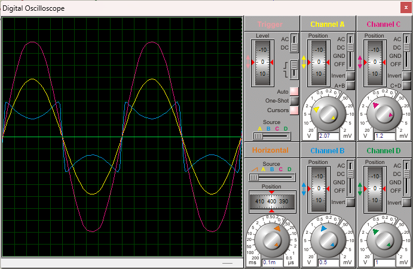

*Figura 2 – Simulação com Vp = 1 V. U1 = 10 V de pico, U3 = 9,54 V e U2 sobe até ≈ 1,5 V e depois cai para ≈ 0,75 V no pico da entrada.*

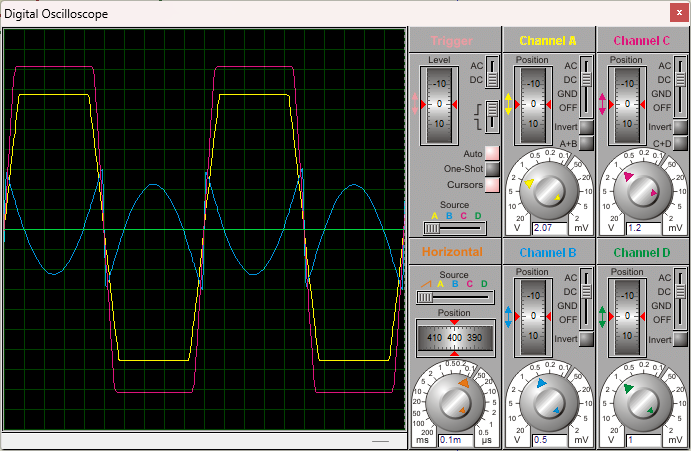

*Figura 3 – Simulação com Vp = 3 V. U1 ceifa em +13,9/−13,6 V, U3 ceifa em ±9,78 V e U2 fica com ≈ 1,1 V de pico, em fase com a entrada.*

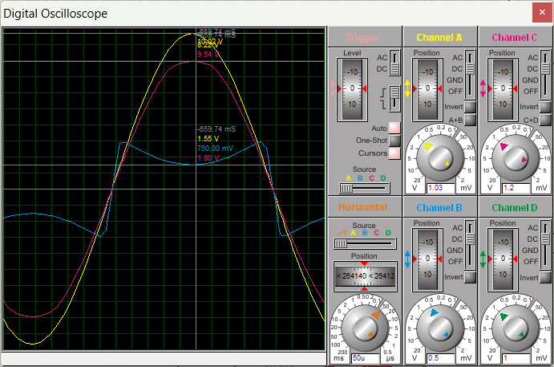

*Figura 4 – Vp = 1 V, zoom no pico com cursores: U1 = 9,93 V, U3 = 9,54 V e U2 = 0,75 V.*

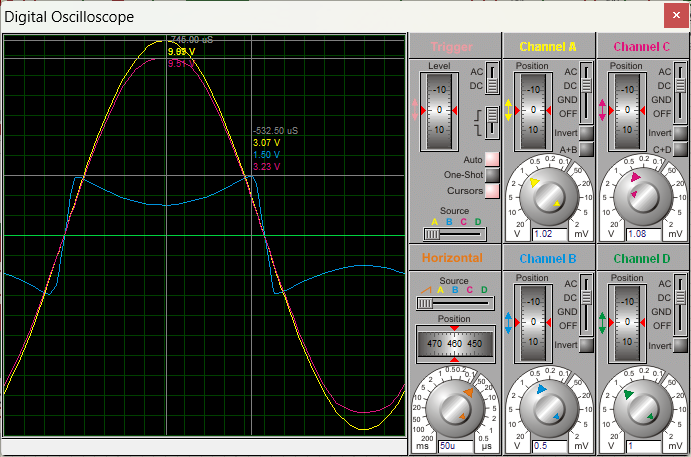

*Figura 5 – Vp = 1 V, outra posição de cursor: U1 = 9,93 V e U3 = 9,51 V no pico; U2 = 1,50 V no "ombro" da onda.*

### Análise

**U1** funcionou como esperado. Em 1 V de pico a saída é uma senoide de 10 V. Em 3 V ela ceifa em ≈ ±13,8 V, uns 1,2 V abaixo da alimentação. Nesse ponto a corrente é só $13{,}9 \times (1/1k + 1/100k) \approx 14$ mA, então a limitação é de tensão.

**U3** chegou a 9,54 V com 1 V de pico (o ideal era 10 V) e a 9,78 V com 3 V, com o topo plano. U1 e U3 têm a mesma alimentação e a mesma realimentação; a única diferença é a carga (1 kΩ e 300 Ω). Se U3 ceifa em 9,78 V enquanto U1 vai até 13,8 V, a diferença só pode vir da corrente puxada pela carga. Então é limite de corrente e não de tensão. O nível quase não mudou entre 1 V e 3 V, como a teoria previa.

Com 1 V de pico isso já aparece de leve: nos cursores da Figura 4, no mesmo instante, U1 marca 9,93 V e U3 marca 9,54 V, mesmo com o mesmo ganho. Na Figura 2 o pico de U3 fica mais achatado que uma senoide normal, enquanto o de U1 fica redondo.

O valor simulado ficou maior que os 7,48 V calculados. Isso acontece porque o modelo do 741 no Proteus aguenta mais corrente que os 25 mA usados na conta. Dá para calcular esse limite com os próprios resultados:

| Onde | Cálculo | I_sc |
|---|---|:---:|
| U3 com Vp = 3 V | $9{,}78 \times (1/300 + 1/100k)$ | 32,7 mA |
| U3 com Vp = 1 V | $9{,}54 \times (1/300 + 1/100k)$ | 31,9 mA |
| U2 no início da limitação | $1{,}47 \times (1/1k + 1/50)$ | 30,9 mA |

Usando I_sc ≈ 32 mA, a fórmula dá:

$$V_{out,max,U2} = \frac{32m}{1/1k + 1/50} \approx 1{,}52\ \text{V} \qquad V_{out,max,U3} = \frac{32m}{1/300 + 1/100k} \approx 9{,}57\ \text{V}$$

Isso bate com a simulação. Então a teoria estava certa, só o valor de I_sc era diferente.

**U2** teve um comportamento que não estava previsto. A saída sobe até ≈ 1,5 V e depois cai para 0,75 V justamente quando a entrada está no máximo. Com 3 V a saída fica em fase com a entrada, sendo que o circuito é inversor.

O motivo é que, quando o ampop entra no limite de corrente, ele deixa de manter o terra virtual. Como R4 + R3 = 55 Ω é um valor muito baixo, a própria fonte V1 passa a jogar corrente direto na saída.

Isso é consequência direta das impedâncias vistas na teoria. A impedância de entrada de U2 é de só 5 Ω, e a carga que a saída enxerga (47,6 Ω) é menor que o próprio r_o do 741. Enquanto o ampop consegue fornecer a corrente, a realimentação segura a saída. Quando ele chega no limite, quem manda na saída é a fonte, através dos resistores de 55 Ω. Em U1 e U3 isso não acontece: com R_in = 10 kΩ, a corrente que vem da fonte é desprezível.

## Conclusão – Parte 1

Os três circuitos têm o mesmo ganho, mas cada um se comportou de um jeito:

- U1 foi o único "normal": linear com sinal pequeno e ceifado na tensão da alimentação com sinal grande.
- U3 saturou por corrente por causa da carga de 300 Ω. A carga também limita o circuito, não só a alimentação.
- U2 saturou por corrente logo com sinal pequeno. Além disso, com resistores tão baixos a fonte de entrada acabou controlando a saída, a ponto de inverter a fase com 3 V.

Na simulação o limite de corrente do 741 ficou em ≈ 32 mA. Com esse valor as contas batem com o que foi visto.

O valor dos resistores importa, e não só a razão entre eles. Resistores muito baixos (como em U2) pedem corrente demais da fonte e do ampop. Resistores muito altos esbarram na resistência de entrada (≈ 2 MΩ) e no erro por corrente de polarização. Com o 741, uma faixa segura fica entre 1 kΩ e 100 kΩ, com carga de 2 kΩ ou mais, como pede o datasheet. U1 está dentro dessa faixa, U2 está muito abaixo e U3 tem uma carga pequena demais.

---

# PARTE 2 – Slew Rate (SR)

## 2.1 Circuito

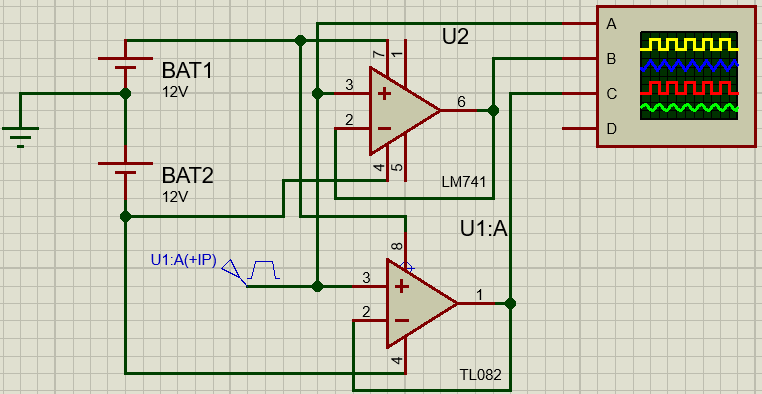

*Figura 6 – Circuito da Parte 2.*

São dois seguidores de tensão (ganho 1) ligados na mesma entrada, alimentados com ±12 V:

| | U1 | U2 |
|---|:---:|:---:|
| CI | TL082 | LM741 |
| Configuração | seguidor (ganho = 1) | seguidor (ganho = 1) |
| Alimentação | ±12 V | ±12 V |
| Entrada | pulso 0/+5 V, 1 kHz, t_r = t_f = 10 ns, 50 % | a mesma |

Na bancada também foram testados um pulso de 0/+3 V e uma senoide de 3 Vpp, de 1 kHz até 2 MHz.

## 2.2 Teoria

O slew rate é a velocidade máxima com que a saída do ampop consegue variar:

$$SR = \left. \frac{dV_{out}}{dt} \right|_{max}$$

Ele depende da corrente que carrega o capacitor de compensação interno do CI. Se a entrada muda mais rápido que isso (como um pulso com t_r = 10 ns), a saída sobe em rampa e o tempo de subida passa a depender só do SR:

$$\Delta t = \frac{\Delta V}{SR}$$

Para um degrau de 5 V:

$$\Delta t_{741} = \frac{5\ V}{0{,}5\ V/\mu s} = 10\ \mu s \qquad \Delta t_{TL082} = \frac{5\ V}{13\ V/\mu s} \approx 0{,}385\ \mu s$$

Em 1 kHz o semiperíodo é de 500 µs, então os dois chegam nos 5 V. A diferença é que a rampa do 741 (10 µs) aparece no osciloscópio e a do TL082 (0,385 µs) fica quase vertical.

**Onda quadrada:** quando o tempo de subida fica perto do semiperíodo, a saída não chega mais no valor final e a onda vira um triângulo. O limite é:

$$f_{max} = \frac{SR}{2 \cdot \Delta V}$$

$$f_{max,741} = \frac{0{,}5 \times 10^6}{2 \times 5} = 50\ \text{kHz} \qquad f_{max,TL082} = \frac{13 \times 10^6}{2 \times 5} = 1{,}3\ \text{MHz}$$

**Senoide:** para $v(t) = V_p \sin(\omega t)$ a maior inclinação é $\omega V_p$. A frequência máxima sem distorção (FPBW) é:

$$f_{FPBW} = \frac{SR}{2\pi V_p}$$

$$f_{FPBW,741} = \frac{0{,}5\times10^6}{2\pi \times 3} \approx 26{,}5\ \text{kHz} \qquad f_{FPBW,TL082} = \frac{13\times10^6}{2\pi \times 3} \approx 689{,}7\ \text{kHz}$$

Acima disso a senoide fica triangular, mesmo sem chegar perto da alimentação. Então aqui a limitação é de velocidade e não de tensão como na Parte 1.

| Parâmetro | LM741 | TL082 | TL082 / 741 |
|-----------|:-----:|:-----:|:---:|
| Slew rate | 0,5 V/µs | 13 V/µs | 26× |
| Δt para 5 V | 10 µs | 0,385 µs | 26× menor |
| f_max onda quadrada (5 V) | 50 kHz | 1,3 MHz | 26× |
| f_FPBW (senoide 3 Vp) | 26,5 kHz | 689,7 kHz | 26× |
| Entrada | bipolar | JFET | – |
| GBW | 1 MHz | 3 MHz | 3× |

## 2.3 Resumo dos resultados

| Grandeza | Teórico | Simulado | Montagem | Desvio T×S | Desvio T×M |
|----------|:-------:|:--------:|:--------:|:----------:|:----------:|
| SR (741) | 0,5 V/µs | ___³ | **0,34 V/µs** (média de 10 medidas) | ___³ | −32 % |
| SR (TL082) | 13 V/µs | **≈ 12,8 V/µs** (média de 10 bordas) | **≈ 15 V/µs** (senoide de 2 MHz)¹ | −2 % | ≈ +15 % |
| Δt subida (741, 5 V) | 10 µs | ___³ | 14,6 µs | ___³ | +46 % |
| Δt subida (TL082, 5 V) | 0,385 µs | ≈ 0,39 µs (10–90 %: 0,31 µs) | 12,2 µs² | ≈ +1 % | –² |
| Δt subida (741, 3 V) | 6,0 µs | ___³ | 8,9 µs | ___³ | +48 % |
| Δt subida (TL082, 3 V) | 0,231 µs | ≈ 0,24 µs | 7,4 µs² | ≈ +4 % | –² |
| f_max quadrada 5 V (741) | 50 kHz | ___³ | ≈ 34 kHz (ainda chega em 5 V com 30 kHz) | ___³ | −32 % |
| f_max quadrada 5 V (TL082) | 1,3 MHz | ≈ 1 MHz (em 1 MHz já é triangular) | não atingida (teste até 30 kHz) | ≈ −23 % | – |
| f_max quadrada 3 V (741) | 83 kHz | ___³ | ≈ 57 kHz (quase triangular em 50 kHz) | ___³ | −32 % |
| f_max quadrada 3 V (TL082) | 2,17 MHz | não simulado | não atingida (teste até 50 kHz) | – | – |
| f_FPBW senoide 3 Vp (741) | 26,5 kHz | ___³ | não testado (bancada usou 3 Vpp) | ___³ | – |
| f_FPBW senoide 3 Vp (TL082) | 689,7 kHz | entre 500 kHz e 1 MHz | não testado (bancada usou 3 Vpp) | ok | – |
| f_FPBW senoide 3 Vpp, Vp = 1,5 V (741) | 53,1 kHz | não simulado | entre 25 e 50 kHz (≈ 36 kHz pelo SR medido) | – | ≈ −32 % |
| f_FPBW senoide 3 Vpp, Vp = 1,5 V (TL082) | 1,38 MHz | não simulado | entre 1 e 2 MHz | – | ok |

¹ Maior inclinação medida na saída do TL082 (2,34 V em 156 ns), na frequência em que a senoide começa a ficar com os lados retos. É uma estimativa por baixo do SR.
² Inclinação da rampa do CH2 no teste de pulso. Esse valor não é o SR do TL082 (ver item 2.5).
³ A saída do LM741 (canal B) não apareceu nas telas da simulação.

## 2.4 Simulação (Proteus)

No osciloscópio da simulação o canal A (amarelo) é a entrada, o B (azul) é o 741 e o C (rosa) é o TL082. O canal B ficou em 5 V/div com posição +40 e o traço dele não aparece nas telas, então a simulação só compara a entrada com o TL082.

O SR foi medido entre 10 % e 90 % da subida e da descida, contando os pixels na tela (20 px por divisão). Cada pixel vale entre 25 e 39 ns, dependendo da base de tempo, então cada medida tem erro de uns ±10 %.

**Pulso:**

| f | Amplitude (escala) | Base de tempo | Saída do TL082 | SR 10–90 % (subida / descida) | Figura |
|:---:|:---:|:---:|---|:---:|:---:|
| 1 kHz | 0 → 3 V (0,2 V/div) | 77,9 µs/div | igual à entrada (a rampa de 0,3 µs não aparece nessa escala) | – | 7 |
| 50 kHz | 0 → 3 V (0,2 V/div) | 0,78 µs/div | rampa de ≈ 0,25 µs com um pequeno overshoot | 12,3 / 12,3 V/µs | 8 |
| 100 kHz | 0 → 5 V (0,5 V/div) | 0,62 µs/div | trapézio, ≈ 0,47 µs da base ao topo | 12,8 / 14,2 V/µs | 9 |
| 200 kHz | 0 → 5 V (0,5 V/div) | 0,62 µs/div | trapézio | 11,6 / 12,8 V/µs | 10 |
| 500 kHz | 0 → 5 V (0,5 V/div) | 0,5 µs/div | trapézio com topo de só ≈ 0,5 µs | 12,3 / 13,3 V/µs | 11 |
| 1 MHz | 0 → 5 V (0,5 V/div) | 0,5 µs/div | triângulo que mal chega em 5 V | 13,3 / 13,3 V/µs | 12 |

A média das 10 bordas deu SR ≈ 12,8 V/µs, praticamente o valor do datasheet (13 V/µs). Em 1 MHz o semiperíodo (0,5 µs) é quase o tempo que o TL082 leva para subir 5 V, e a onda quadrada vira triângulo, perto dos 1,3 MHz calculados.

**Senoide de 3 Vp (6 Vpp, 0,5 V/div):**

| f | Inclinação máxima exigida ($2\pi f V_p$) | Saída do TL082 | Figura |
|:---:|:---:|---|:---:|
| 10 kHz | 0,19 V/µs | igual à entrada | 13 |
| 100 kHz | 1,9 V/µs | igual à entrada | 14 |
| 200 kHz | 3,8 V/µs | igual à entrada | 15 |
| 500 kHz | 9,4 V/µs | igual, com um atraso bem pequeno | 16 |
| 1 MHz | 18,8 V/µs | atrasada, com os lados mais retos e ≈ 5,5 Vpp (−8 %) | 17 |

Em 1 MHz a senoide precisaria de 18,8 V/µs, mais do que o TL082 consegue, e a saída começa a distorcer. A FPBW simulada fica então entre 500 kHz e 1 MHz, o que confere com os 689,7 kHz calculados.

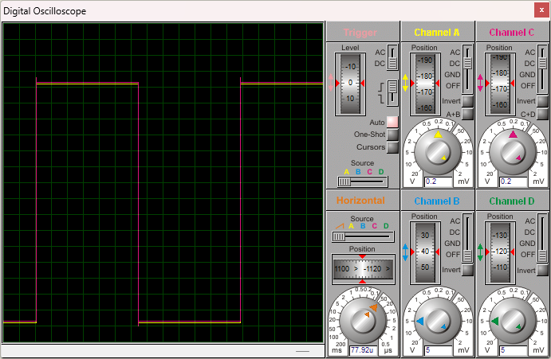

*Figura 7 – Simulação, pulso de 1 kHz. Entrada (amarelo) e TL082 (rosa) coincidem nessa escala.*

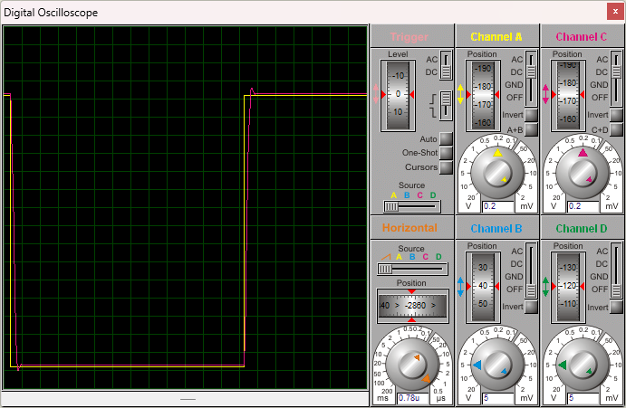

*Figura 8 – Simulação, pulso de 50 kHz (0,78 µs/div). Rampa do TL082 de ≈ 12 V/µs.*

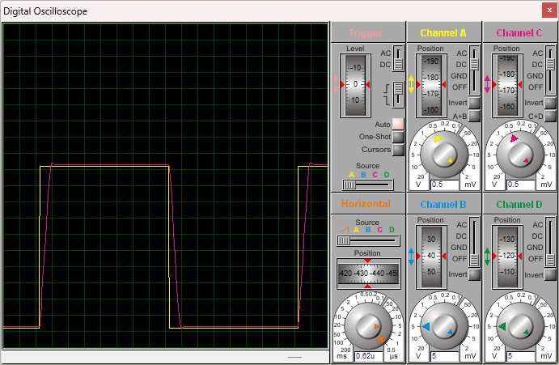

*Figura 9 – Simulação, pulso de 5 V em 100 kHz. Bordas do TL082 com ≈ 0,47 µs.*

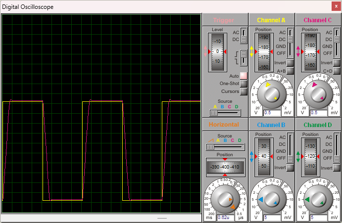

*Figura 10 – Simulação, pulso de 5 V em 200 kHz.*

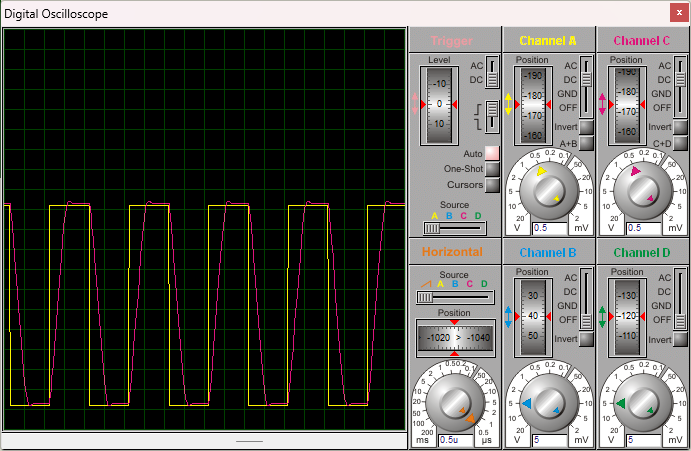

*Figura 11 – Simulação, pulso de 5 V em 500 kHz. O topo fica mais curto.*

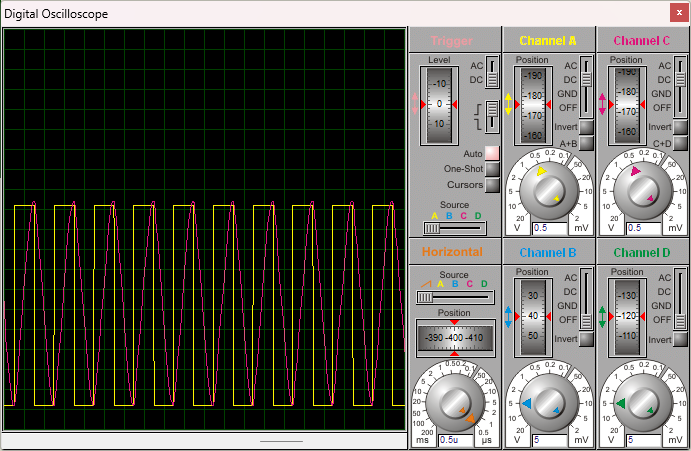

*Figura 12 – Simulação, pulso de 5 V em 1 MHz. A saída do TL082 vira triângulo.*

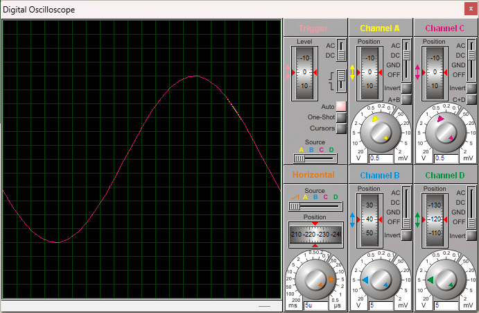

*Figura 13 – Simulação, senoide de 3 Vp em 10 kHz.*

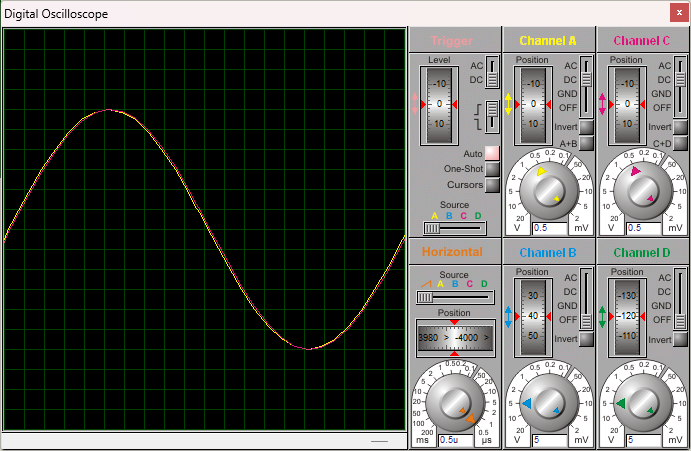

*Figura 14 – Simulação, senoide de 3 Vp em 100 kHz.*

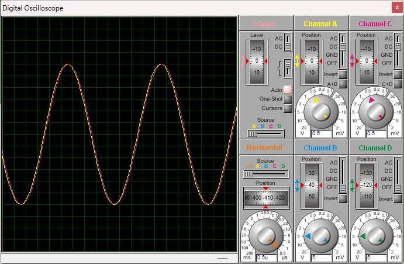

*Figura 15 – Simulação, senoide de 3 Vp em 200 kHz.*

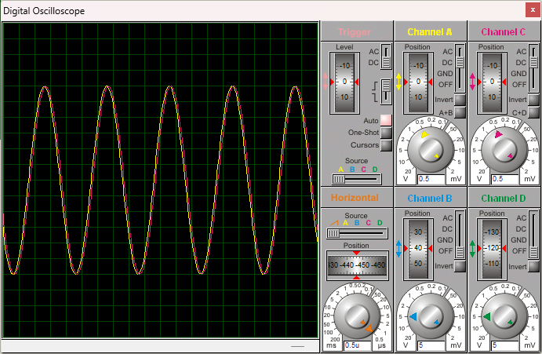

*Figura 16 – Simulação, senoide de 3 Vp em 500 kHz. O TL082 ainda acompanha a entrada.*

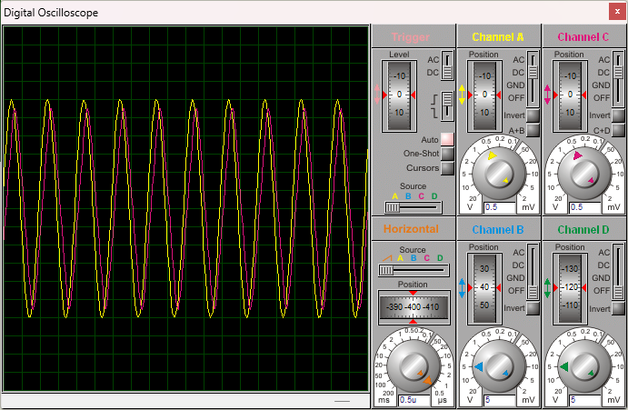

*Figura 17 – Simulação, senoide de 3 Vp em 1 MHz. Saída atrasada e menor por causa do slew rate.*

<!-- falta: telas da simulação com o canal B (LM741) visível -->

## 2.5 Bancada

Os testes foram feitos em 31/08/2026, com os dois seguidores montados em protoboard. Equipamentos: osciloscópio Tektronix TDS 2024C, gerador de funções Tektronix e fonte simétrica (o display mostrava 11,9 V e 11,6 V).

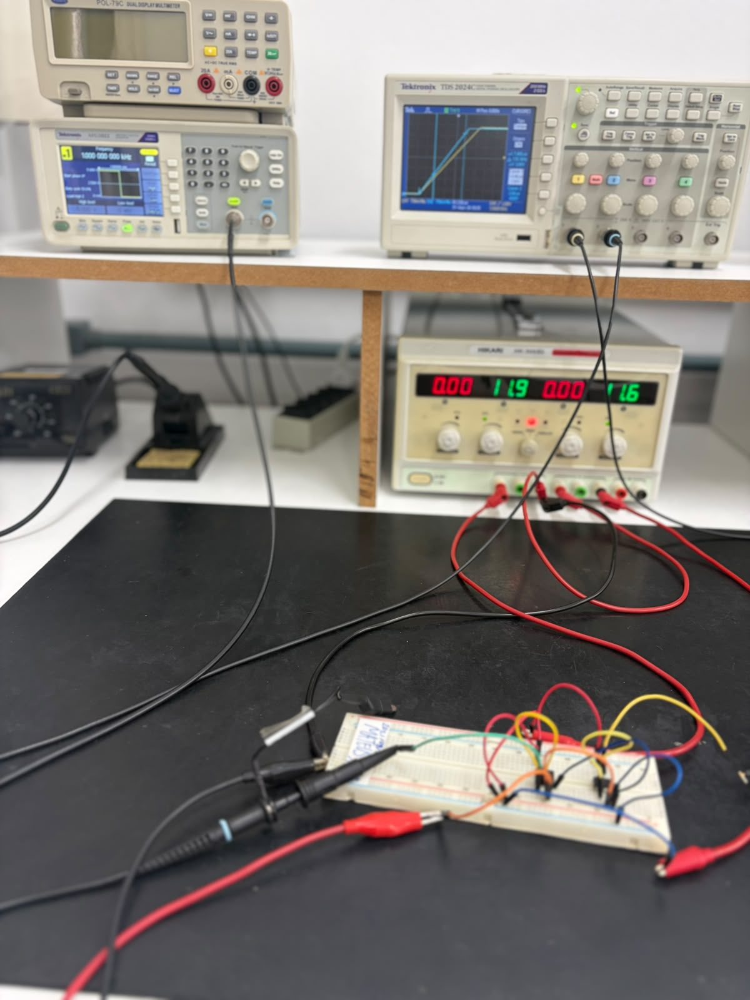

*Figura 18 – Montagem da Parte 2 na bancada.*

Canais usados em todas as fotos:

| Canal | Cor | Sinal |
|:---:|:---:|---|
| CH1 | amarelo | saída do LM741 |
| CH2 | ciano | saída do TL082 |
| CH3 | roxo | entrada (só no teste com senoide) |

O SR foi calculado como ΔV/Δt entre os dois cursores, colocados na parte reta da rampa de subida.

### Pulso de 0 a 5 V

| f | Canal | Δt (µs) | ΔV (V) | SR = ΔV/Δt (V/µs) | Figura |
|:---:|---|:---:|:---:|:---:|:---:|
| 1 kHz | CH1 – 741 | 6,30 | 2,15 | 0,341 | 20 |
| 1 kHz | CH2 – TL082 | 6,30 | 2,62 | 0,416 | 21 |
| 10 kHz | CH1 – 741 | 6,30 | 2,15 | 0,341 | 23 |
| 10 kHz | CH2 – TL082 | 6,30 | 2,59 | 0,411 | 24 |
| 25 kHz | CH1 – 741 | 7,40 | 2,53 | 0,342 | 26 |
| 25 kHz | CH2 – TL082 | 7,40 | 3,00 | 0,405 | 27 |
| 30 kHz | CH1 – 741 | 7,40 | 2,53 | 0,342 | 28 |
| 30 kHz | CH2 – TL082 | 7,40 | 3,00 | 0,405 | 29 |
| **Média** | **CH1 – 741** | | | **0,342** | |
| **Média** | **CH2 – TL082** | | | **0,409**² | |

Em 1 kHz o osciloscópio mediu 5,02 Vpp no CH1, 5,06 Vpp no CH2 e média de 2,53 V no CH2 (duty de 50 %). Isso confirma o ganho 1 dos dois seguidores.

Com o SR medido, o 741 leva 5 / 0,342 ≈ 14,6 µs para subir 5 V (o teórico era 10 µs). Em 25 kHz o topo do 741 já fica com uns 5 µs. Em 30 kHz sobram só uns 2 µs, perto do limite de $f_{max} \approx 34$ kHz calculado com o SR medido.

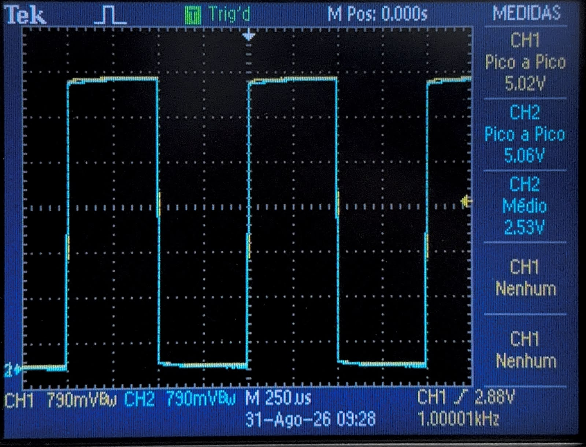

*Figura 19 – Pulso de 5 V, 1 kHz, visão geral (250 µs/div). CH1 = 5,02 Vpp e CH2 = 5,06 Vpp.*

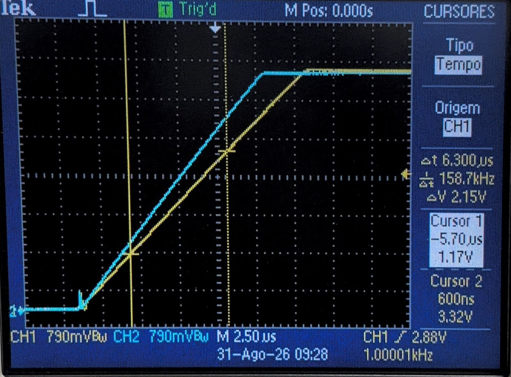

*Figura 20 – Pulso de 5 V, 1 kHz, subida (2,5 µs/div). Cursores no CH1 (741): 2,15 V / 6,3 µs = 0,341 V/µs.*

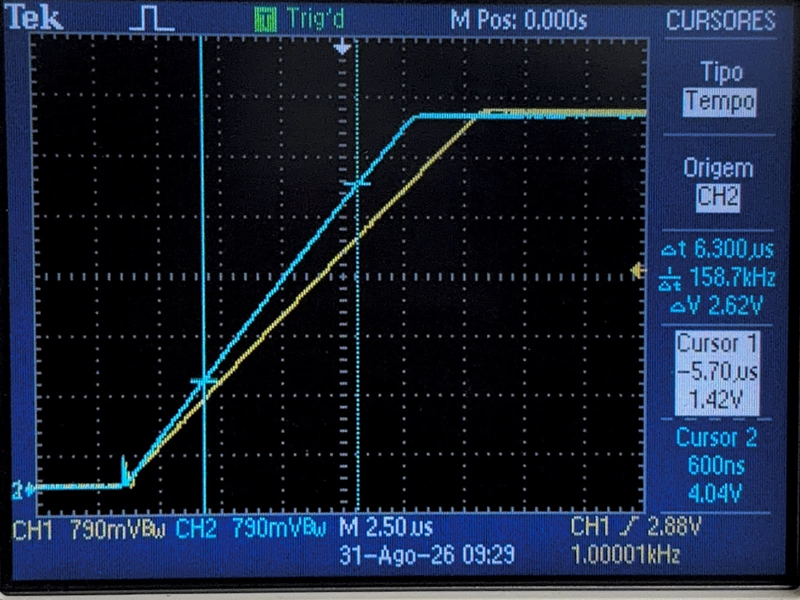

*Figura 21 – Pulso de 5 V, 1 kHz. Cursores no CH2 (TL082): 2,62 V / 6,3 µs = 0,416 V/µs.*

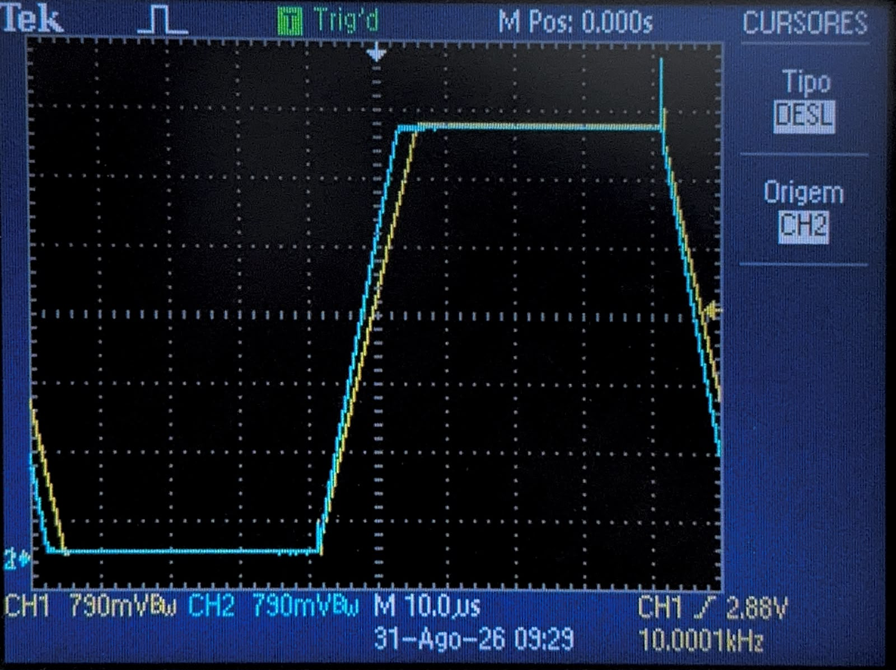

*Figura 22 – Pulso de 5 V, 10 kHz, visão geral (10 µs/div).*

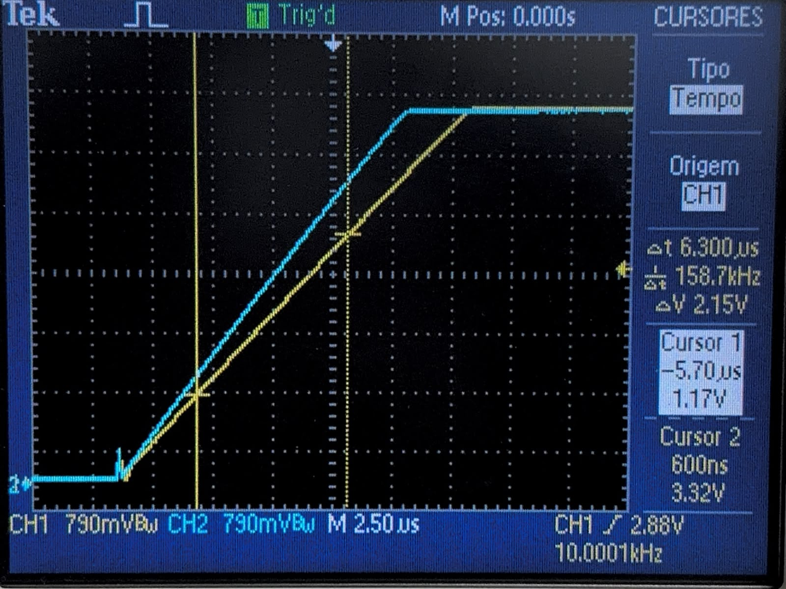

*Figura 23 – Pulso de 5 V, 10 kHz. Cursores no CH1 (741): 2,15 V / 6,3 µs = 0,341 V/µs.*

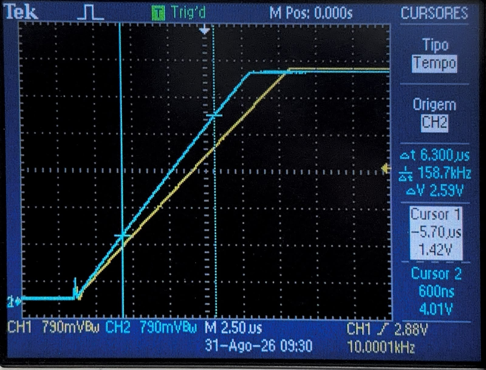

*Figura 24 – Pulso de 5 V, 10 kHz. Cursores no CH2 (TL082): 2,59 V / 6,3 µs = 0,411 V/µs.*

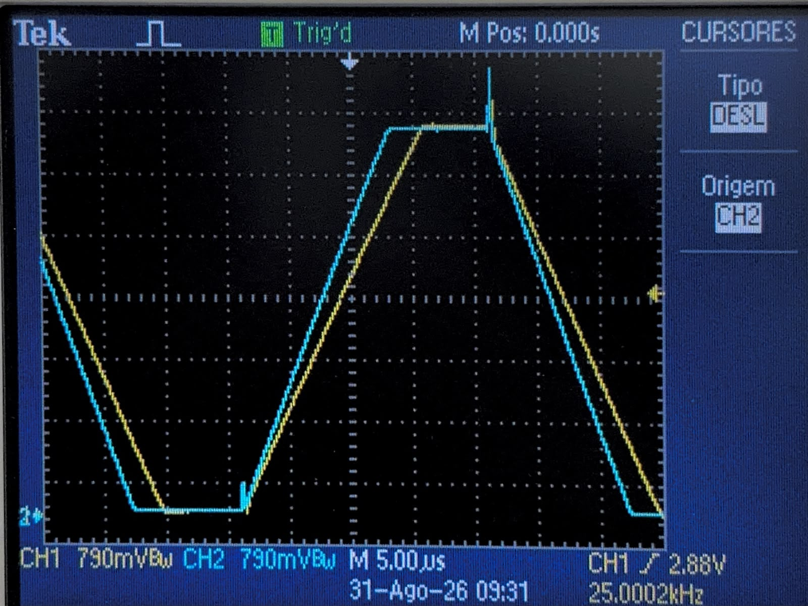

*Figura 25 – Pulso de 5 V, 25 kHz, visão geral (5 µs/div). O topo do 741 (amarelo) já é mais curto que o do TL082.*

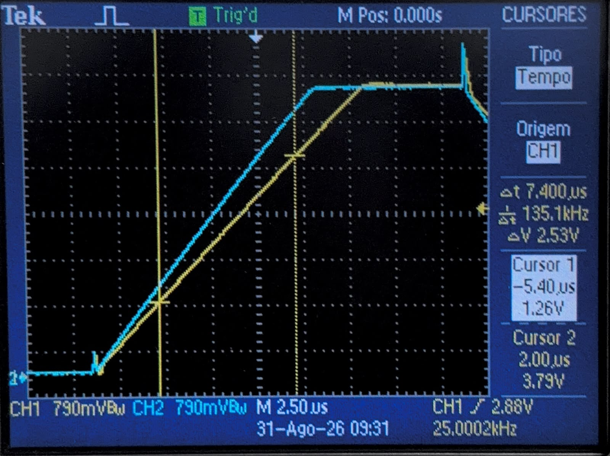

*Figura 26 – Pulso de 5 V, 25 kHz. Cursores no CH1 (741): 2,53 V / 7,4 µs = 0,342 V/µs.*

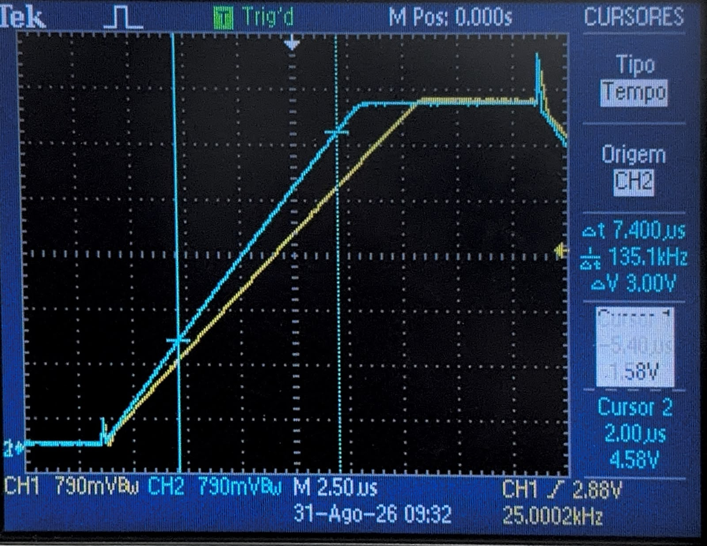

*Figura 27 – Pulso de 5 V, 25 kHz. Cursores no CH2 (TL082): 3,00 V / 7,4 µs = 0,405 V/µs.*

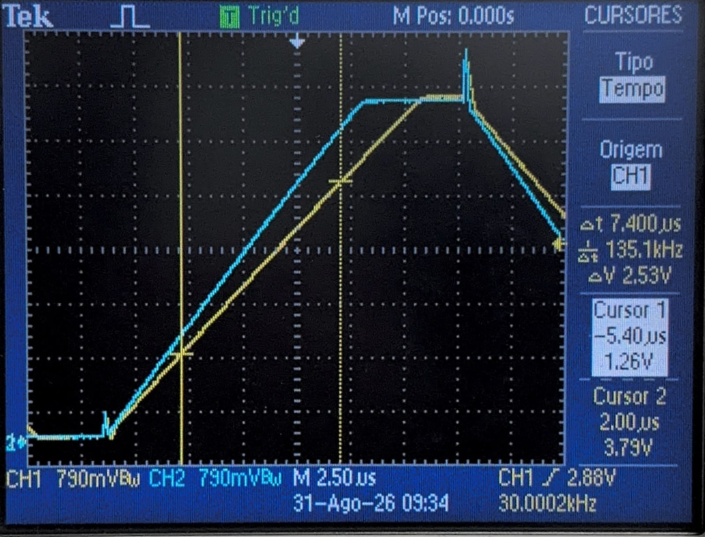

*Figura 28 – Pulso de 5 V, 30 kHz. Cursores no CH1 (741): 2,53 V / 7,4 µs = 0,342 V/µs. O topo do 741 dura só uns 2 µs.*

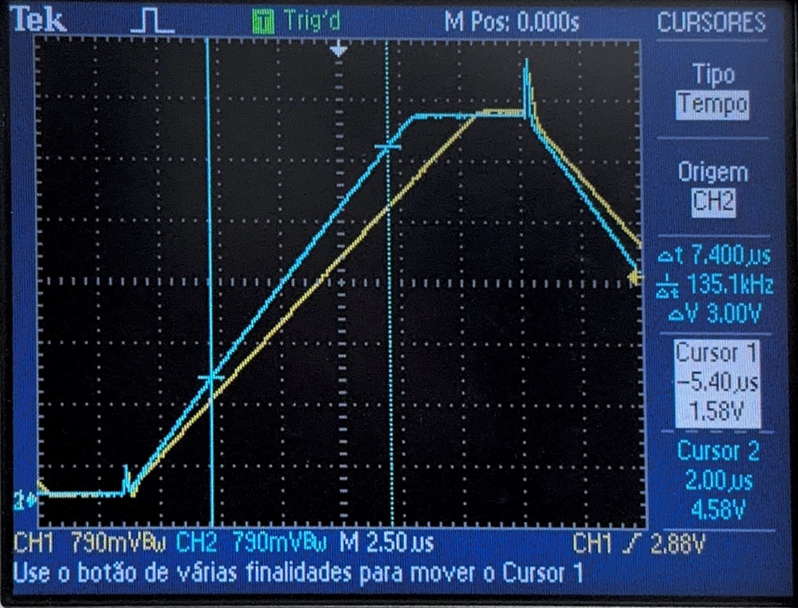

*Figura 29 – Pulso de 5 V, 30 kHz. Cursores no CH2 (TL082): 3,00 V / 7,4 µs = 0,405 V/µs.*

### Pulso de 0 a 3 V

| f | Canal | Δt (µs) | ΔV (V) | SR = ΔV/Δt (V/µs) | Figura |
|:---:|---|:---:|:---:|:---:|:---:|
| 1 kHz | CH1 – 741 | 48,0 | 1,06 | 0,022* | 31 |
| 1 kHz | CH2 – TL082 | 48,0 | 1,92 | 0,040* | 32 |
| 10 kHz | CH1 – 741 | 5,20 | 1,78 | 0,342 | 34 |
| 10 kHz | CH2 – TL082 | 5,20 | 2,16 | 0,415 | 35 |
| 25 kHz | CH1 – 741 | 4,96 | 1,58 | 0,319 | 37 |
| 25 kHz | CH2 – TL082 | 4,56 | 1,80 | 0,395 | 38 |
| 30 kHz | CH1 – 741 | 6,00 | 2,04 | 0,340 | 39 |
| 30 kHz | CH2 – TL082 | 4,20 | 1,70 | 0,405 | 40 |
| 50 kHz | CH1 – 741 | 4,20 | 1,49 | 0,355 | 41 |
| 50 kHz | CH2 – TL082 | 4,20 | 1,75 | 0,417 | 42 |
| **Média (10 a 50 kHz)** | **CH1 – 741** | | | **0,339** | |
| **Média (10 a 50 kHz)** | **CH2 – TL082** | | | **0,408**² | |

\* Em 1 kHz as duas saídas ficaram iguais, com bordas arredondadas de uns 90 µs (Figuras 30 a 32). Quem limitou ali foi a borda do próprio sinal de entrada, e não os ampops: o 741 subiria 3 V em uns 9 µs. Por isso essas duas medidas ficaram fora da média.

Em 1 kHz o osciloscópio mediu 3,02 Vpp nos dois canais (média do CH2 = 1,41 V). Em 25 kHz mediu 3,30 Vpp no CH1 e 3,34 Vpp no CH2 (contando os picos das transições), com média do CH2 = 1,28 V.

O 741 leva 3 / 0,339 ≈ 8,9 µs para subir 3 V (o teórico era 6,0 µs). Em 50 kHz o semiperíodo é de 10 µs, então a onda já fica quase triangular (Figuras 41 e 42). Pelo SR medido, $f_{max}(3\text{ V}) = 0{,}339 \times 10^6 / (2 \times 3) \approx 57$ kHz.

**Comparando 5 V e 3 V:** o SR do 741 foi o mesmo nas duas amplitudes (0,342 e 0,339 V/µs), o que faz sentido porque ele é uma característica do CI. A amplitude muda só o tempo de subida (14,6 µs contra 8,9 µs) e, com isso, a frequência em que a onda vira triângulo (≈ 34 kHz contra ≈ 57 kHz). Com amplitude menor o ampop consegue ir mais longe em frequência.

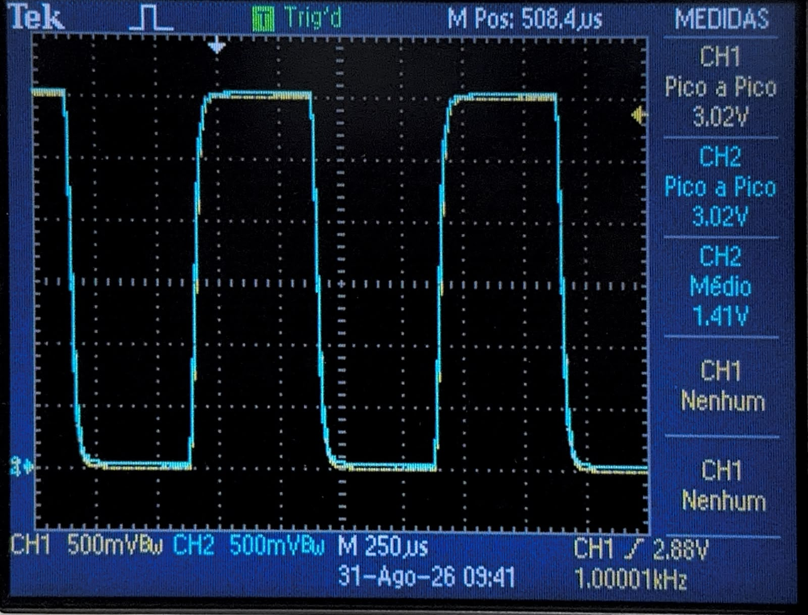

*Figura 30 – Pulso de 3 V, 1 kHz, visão geral (250 µs/div). CH1 = CH2 = 3,02 Vpp, com bordas arredondadas iguais nos dois canais.*

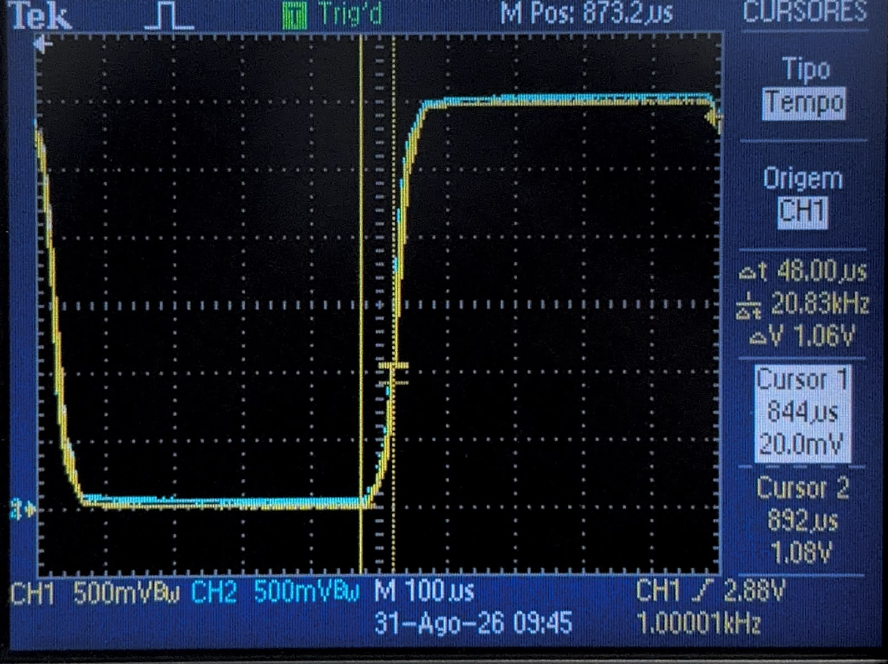

*Figura 31 – Pulso de 3 V, 1 kHz (100 µs/div). Cursores no CH1 (741): 1,06 V / 48 µs. A transição é lenta nos dois canais.*

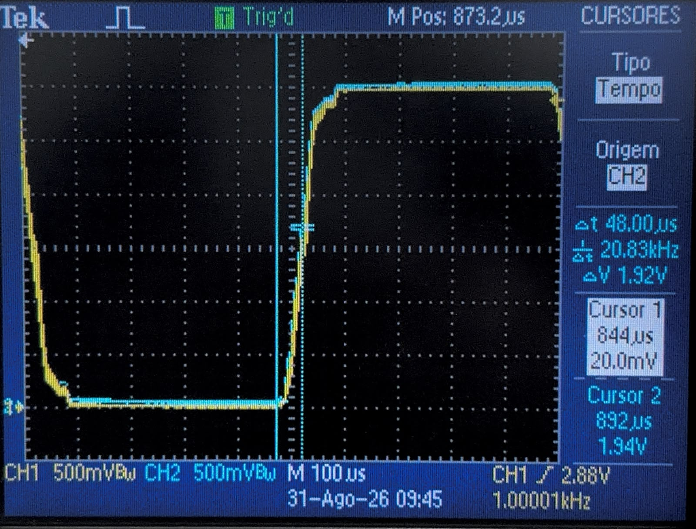

*Figura 32 – Pulso de 3 V, 1 kHz. Cursores no CH2 (TL082): 1,92 V / 48 µs.*

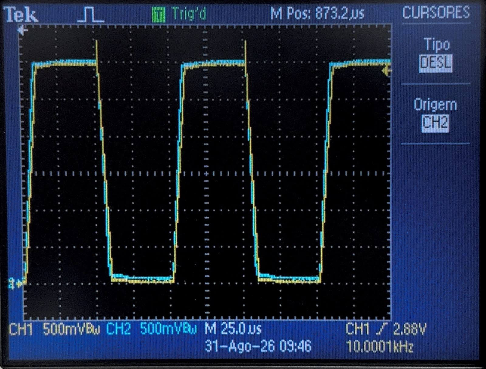

*Figura 33 – Pulso de 3 V, 10 kHz, visão geral (25 µs/div).*

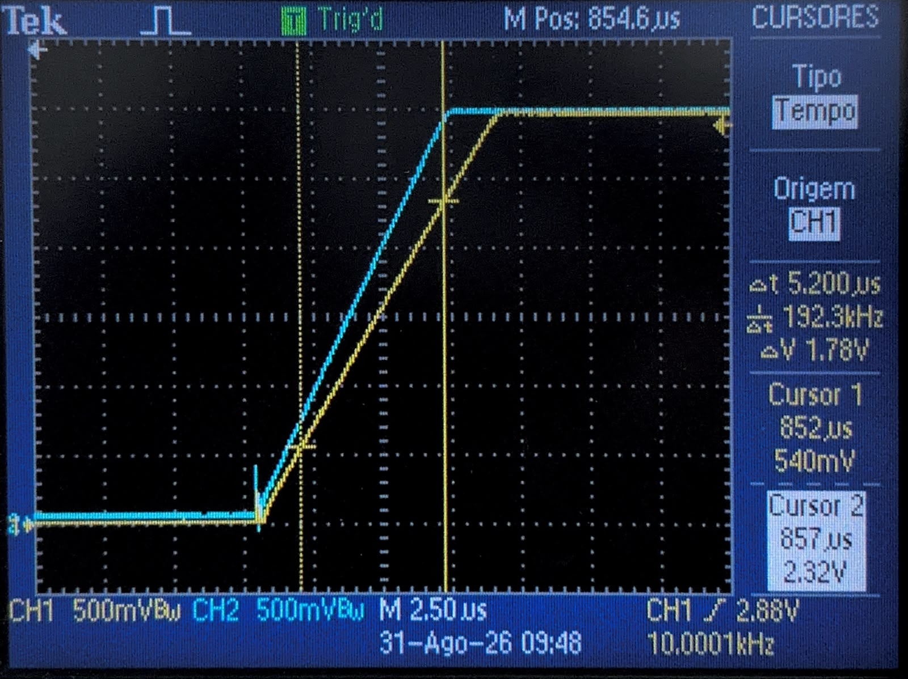

*Figura 34 – Pulso de 3 V, 10 kHz (2,5 µs/div). Cursores no CH1 (741): 1,78 V / 5,2 µs = 0,342 V/µs.*

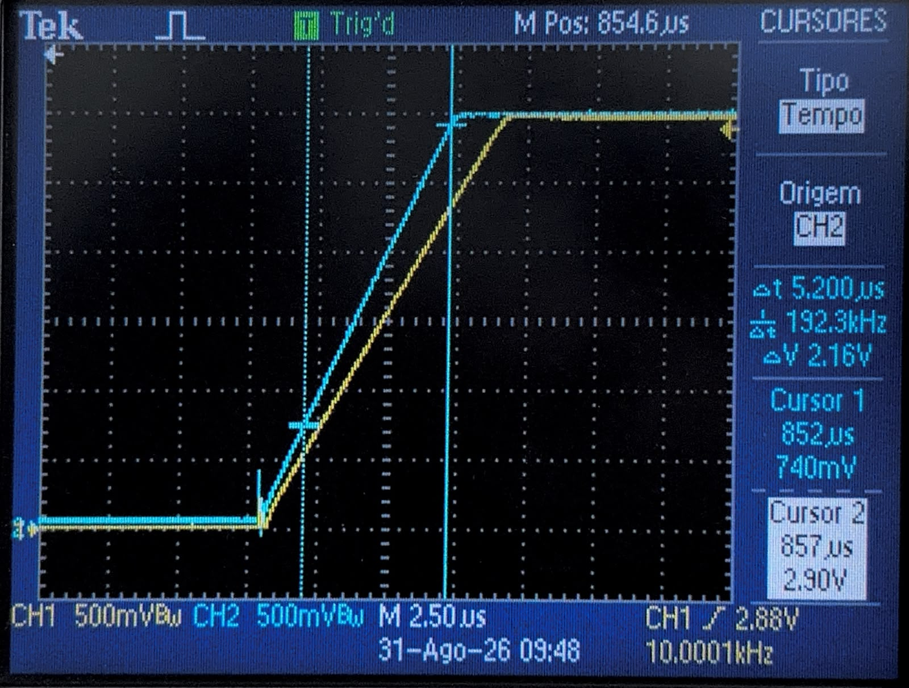

*Figura 35 – Pulso de 3 V, 10 kHz. Cursores no CH2 (TL082): 2,16 V / 5,2 µs = 0,415 V/µs.*

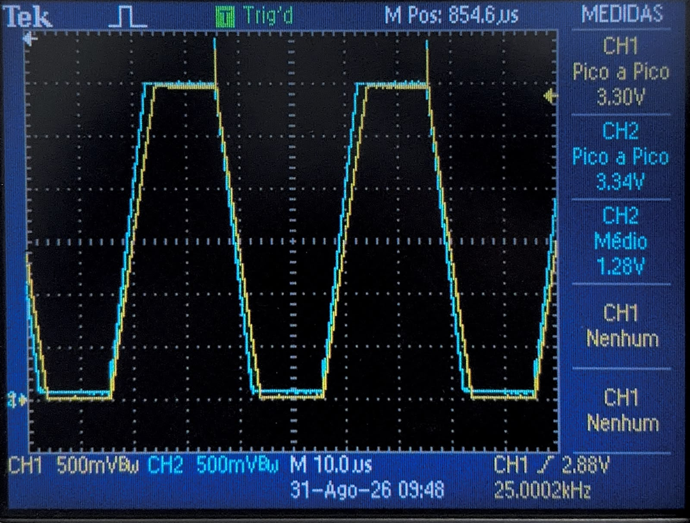

*Figura 36 – Pulso de 3 V, 25 kHz, visão geral (10 µs/div). CH1 = 3,30 Vpp e CH2 = 3,34 Vpp.*

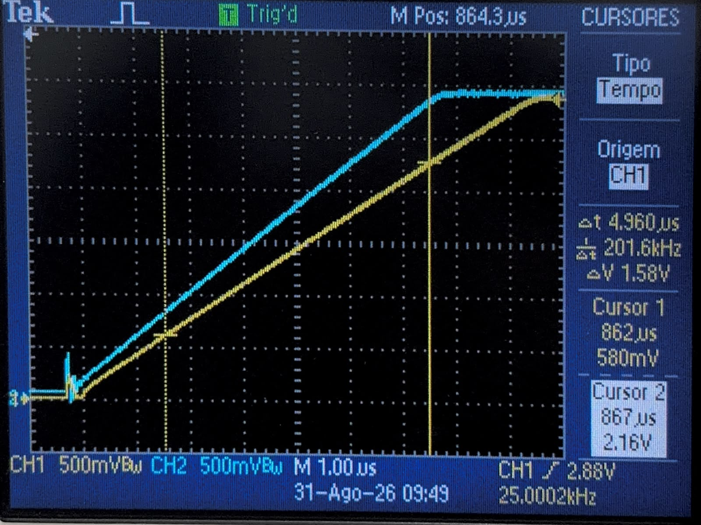

*Figura 37 – Pulso de 3 V, 25 kHz (1 µs/div). Cursores no CH1 (741): 1,58 V / 4,96 µs = 0,319 V/µs.*

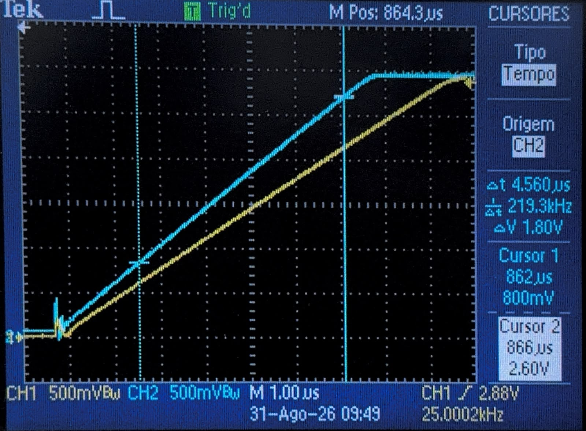

*Figura 38 – Pulso de 3 V, 25 kHz. Cursores no CH2 (TL082): 1,80 V / 4,56 µs = 0,395 V/µs.*

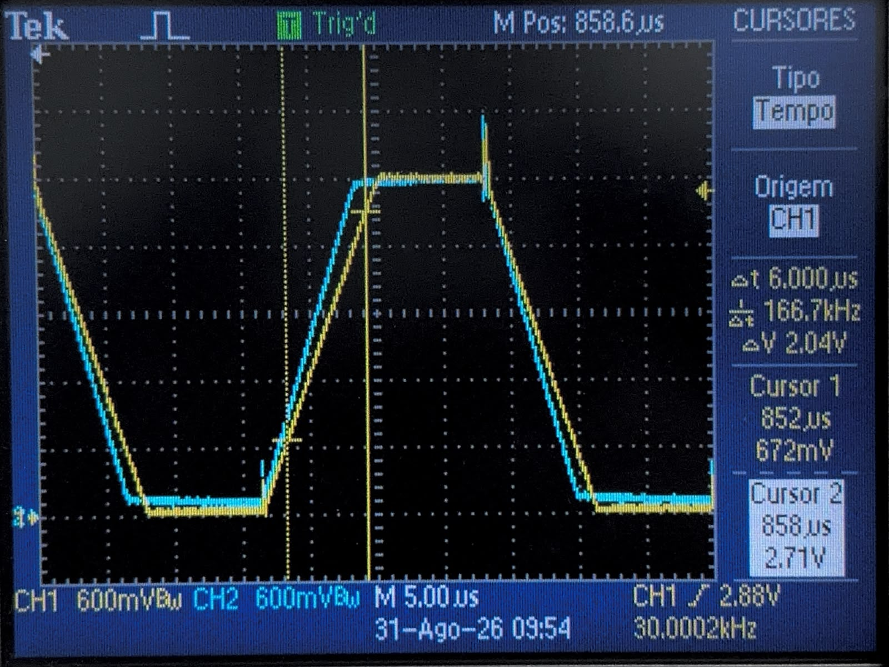

*Figura 39 – Pulso de 3 V, 30 kHz (5 µs/div). Cursores no CH1 (741): 2,04 V / 6,0 µs = 0,340 V/µs.*

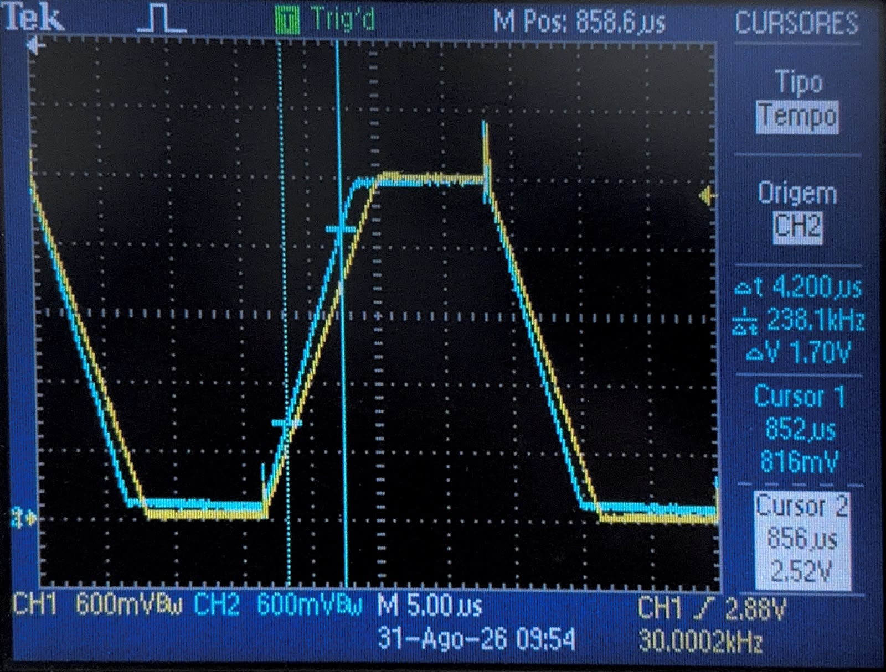

*Figura 40 – Pulso de 3 V, 30 kHz. Cursores no CH2 (TL082): 1,70 V / 4,2 µs = 0,405 V/µs.*

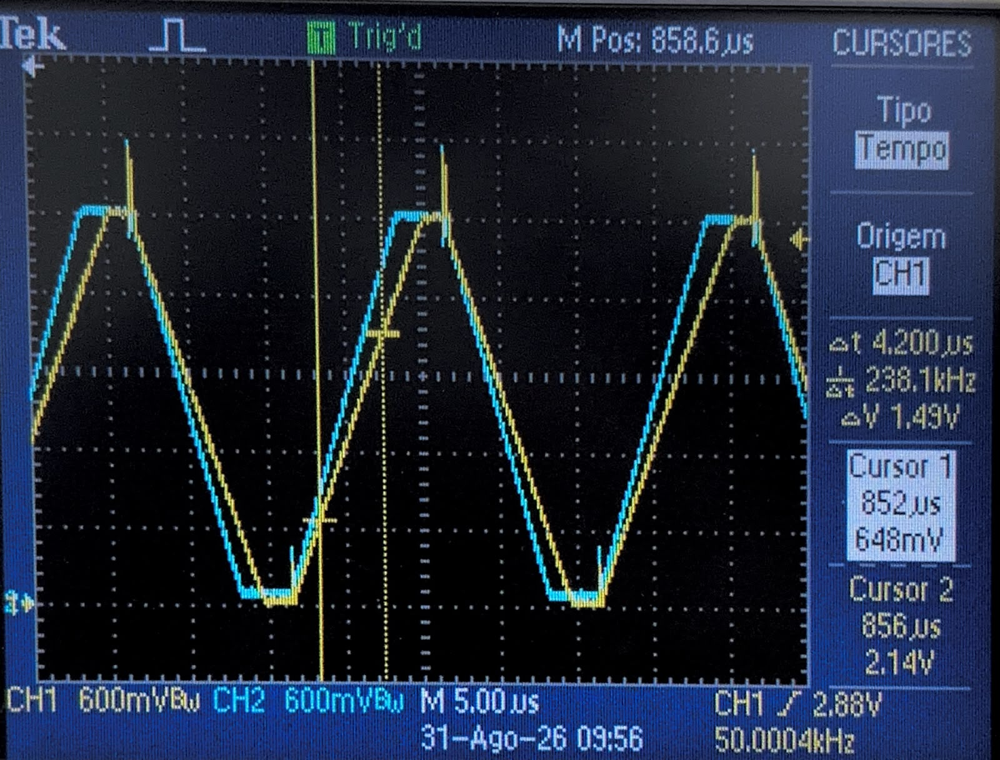

*Figura 41 – Pulso de 3 V, 50 kHz (5 µs/div). Cursores no CH1 (741): 1,49 V / 4,2 µs = 0,355 V/µs. A onda já é quase triangular.*

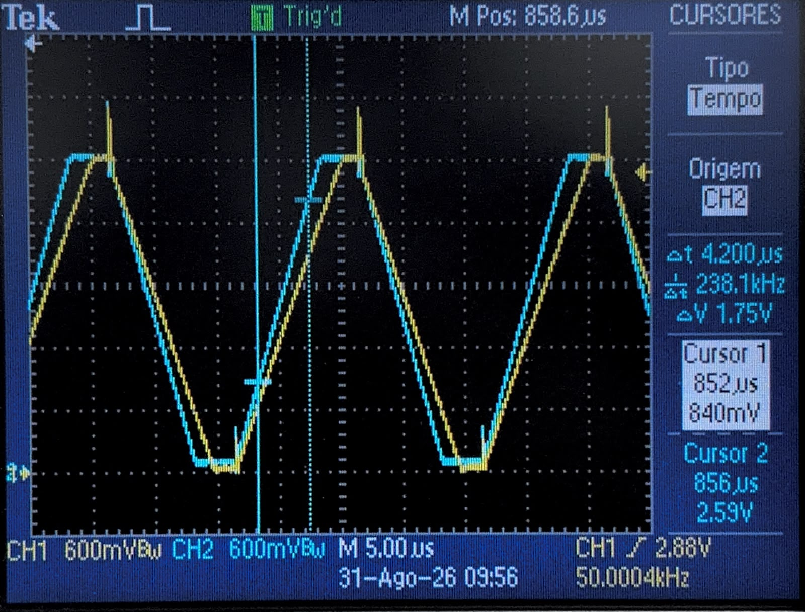

*Figura 42 – Pulso de 3 V, 50 kHz. Cursores no CH2 (TL082): 1,75 V / 4,2 µs = 0,417 V/µs.*

### Senoide de 3 Vpp (0 a 3 V, Vp ≈ 1,5 V)

Nesse teste foi usado o CH3 (roxo) para ver a entrada. A amplitude usada foi de 3 Vpp (≈ 1,5 V de pico, lido na tela), e não os 3 V de pico da teoria. Recalculando a FPBW para Vp = 1,5 V:

$$f_{FPBW,741} = \frac{0{,}5\times10^6}{2\pi \times 1{,}5} \approx 53{,}1\ \text{kHz} \qquad f_{FPBW,TL082} = \frac{13\times10^6}{2\pi \times 1{,}5} \approx 1{,}38\ \text{MHz}$$

Com o SR medido do 741 (0,341 V/µs) a FPBW cai para uns 36 kHz. Acima dela a saída vira um triângulo com amplitude $\Delta V_{pp} = SR \cdot T/2$, que diminui conforme a frequência aumenta.

| f | Inclinação máxima exigida ($2\pi f V_p$) | LM741 (CH1) | TL082 (CH2) | Figura |
|:---:|:---:|---|---|:---:|
| 25 kHz | 0,24 V/µs | senoide sem distorção, em cima da entrada | sem distorção | 43 |
| 50 kHz | 0,47 V/µs | lados retos (começa a triangular); cursores: 2,20 V / 6,4 µs = **0,344 V/µs** | igual à entrada | 44 |
| 100 kHz | 0,94 V/µs | triângulo de ≈ 1,7 Vpp (esperado 0,341 × 5 µs = 1,71 Vpp); cursores: 1,28 V / 3,7 µs = **0,346 V/µs** | igual à entrada | 45 |
| 500 kHz | 4,71 V/µs | triângulo de ≈ 0,3 Vpp (esperado 0,34 Vpp) | senoide com amplitude cheia; 2,36 V / 580 ns = 4,1 V/µs | 46 |
| 1 MHz | 9,42 V/µs | quase uma linha reta (esperado 0,17 Vpp) | senoide com amplitude cheia e pequeno atraso; 1,80 V / 210 ns = 8,6 V/µs | 47 |
| 2 MHz | 18,8 V/µs | linha reta | lados começando a ficar retos e atraso visível; 2,34 V / 156 ns = **15,0 V/µs** | 48 |

O 741 distorceu entre 25 e 50 kHz, o que bate com os ≈ 36 kHz calculados com o SR medido. As amplitudes dos triângulos em 100 e 500 kHz também batem com $SR \cdot T/2$, confirmando mais uma vez SR ≈ 0,34 V/µs.

O TL082 continuou senoidal até 1 MHz, o que exige pelo menos 9,4 V/µs. Em 2 MHz os lados começam a ficar retos, com inclinação de ≈ 15 V/µs, perto dos 13 V/µs do datasheet. A FPBW medida fica então entre 1 e 2 MHz (teórica de 1,38 MHz). O atraso que aparece em 1 e 2 MHz vem do GBW de 3 MHz do TL082: nessas frequências o seguidor já está perto do limite de banda.

A diferença de velocidade entre os dois ficou em 15 / 0,34 ≈ 44 vezes. O datasheet dá 26 vezes.

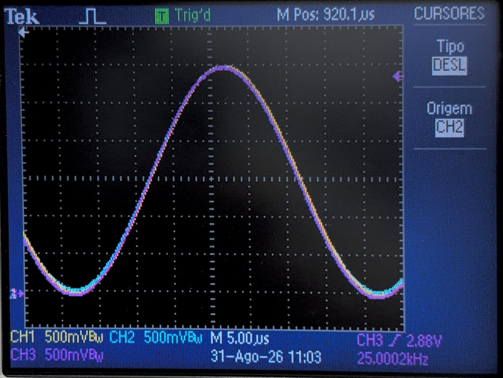

*Figura 43 – Senoide de 3 Vpp, 25 kHz (5 µs/div). Entrada (roxo), 741 (amarelo) e TL082 (ciano) um em cima do outro, sem distorção.*

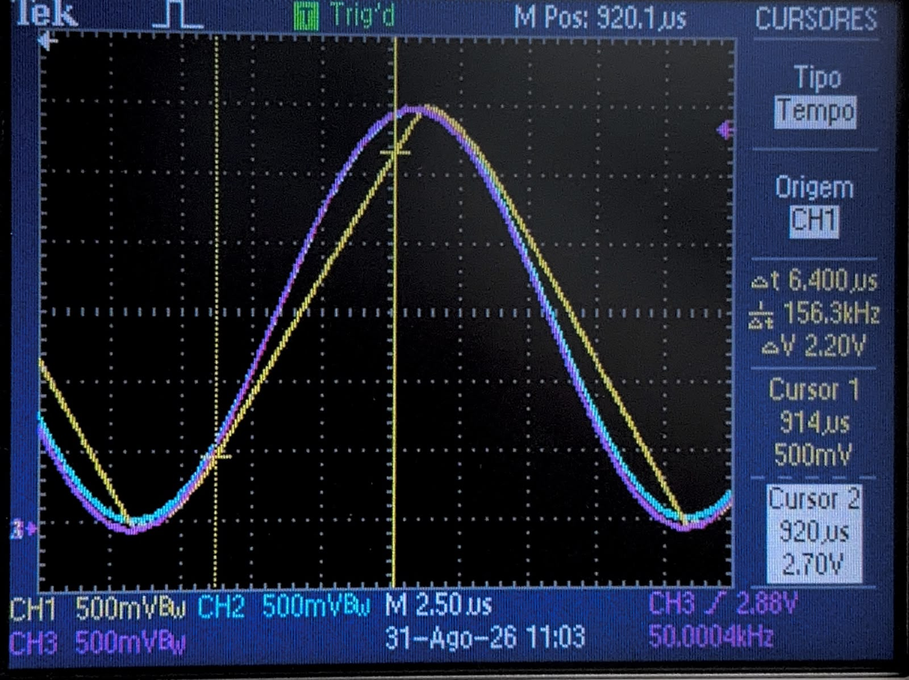

*Figura 44 – Senoide de 3 Vpp, 50 kHz (2,5 µs/div). O 741 começa a ficar triangular. Cursores no CH1: 2,20 V / 6,4 µs = 0,344 V/µs.*

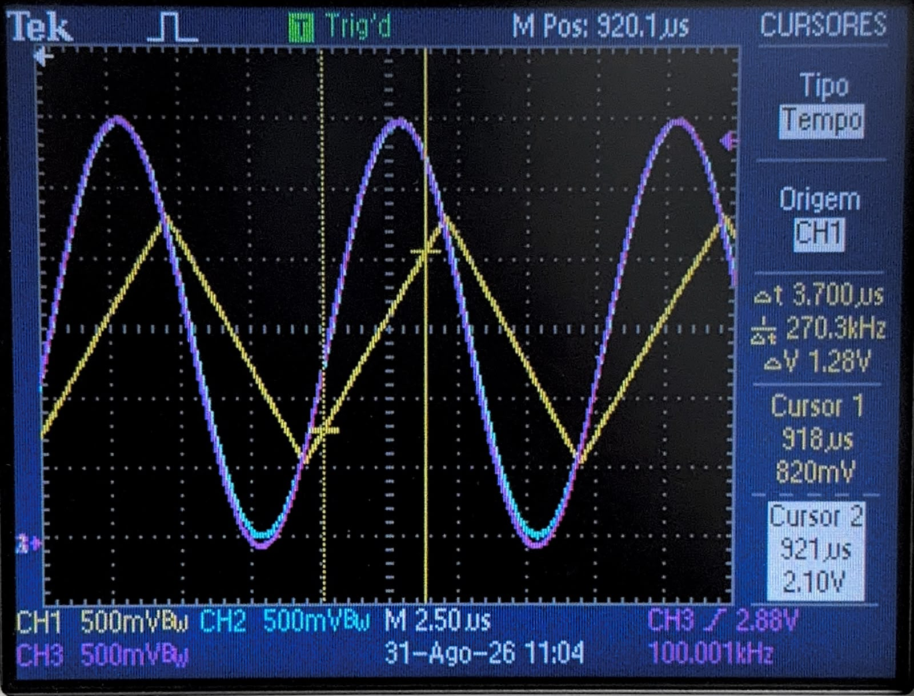

*Figura 45 – Senoide de 3 Vpp, 100 kHz. O 741 vira um triângulo de ≈ 1,7 Vpp. Cursores no CH1: 1,28 V / 3,7 µs = 0,346 V/µs. O TL082 continua igual à entrada.*

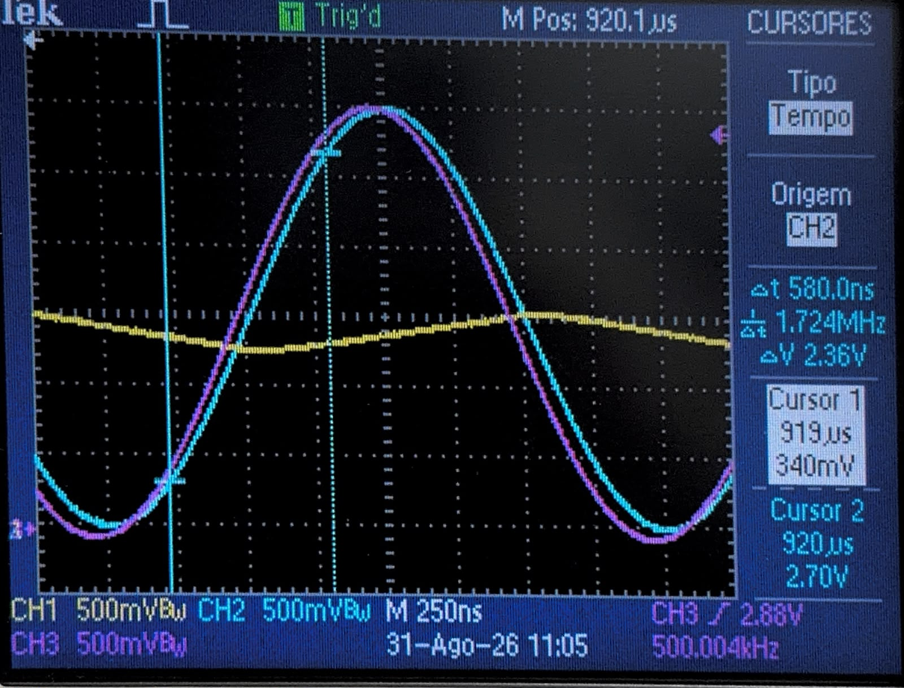

*Figura 46 – Senoide de 3 Vpp, 500 kHz (250 ns/div). O 741 cai para ≈ 0,3 Vpp e o TL082 segue a entrada (cursores no CH2: 2,36 V / 580 ns).*

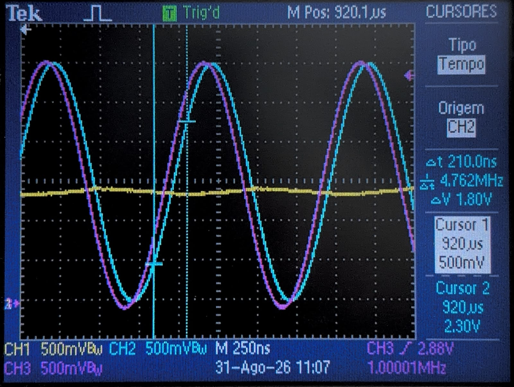

*Figura 47 – Senoide de 3 Vpp, 1 MHz (250 ns/div). O 741 fica praticamente parado e o TL082 mantém a amplitude, com um pequeno atraso (cursores no CH2: 1,80 V / 210 ns).*

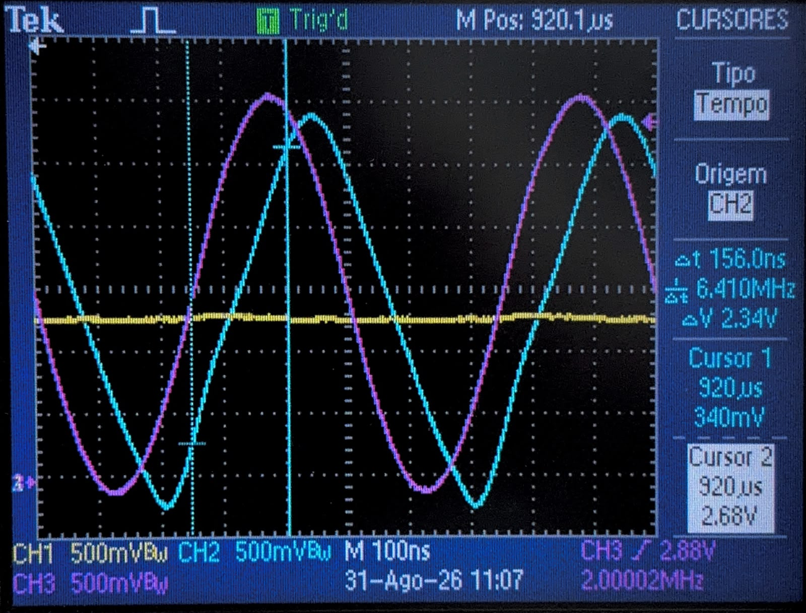

*Figura 48 – Senoide de 3 Vpp, 2 MHz (100 ns/div). Os lados da onda do TL082 ficam retos (cursores no CH2: 2,34 V / 156 ns ≈ 15 V/µs). Ele está começando a ser limitado pelo slew rate.*

### Comparação dos testes

| Teste | SR do 741 (CH1) | Inclinação medida no TL082 (CH2) |
|---|:---:|:---:|
| Pulso de 5 V | 0,342 V/µs | 0,409 V/µs² |
| Pulso de 3 V | 0,339 V/µs | 0,408 V/µs² |
| Senoide de 3 Vpp | 0,345 V/µs | ≥ 9,4 V/µs (≈ 15 V/µs em 2 MHz) |
| Simulação (Proteus) | – | ≈ 12,8 V/µs |
| Datasheet (típico) | 0,5 V/µs | 13 V/µs |

**LM741:** os três testes deram o mesmo SR, 0,34 V/µs (variação menor que 5 %), independente da amplitude, da frequência e da forma de onda. O valor ficou uns 32 % abaixo do típico. O datasheet só traz o valor típico, medido com ±15 V (aqui foram ±12 V), e cada CI varia um pouco.

**TL082 no teste de pulso:** a rampa do CH2 deu ≈ 0,41 V/µs tanto com 5 V quanto com 3 V. Isso é só uns 20 % mais rápido que o 741 e bem abaixo do datasheet. Esse valor não pode ser o SR do TL082, porque no teste com senoide o mesmo CI acompanhou 1 MHz, que exige pelo menos 9,4 V/µs. A simulação também deu ≈ 12,8 V/µs.

O mais provável é que, no teste de pulso, a própria borda do gerador já fosse uma rampa de ≈ 0,4 V/µs. Nesse teste só dois canais estavam ligados (Figura 18) e a entrada não foi medida. O TL082, que é rápido, só copiou essa borda. Já o 741, que é mais lento que ela, mostrou o seu próprio SR, e por isso o valor dele bate com o da senoide. Dois detalhes reforçam isso: a inclinação do CH2 foi a mesma com 3 V e com 5 V, e em 1 kHz/3 V as duas saídas ficaram lentas e iguais, mostrando que a borda da entrada não era ideal. Para confirmar, seria preciso repetir o pulso com a entrada no CH3 e a base de tempo em 250 ns/div ou menos, onde a rampa do TL082 (≈ 0,4 µs para 5 V) apareceria.

---

## Conclusão – Parte 2

Pelo datasheet o TL082 (13 V/µs) é 26 vezes mais rápido que o LM741 (0,5 V/µs), e essa é a principal diferença entre eles nesta parte. Em 1 kHz os dois reproduzem o pulso, mas dá para ver a rampa do 741. Aumentando a frequência, o 741 vira triângulo muito antes, tanto com onda quadrada quanto com senoide. Essa limitação não depende da alimentação nem da carga: é uma característica do CI.

Na prática:

- O 741 deu 0,34 V/µs em todos os testes. A amplitude só mudou o tempo de subida (14,6 µs com 5 V e 8,9 µs com 3 V) e a frequência em que a onda quadrada vira triângulo (≈ 34 kHz e ≈ 57 kHz).
- Com a senoide de 3 Vpp o 741 distorceu entre 25 e 50 kHz. O TL082 acompanhou até 1 MHz e só começou a distorcer em 2 MHz (≈ 15 V/µs), ou seja, ficou uns 44 vezes mais rápido.
- A simulação deu ≈ 12,8 V/µs para o TL082, bem perto do datasheet.
- No teste de pulso o TL082 ficou limitado pela borda do sinal de entrada, e não pelo CI.

---

# Conclusão Geral

A atividade mostrou três limitações diferentes:

1. **Saturação de tensão** (Parte 1, U1): a saída não passa de uns 1 a 2 V abaixo da alimentação.
2. **Saturação de corrente** (Parte 1, U2 e U3): com resistores de realimentação ou carga de valor baixo, o ampop chega no limite de corrente antes de chegar no limite de tensão. Em U2, com resistores de só 55 Ω, a entrada chegou a controlar a saída.
3. **Slew rate** (Parte 2): mesmo dentro dos limites de tensão e corrente, a saída não consegue acompanhar sinais rápidos. O problema é maior quanto maiores forem a amplitude e a frequência.

A Parte 1 mostrou que o valor dos resistores precisa respeitar as impedâncias do ampop: nem tão baixo que exija corrente demais, nem tão alto que esbarre na resistência de entrada. Na Parte 2, comparando os dois CIs, o TL082 foi muito mais rápido que o 741.

---

## Referências

- Datasheet LM741 – Texas Instruments
- Datasheet µA741 – Texas Instruments, SLOS094 (valores clássicos da revisão G, 2018; a revisão H, 2026, traz outros valores típicos)
- Datasheet TL08x (TL081/TL082) – Texas Instruments
- SEDRA, A. S.; SMITH, K. C. *Microeletrônica*. 7ª ed. Pearson, 2015.
- Simulação: Proteus 8 Professional
